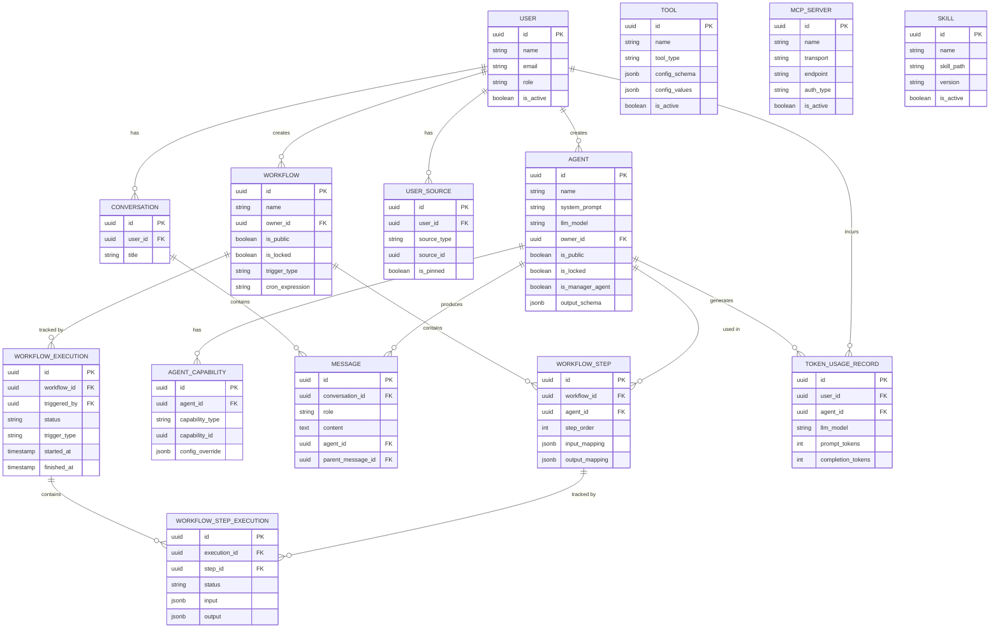
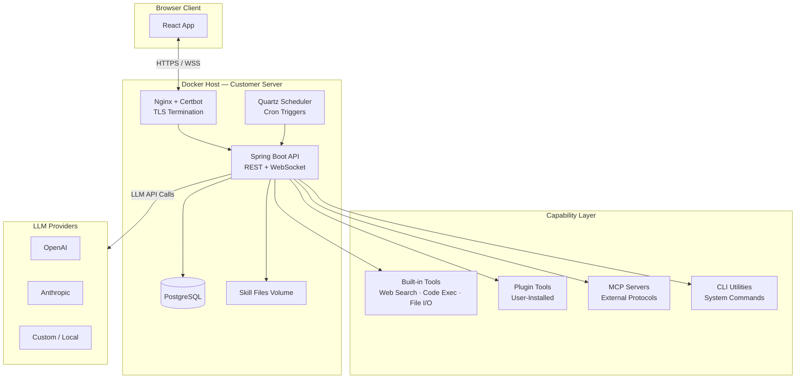
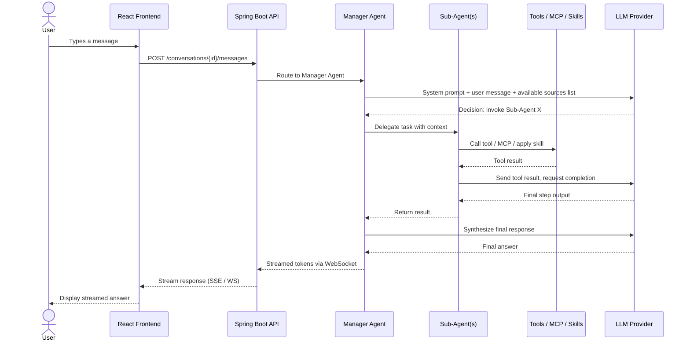
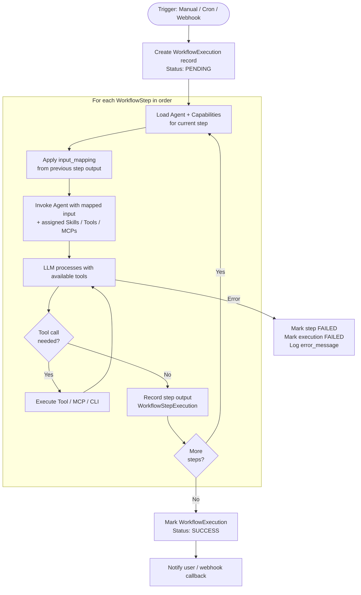
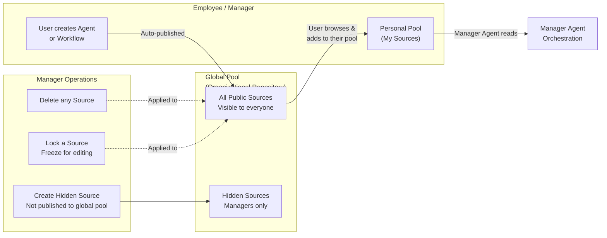
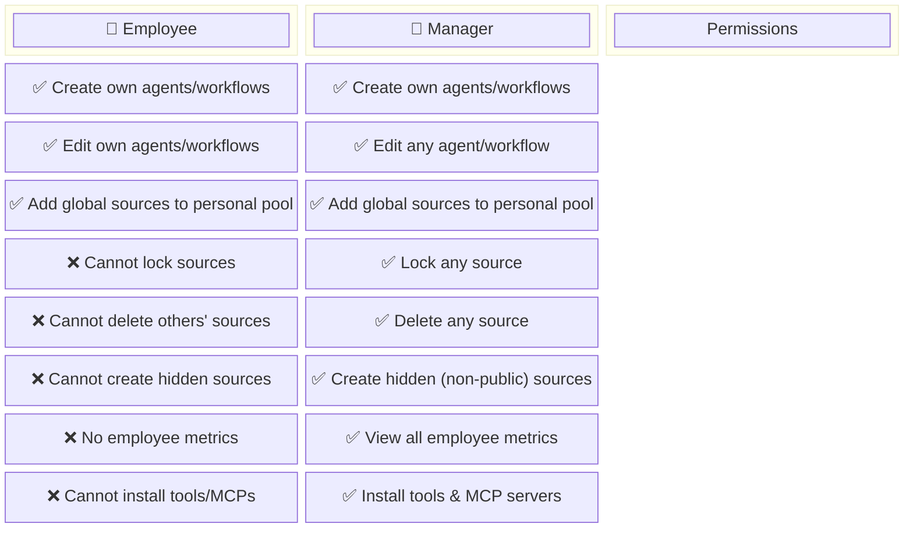

# AgentForge — Project Documentation

> **Working title:** AgentForge. A multi-user, business-oriented AI agent management platform.

---

## 1. Executive Summary

AgentForge is a self-hosted platform that enables businesses to build, manage, and execute AI agents and automated workflows across their entire organization. Rather than treating AI as a single chatbot endpoint, AgentForge models the workforce: every employee gets a personal AI Manager Agent — their intelligent entry point — backed by a growing library of specialized sub-agents and multi-step workflows that the team collectively builds and shares.

The platform is designed to be deployed on any server via Docker Compose. Users link their own domain through Nginx and Let's Encrypt (Certbot), making it easy to operate as an internal business tool without relying on external SaaS subscriptions.

The core philosophy is that **AI assets belong to the business**. When an employee builds an agent or workflow, it is automatically contributed to a shared organizational pool — turning individual productivity gains into reusable company infrastructure that every team member can benefit from.

---

## 2. Vision & Goals

| Goal | Description |
|------|-------------|
| **Self-hosted** | The entire stack runs inside Docker containers on the customer's own server. No external dependency on a cloud AI platform beyond the LLM API calls themselves. |
| **Multi-user** | Multiple employees and managers operate in the same instance, each with their own private workspace and access to a shared organizational pool. |
| **Extensible tooling** | Ships with built-in tools, but accepts user-installed plugins and external MCP (Model Context Protocol) servers, giving teams the freedom to expand capabilities without waiting for core updates. |
| **Observable** | Managers can see how employees use AI — token consumption, agent usage frequency, workflow execution history — turning the platform into a strategic lens on the organization's AI adoption. |
| **Deterministic by design** | Each agent is assigned a precise set of skills, tools, MCPs, and CLIs. Narrow agent scope produces more consistent outputs and reduces unnecessary token usage. |

---

## 3. How It Works

### 3.1 The Manager Agent Pattern

Every user — employee or manager — interacts with the system through their **Manager Agent**. This is an AI orchestrator agent that serves as the single conversational entry point. When a user sends a message, the Manager Agent:

1. Receives the user's request.
2. Inspects the user's personal source pool (their assigned agents and workflows).
3. Decides which sub-agent(s) or workflow(s) are most appropriate to fulfill the task.
4. Delegates, chains, or orchestrates those sub-agents to produce a result.
5. Returns a final response to the user.

This pattern means the user never needs to manually select which agent to use — the Manager Agent handles routing. However, users can also trigger specific workflows manually, or set them to fire automatically via cron jobs or webhook events.

### 3.2 Sub-Agents

Sub-agents are specialized AI agents designed for a narrow, well-defined task. Examples:

- A **Web Research Agent** that searches the internet and summarizes findings.
- An **Excel Generator Agent** that takes structured data and produces `.xlsx` files.
- A **Data Extraction Agent** that parses raw text and returns a structured JSON.
- An **HR FAQ Agent** trained on internal HR documentation.

Each sub-agent is configured with:
- A system prompt defining its role and output format.
- A curated set of **Skills**, **Tools**, **MCP Servers**, and/or **CLI utilities** — only what it needs, nothing more.

### 3.3 Workflows

A workflow is a directed chain of agents. Each step passes its output as the input to the next agent in the sequence. This enables complex multi-step automation:

```
[Web Research Agent] → [Content Analysis Agent] → [Data Extraction Agent] → [Excel Generator Agent] → [Chart Creator Agent]
```

Workflows can be triggered:
- **Manually** by the user via the UI.
- **On a schedule** via a cron expression.
- **Externally** via a webhook endpoint, allowing integration with third-party services.

### 3.4 The Source Pool System

All agents and workflows are collectively referred to as **Sources**. Sources live in two pools:

**Global Pool (Public Sources)**
The organizational repository of all agents and workflows ever created by any user. When a user creates an agent or workflow, it is automatically published here. Any employee can discover it and add it to their personal pool.

**Personal Pool (Private Sources)**
Each user maintains a curated list of sources from the global pool. The Manager Agent only sees the sources in the user's personal pool. This keeps each employee's AI workspace focused and relevant to their role — an accountant's Manager Agent won't be overwhelmed with HR-specific workflows.

Managers have the additional ability to create **hidden sources** — agents or workflows that are not published to the global pool and are only visible and usable by the manager themselves.

### 3.5 Tools, Skills, and MCP Servers

Each agent can be equipped with specific capabilities:

| Capability Type | Description | Examples |
|----------------|-------------|---------|
| **Built-in Tools** | Core tools that ship with the platform | Web search, file reader, code executor, HTTP request |
| **Plugin Tools** | User-installable tools in a plugin format | Custom API connectors, internal data fetchers |
| **MCP Servers** | External Model Context Protocol servers | Database MCPs, GitHub MCP, Slack MCP |
| **Skills** | Markdown-based instruction files following the standard skill directory format (`skill.md`) | Reasoning frameworks, output templates, domain knowledge |
| **CLI Utilities** | Command-line tools the agent can invoke | `ffmpeg`, `pandoc`, custom internal scripts |

By assigning only the necessary capabilities to each agent, the platform reduces token overhead and produces more deterministic results.

---

## 4. User Roles

There are two roles in the system: **Employee** and **Manager**.

### 4.1 Shared Capabilities (Both Roles)

- Create, read, and update their own agents and workflows.
- Browse the global pool of sources and add any source to their personal pool.
- Remove sources from their personal pool.
- Manually trigger workflows.
- Configure cron-based or webhook-based workflow triggers.
- Chat with their Manager Agent.
- View their own execution history and token usage.

### 4.2 Manager-Exclusive Capabilities

| Capability | Description |
|-----------|-------------|
| **Edit any source** | Can update agents and workflows created by any employee, not only their own. |
| **Lock sources** | Can lock a source so that no user — including the original author — can modify it. Useful for production-grade, QA-approved agents. |
| **Delete any source** | Full delete access across the organization's source pool. |
| **Create hidden sources** | Can create agents or workflows that are not published to the global pool, invisible to employees. |
| **View employee metrics** | Access to a dashboard showing per-employee source counts, token usage, workflow execution counts, and trends over time. |
| **Manage tools and MCP servers** | Install, configure, or remove plugin tools and MCP server connections for the entire platform. |

---

## 5. Tech Stack

### 5.1 Overview

| Layer | Technology | Rationale |
|-------|-----------|-----------|
| **Backend** | Spring Boot (Java) | Robust, production-grade REST API framework with strong ecosystem support for background jobs, scheduling, and security. |
| **Frontend** | React (TypeScript) | Component-based UI well-suited for building complex dashboards and real-time chat interfaces. |
| **Database** | PostgreSQL | Reliable relational database with JSONB support for flexible agent configuration storage. |
| **Reverse Proxy** | Nginx | Handles TLS termination, domain routing, and static asset delivery. |
| **TLS / Certificates** | Certbot (Let's Encrypt) | Automatic free SSL certificate provisioning and renewal for user-owned domains. |
| **Containerization** | Docker & Docker Compose | Single-command deployment. Users run `docker compose up` and the entire stack starts. |
| **Agent Orchestration** | LangChain4j / Spring AI | Java-native libraries for constructing LLM chains, tool-calling agents, and workflow steps. |
| **Background Jobs** | Spring Scheduler + Quartz | Handles cron-triggered workflow executions. |
| **Realtime** | WebSocket (Spring) | Streams agent responses token-by-token to the frontend for a live chat experience. |

### 5.2 Deployment Architecture

```
Internet
    │
    ▼
[ Nginx (port 80/443) ]
    │ TLS terminated by Certbot
    ├──► /api/*   ──► [ Spring Boot :8080 ]
    │                        │
    │                   [ PostgreSQL :5432 ]
    │
    └──► /*       ──► [ React (static) :3000 ]
```

All services are orchestrated via Docker Compose, giving operators a single `docker-compose.yml` file that spins up the full stack. Environment variables (LLM API keys, database credentials, domain name) are managed via a `.env` file.

---

## 6. Entity Model

This section describes every core data entity, its attributes, and its relationships to other entities.

### 6.1 User

Represents a human user of the platform — either an employee or a manager.

| Attribute | Type | Description |
|-----------|------|-------------|
| `id` | UUID | Primary key |
| `name` | String | Display name |
| `email` | String | Unique login email |
| `password_hash` | String | Bcrypt-hashed password |
| `role` | Enum | `EMPLOYEE` or `MANAGER` |
| `is_active` | Boolean | Soft-delete / account suspension |
| `created_at` | Timestamp | Account creation time |
| `updated_at` | Timestamp | Last profile update |

---

### 6.2 Agent

A specialized AI agent with a defined purpose, system prompt, and assigned capabilities.

| Attribute | Type | Description |
|-----------|------|-------------|
| `id` | UUID | Primary key |
| `name` | String | Human-readable name |
| `description` | String | What this agent does |
| `system_prompt` | Text | The LLM system prompt defining the agent's behavior |
| `llm_model` | String | Which LLM model this agent uses (e.g., `gpt-4o`, `claude-3-5-sonnet`) |
| `owner_id` | UUID → User | User who created this agent |
| `is_public` | Boolean | Whether it appears in the global pool |
| `is_locked` | Boolean | Locked agents cannot be edited (manager-only toggle) |
| `is_manager_agent` | Boolean | Marks this as the user's personal Manager Agent |
| `output_schema` | JSONB | Optional structured output schema (JSON Schema) |
| `created_at` | Timestamp | Creation time |
| `updated_at` | Timestamp | Last modification time |

---

### 6.3 Workflow

An ordered chain of agents executed sequentially, where each step's output feeds the next.

| Attribute | Type | Description |
|-----------|------|-------------|
| `id` | UUID | Primary key |
| `name` | String | Human-readable workflow name |
| `description` | String | What this workflow accomplishes |
| `owner_id` | UUID → User | Creator |
| `is_public` | Boolean | Visible in the global pool |
| `is_locked` | Boolean | Cannot be edited when locked |
| `trigger_type` | Enum | `MANUAL`, `CRON`, or `WEBHOOK` |
| `cron_expression` | String | Cron expression (when `trigger_type = CRON`) |
| `webhook_secret` | String | HMAC secret for webhook validation |
| `created_at` | Timestamp | Creation time |
| `updated_at` | Timestamp | Last modification time |

---

### 6.4 WorkflowStep

Defines a single step within a workflow — which agent runs, in what order, and how its I/O is mapped.

| Attribute | Type | Description |
|-----------|------|-------------|
| `id` | UUID | Primary key |
| `workflow_id` | UUID → Workflow | Parent workflow |
| `agent_id` | UUID → Agent | Agent executing this step |
| `step_order` | Integer | Execution sequence (1, 2, 3, ...) |
| `input_mapping` | JSONB | How to transform the previous step's output into this step's input |
| `output_mapping` | JSONB | How to extract and name this step's outputs for the next step |

---

### 6.5 UserSource

The junction between a user and the sources (agents + workflows) in their personal pool.

| Attribute | Type | Description |
|-----------|------|-------------|
| `id` | UUID | Primary key |
| `user_id` | UUID → User | The user who added this source |
| `source_type` | Enum | `AGENT` or `WORKFLOW` |
| `source_id` | UUID | References an Agent or Workflow depending on `source_type` |
| `added_at` | Timestamp | When the user added this source to their pool |
| `is_pinned` | Boolean | User-level pin for quick access |

---

### 6.6 Tool

Represents a capability that can be assigned to an agent. Covers built-in tools, user-installed plugins, and CLI utilities.

| Attribute | Type | Description |
|-----------|------|-------------|
| `id` | UUID | Primary key |
| `name` | String | Tool identifier (e.g., `web_search`, `excel_writer`) |
| `display_name` | String | Human-readable label |
| `description` | String | What this tool does (fed to the LLM for tool selection) |
| `tool_type` | Enum | `BUILTIN`, `PLUGIN`, or `CLI` |
| `config_schema` | JSONB | JSON Schema describing required configuration parameters |
| `config_values` | JSONB | Encrypted stored configuration (API keys, paths, etc.) |
| `entrypoint` | String | For CLI tools: the shell command to invoke. For plugins: the class or module reference. |
| `is_active` | Boolean | Enabled/disabled globally |
| `installed_by` | UUID → User | Who installed this tool (null for built-in) |
| `created_at` | Timestamp | Installation time |

---

### 6.7 MCPServer

Represents a connected Model Context Protocol server, providing external tool capabilities to agents.

| Attribute | Type | Description |
|-----------|------|-------------|
| `id` | UUID | Primary key |
| `name` | String | Friendly name (e.g., `GitHub MCP`, `Postgres MCP`) |
| `description` | String | What capabilities this MCP server exposes |
| `transport` | Enum | `STDIO`, `SSE`, or `HTTP` |
| `endpoint` | String | URL or command used to connect |
| `auth_type` | Enum | `NONE`, `API_KEY`, `OAUTH` |
| `auth_config` | JSONB | Encrypted authentication credentials |
| `is_active` | Boolean | Whether the server is reachable and enabled |
| `installed_by` | UUID → User | The manager who added this server |
| `created_at` | Timestamp | Registration time |

---

### 6.8 Skill

A skill is a markdown-based instruction set that shapes agent behavior. Following the standard skill directory convention, each skill maps to a directory containing a `skill.md` file and optionally supporting files.

| Attribute | Type | Description |
|-----------|------|-------------|
| `id` | UUID | Primary key |
| `name` | String | Skill identifier (e.g., `chain_of_thought`, `json_output`) |
| `display_name` | String | Human-readable label |
| `description` | String | What this skill teaches the agent |
| `skill_path` | String | Filesystem path to the skill directory (inside the container volume) |
| `version` | String | Semantic version of the skill definition |
| `is_active` | Boolean | Whether this skill is available for assignment |
| `created_at` | Timestamp | Upload time |

---

### 6.9 AgentCapability (Junction)

A polymorphic junction table that links an agent to any of its assigned capabilities: Tools, MCP Servers, or Skills.

| Attribute | Type | Description |
|-----------|------|-------------|
| `id` | UUID | Primary key |
| `agent_id` | UUID → Agent | The agent receiving this capability |
| `capability_type` | Enum | `TOOL`, `MCP_SERVER`, or `SKILL` |
| `capability_id` | UUID | References the Tool, MCPServer, or Skill record |
| `config_override` | JSONB | Agent-level configuration overriding the capability's defaults |

> **Note:** Alternatively, this can be modelled as three separate junction tables (`AgentTool`, `AgentMCP`, `AgentSkill`) for cleaner foreign key constraints. The choice depends on whether polymorphic queries are preferred over strict referential integrity.

---

### 6.10 Conversation

A conversation session between a user and their Manager Agent.

| Attribute | Type | Description |
|-----------|------|-------------|
| `id` | UUID | Primary key |
| `user_id` | UUID → User | The user participating in this conversation |
| `title` | String | Auto-generated or user-defined title |
| `created_at` | Timestamp | Start time of conversation |

---

### 6.11 Message

A single message within a conversation.

| Attribute | Type | Description |
|-----------|------|-------------|
| `id` | UUID | Primary key |
| `conversation_id` | UUID → Conversation | Parent conversation |
| `role` | Enum | `USER`, `ASSISTANT`, `AGENT`, or `SYSTEM` |
| `content` | Text | Message text content |
| `agent_id` | UUID → Agent | Which agent produced this message (null for user/system messages) |
| `parent_message_id` | UUID → Message | For threaded agent sub-calls (the orchestration tree) |
| `created_at` | Timestamp | Timestamp |

---

### 6.12 WorkflowExecution

Tracks each time a workflow is executed — manually, on schedule, or via webhook.

| Attribute | Type | Description |
|-----------|------|-------------|
| `id` | UUID | Primary key |
| `workflow_id` | UUID → Workflow | The workflow being executed |
| `triggered_by` | UUID → User | Null for automated triggers |
| `trigger_type` | Enum | `MANUAL`, `CRON`, `WEBHOOK` |
| `input_payload` | JSONB | The initial input data supplied to the workflow |
| `status` | Enum | `PENDING`, `RUNNING`, `SUCCESS`, `FAILED`, `CANCELLED` |
| `started_at` | Timestamp | Execution start |
| `finished_at` | Timestamp | Execution end (null if still running) |
| `error_message` | Text | Populated on `FAILED` status |

---

### 6.13 WorkflowStepExecution

Tracks the execution result of each individual step within a workflow run.

| Attribute | Type | Description |
|-----------|------|-------------|
| `id` | UUID | Primary key |
| `execution_id` | UUID → WorkflowExecution | Parent execution |
| `step_id` | UUID → WorkflowStep | The step being executed |
| `status` | Enum | `PENDING`, `RUNNING`, `SUCCESS`, `FAILED` |
| `input` | JSONB | Input received by this step |
| `output` | JSONB | Output produced by this step |
| `started_at` | Timestamp | Step start |
| `finished_at` | Timestamp | Step end |

---

### 6.14 TokenUsageRecord

Records token consumption per agent invocation, enabling per-user and per-agent cost tracking.

| Attribute | Type | Description |
|-----------|------|-------------|
| `id` | UUID | Primary key |
| `user_id` | UUID → User | Which user's context triggered this usage |
| `agent_id` | UUID → Agent | Which agent consumed tokens |
| `execution_id` | UUID | References a WorkflowExecution or Conversation Message ID |
| `execution_type` | Enum | `CONVERSATION` or `WORKFLOW` |
| `llm_model` | String | Model used (e.g., `gpt-4o`) |
| `prompt_tokens` | Integer | Input tokens |
| `completion_tokens` | Integer | Output tokens |
| `total_tokens` | Integer | Sum |
| `recorded_at` | Timestamp | When the call was made |

---

## 7. Entity Relationship Diagram



---

## 8. System Architecture Diagram



---

## 9. User Interaction Flow



---

## 10. Workflow Execution Flow



---

## 11. Source Pool System



---

## 12. Role & Permission Matrix



---

## 13. Extensibility & Plugin System

### 13.1 Plugin Tool Contract

A plugin tool is a self-contained package that the platform loads at runtime. Each plugin must expose:

- **Manifest** (`plugin.json`): name, version, description, config schema, input/output schema.
- **Handler**: A Java class implementing the `AgentTool` interface (or a REST microservice endpoint for language-agnostic plugins).
- **Icon & Documentation**: For display in the tool marketplace UI.

The platform scans a designated `/plugins` volume directory on startup and registers any valid plugin manifests into the `TOOL` table with `tool_type = PLUGIN`.

### 13.2 MCP Server Integration

MCP servers are registered by providing their transport type and connection details. The platform's agent executor wraps each registered MCP server with a LangChain4j `McpToolProvider`, making all MCP-exposed tools available to agents assigned that server. Supported transports: STDIO (local process), SSE (Server-Sent Events), and HTTP.

### 13.3 Skill Directory Format

Skills follow the standard directory convention:

```
skills/
└── chain_of_thought/
    ├── skill.md          ← Main instruction file (loaded into system prompt)
    ├── examples/
    │   └── example_01.md
    └── metadata.json     ← name, version, description
```

Skills are mounted into the container via a Docker volume. The platform reads the `skill.md` content and injects it into the agent's system prompt context at invocation time.

---

## 14. Observability & Metrics

Managers have access to a dedicated analytics dashboard showing:

- **Per-employee metrics**: Number of sources (agents + workflows) in personal pool, total token consumption by period, number of workflow executions.
- **Source usage heatmap**: Which agents and workflows are most frequently used across the organization.
- **Token cost breakdown**: By model, by agent, by employee — enabling cost attribution and optimization decisions.
- **Execution health**: Success/failure rates per workflow, average execution time per step.
- **Trend charts**: Token usage over time, new sources created per week, active users per day.

All metrics are computed from the `TOKEN_USAGE_RECORD` and `WORKFLOW_EXECUTION` tables, making them queryable and exportable.

---

## 15. Deployment Guide (Summary)

### Prerequisites

- A Linux server (VPS or dedicated) with Docker and Docker Compose installed.
- A registered domain name with DNS A record pointing to the server's IP.
- An LLM API key (OpenAI, Anthropic, or compatible provider).

### Steps

1. Clone the repository onto the server.
2. Copy `.env.example` to `.env` and fill in:
   - `DOMAIN=yourdomain.com`
   - `POSTGRES_PASSWORD=...`
   - `LLM_API_KEY=...`
   - `JWT_SECRET=...`
3. Run `docker compose up -d`.
4. Certbot automatically requests and renews a TLS certificate for the configured domain.
5. Access the platform at `https://yourdomain.com`.
6. Log in with the default admin (manager) account and invite employees.

### Docker Compose Services

| Service | Image | Purpose |
|---------|-------|---------|
| `nginx` | `nginx:alpine` + Certbot | Reverse proxy & TLS |
| `api` | Custom Spring Boot image | Backend REST API & WebSocket |
| `frontend` | Custom React build (served by Nginx) | Web UI |
| `db` | `postgres:16` | Primary data store |

---

## 16. Future Roadmap

The following features are candidates for future iterations, listed in rough priority order:

- **CLI Creator**: A UI for managers to author, test, and package new CLI tools without writing Java code — lowering the barrier to extending the platform.
- **Agent Marketplace**: A public registry where the community can share agents and workflows between different AgentForge instances.
- **Fine-grained RBAC**: Team-level permissions (e.g., a Marketing team pool separate from the Finance team pool) within the same instance.
- **Multi-LLM routing**: Assign different LLM providers to different agents based on cost-performance tradeoffs, with automatic fallback.
- **Evaluation framework**: Automated testing of agents against expected outputs, enabling CI/CD-style quality gates for source promotion.
- **Audit log**: Immutable record of all source changes, executions, and admin actions for compliance.
- **Notebook mode**: Side-by-side view of workflow execution steps and intermediate outputs, for debugging and iterating on complex pipelines.

