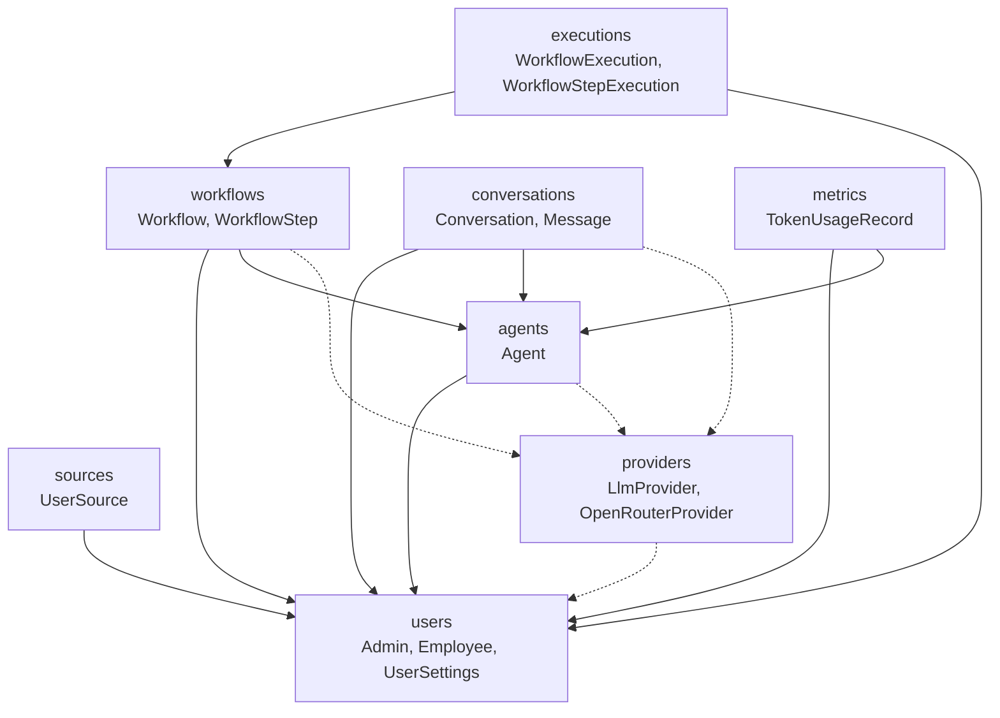
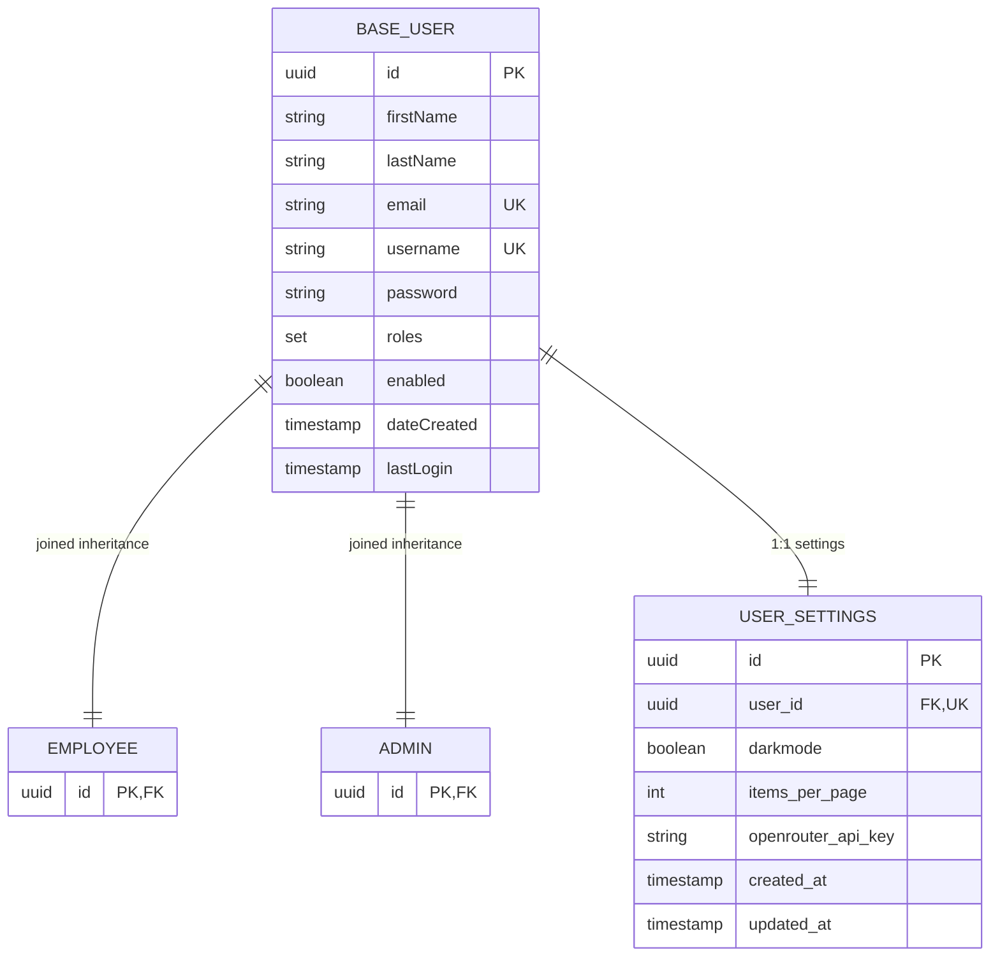
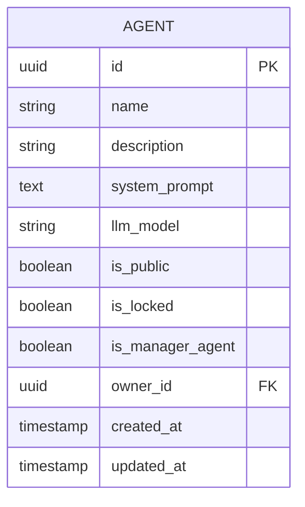
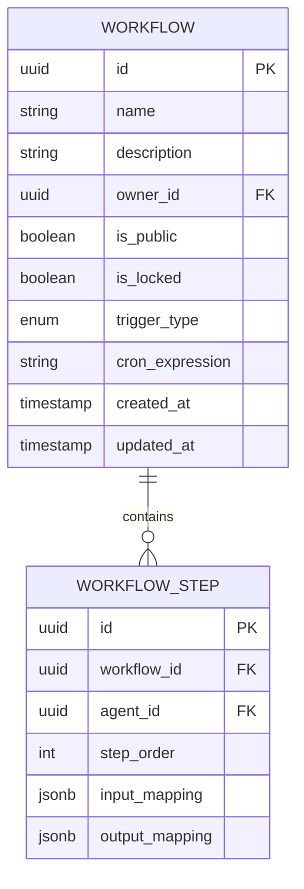
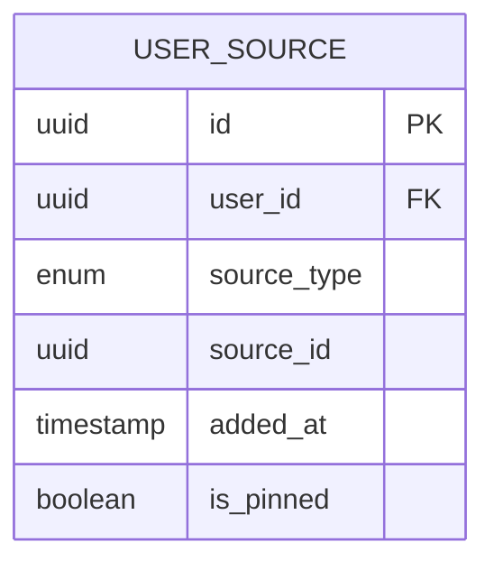
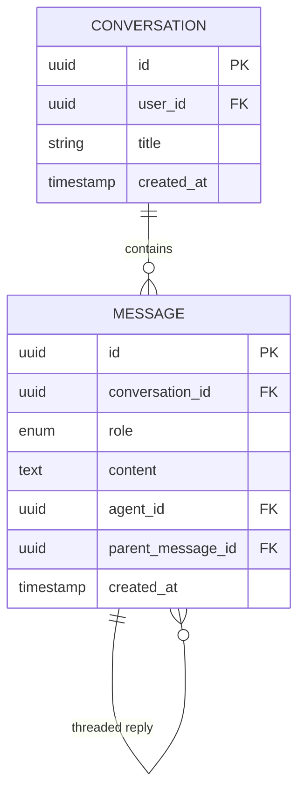
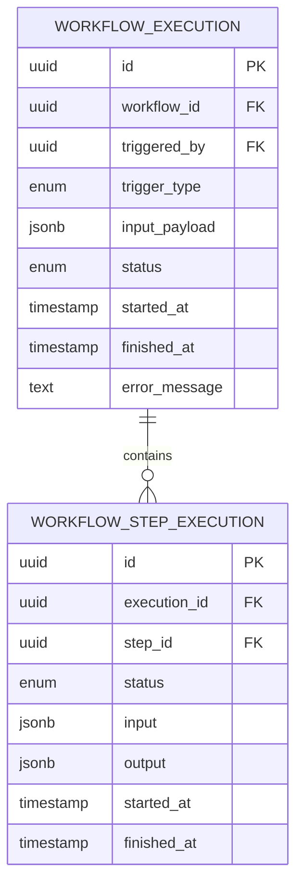
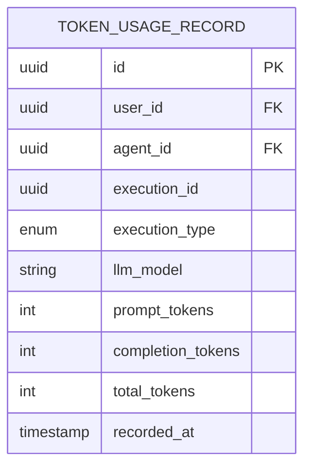
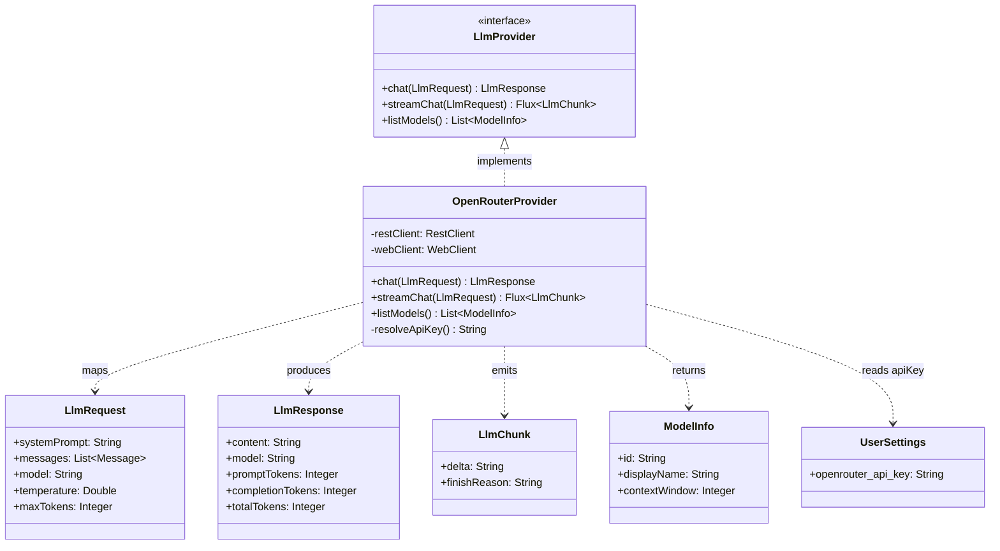
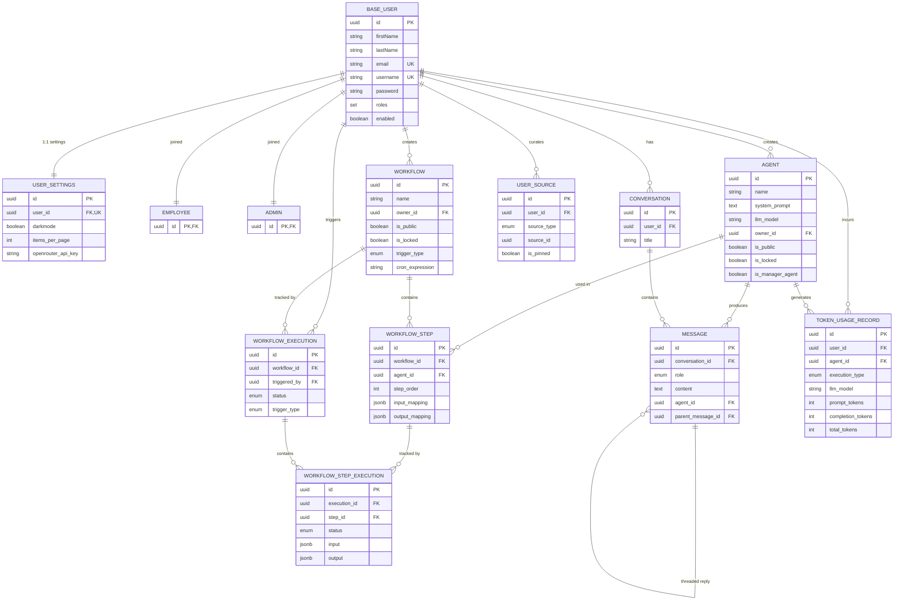

---
tags:
  - architecture
  - mvp
  - entities
---

# MVP Entity Model & Package Layout

> Minimal set of entities grouped by package to deliver the AgentForge MVP. All non-essential modules are deferred to post-MVP iterations.

---

## Table of Contents

1. [Overview](#overview)
2. [Package Structure](#package-structure)
3. [Package Dependency Map](#package-dependency-map)
4. [Package: users](#package-users)
5. [Package: agents](#package-agents)
6. [Package: workflows](#package-workflows)
7. [Package: sources](#package-sources)
8. [Package: conversations](#package-conversations)
9. [Package: executions](#package-executions)
10. [Package: metrics](#package-metrics)
11. [Package: providers](#package-providers)
12. [Cross-Package Entity Relationship Diagram](#cross-package-entity-relationship-diagram)
13. [Deferred Modules](#deferred-modules)
14. [Alignment with Existing Boilerplate](#alignment-with-existing-boilerplate)

---

## Overview

The MVP delivers the core AgentForge loop: authenticate, create agents, chain them into workflows, chat with the Manager Agent, and track usage. This document defines the **minimum entity set** required to support that loop, organized into **7 packages** mapped to the [existing generic CRUD layering](Backend-QueryDSL-Pageable-List-Queries).

Each package maps to a package under `com.agentforge.models.<package>/` — mirroring the current `com.authServer.models.hq.admin/` and `com.authServer.models.hq/client/` structure.

---

## Package Structure

```
com.agentforge.models/
├── users/           Admin, Employee, UserSettings
├── agents/          Agent
├── workflows/       Workflow, WorkflowStep
├── sources/         UserSource
├── conversations/   Conversation, Message
├── executions/      WorkflowExecution, WorkflowStepExecution
├── metrics/         TokenUsageRecord
└── providers/       LlmProvider (interface), OpenRouterProvider (adapter)
```

| #   | Package         | Modules                                      | Type                | Purpose                                                       |
| --- | --------------- | -------------------------------------------- | ------------------- | ------------------------------------------------------------- |
| 1   | `users`         | `Admin`, `Employee`, `UserSettings`          | JPA Entity          | Authentication, roles, profile, per-user preferences          |
| 2   | `agents`        | `Agent`                                      | JPA Entity          | AI agent definition (system prompt, model, owner)             |
| 3   | `workflows`     | `Workflow`, `WorkflowStep`                   | JPA Entity          | Ordered agent chains and step definitions                     |
| 4   | `sources`       | `UserSource`                                 | JPA Entity          | Junction: user personal pool ↔ global sources                 |
| 5   | `conversations` | `Conversation`, `Message`                    | JPA Entity          | Chat sessions with the Manager Agent                          |
| 6   | `executions`    | `WorkflowExecution`, `WorkflowStepExecution` | JPA Entity          | Run history, inputs, outputs, status                          |
| 7   | `metrics`       | `TokenUsageRecord`                           | JPA Entity          | Per-user, per-agent token/cost tracking                       |
| 8   | `providers`     | `LlmProvider`, `OpenRouterProvider`          | Interface + Adapter | LLM provider abstraction; bridges backend ↔ external LLM APIs |

**Total: 8 packages, 13 modules** (11 JPA entities + 1 interface + 1 adapter).

---

## Package Dependency Map



> **Solid edges** (`-->`) are FK dependencies: one entity references another's PK. **Dashed edges** (`-.->`) are DIP dependencies: callers depend on the `LlmProvider` interface, never on `OpenRouterProvider` directly. The `providers` package reads the current user's `UserSettings.openrouter_api_key` at invocation time, creating a logical read-dependency on `users`.

---

## Package: users

### Employee

Extends `BaseUserEntity`. Represents a standard platform user who can create agents, workflows, and converse with their Manager Agent.

| Attribute | Type | Description |
|-----------|------|-------------|
| `id` | UUID | Inherited from `BaseUserEntity` |
| `firstName` | String | Inherited |
| `lastName` | String | Inherited |
| `email` | String | Inherited — unique |
| `username` | String | Inherited — unique |
| `password` | String | Inherited — bcrypt hashed |
| `roles` | Set\<UserRoles\> | Inherited — contains `EMPLOYEE` |
| `enabled` | Boolean | Inherited |
| `dateCreated` | Timestamp | Inherited |
| `lastLogin` | Timestamp | Inherited |

### Admin

Extends `BaseUserEntity`. Represents a manager with full platform control.

| Attribute | Type | Description |
|-----------|------|-------------|
| `id` | UUID | Inherited from `BaseUserEntity` |
| `firstName` | String | Inherited |
| `lastName` | String | Inherited |
| `email` | String | Inherited — unique |
| `username` | String | Inherited — unique |
| `password` | String | Inherited — bcrypt hashed |
| `roles` | Set\<UserRoles\> | Inherited — contains `ADMIN` |
| `enabled` | Boolean | Inherited |
| `dateCreated` | Timestamp | Inherited |
| `lastLogin` | Timestamp | Inherited |

**Role mapping against existing boilerplate:**

| Boilerplate Role | MVP Role | Action |
|-----------------|----------|--------|
| `ADMIN` | Admin (Manager) | Rename entity, keep role constant |
| `CLIENT` | *(removed)* | Delete `ClientEntity` and related stack |
| `EMPLOYEE` | Employee | Keep role constant, create `EmployeeEntity` |

### UserSettings

Per-user UI preferences and LLM provider configuration. A 1:1 entity linked to a user — each user has exactly one settings record, created at account creation with sensible defaults.

| Attribute | Type | Description |
|-----------|------|-------------|
| `id` | UUID | Primary key |
| `user_id` | UUID → BaseUser | Unique FK — one settings record per user |
| `darkmode` | Boolean | UI dark mode toggle. Default: `false` |
| `items_per_page` | Integer | Default page size for paginated list requests. Default: `20` |
| `openrouter_api_key` | String | OpenRouter API key (encrypted at rest via `@Convert`). Null until the user provides one |
| `created_at` | Timestamp | Creation time |
| `updated_at` | Timestamp | Last update |

> **SOLID note — SRP & Depth:** `UserSettings` has exactly one reason to change: user preference defaults. The `items_per_page` field feeds every paginated list endpoint via `PageableRequest.setSize(...)` — a small interface (one entity) with substantial leverage (N list endpoints rely on it). The `openrouter_api_key` is consumed by `OpenRouterProvider` at invocation time — the settings entity owns the key, the provider reads it; neither owns the other's concern.



> `Employee` and `Admin` use **joined inheritance** — each has its own table (`employee`, `admin`) with an `id` column that is both the primary key and a foreign key to `base_user`. This matches the existing `AdminEntity` / `BaseUserEntity` pattern already in the boilerplate.

---

## Package: agents

### Agent

A specialized AI agent with a system prompt, assigned LLM model, and owner.

| Attribute | Type | Description |
|-----------|------|-------------|
| `id` | UUID | Primary key |
| `name` | String | Human-readable name |
| `description` | String | What this agent does |
| `system_prompt` | Text | LLM system prompt defining behavior |
| `llm_model` | String | Model identifier (e.g. `gpt-4o`) |
| `is_public` | Boolean | Visible in the global pool |
| `is_locked` | Boolean | Locked by admin (no edits allowed) |
| `is_manager_agent` | Boolean | Marks this as the owner's personal Manager Agent |
| `owner_id` | UUID → Admin/Employee | Creator of this agent |
| `created_at` | Timestamp | Creation time |
| `updated_at` | Timestamp | Last modification |



> **MVP simplification:** The `AgentCapability` junction (Tool, MCP Server, Skill) is deferred. MVP agents operate with only a system prompt and model — no external tools. See [[#deferred-modules]].

---

## Package: workflows

### Workflow

An ordered chain of agents executed sequentially. Each step's output feeds the next step's input.

| Attribute | Type | Description |
|-----------|------|-------------|
| `id` | UUID | Primary key |
| `name` | String | Human-readable name |
| `description` | String | What this workflow accomplishes |
| `owner_id` | UUID → Admin/Employee | Creator |
| `is_public` | Boolean | Visible in the global pool |
| `is_locked` | Boolean | Locked by admin |
| `trigger_type` | Enum | `MANUAL`, `CRON`, `WEBHOOK` |
| `cron_expression` | String | Cron expression (null if not cron-triggered) |
| `created_at` | Timestamp | Creation time |
| `updated_at` | Timestamp | Last modification |

### WorkflowStep

A single step inside a workflow — binds an agent at a position with I/O mapping.

| Attribute | Type | Description |
|-----------|------|-------------|
| `id` | UUID | Primary key |
| `workflow_id` | UUID → Workflow | Parent workflow |
| `agent_id` | UUID → Agent | Agent that executes this step |
| `step_order` | Integer | Execution sequence (1, 2, 3...) |
| `input_mapping` | JSONB | How previous output maps to this step's input |
| `output_mapping` | JSONB | How to name outputs for the next step |



---

## Package: sources

### UserSource

Junction table connecting a user to an agent or workflow in their personal pool. This is how the personal-pool/global-pool system works — agents and workflows created as `is_public = true` appear in the global pool; adding them via `UserSource` puts them in a user's personal pool.

| Attribute | Type | Description |
|-----------|------|-------------|
| `id` | UUID | Primary key |
| `user_id` | UUID → Admin/Employee | The user |
| `source_type` | Enum | `AGENT` or `WORKFLOW` |
| `source_id` | UUID | References the Agent or Workflow |
| `added_at` | Timestamp | When added to personal pool |
| `is_pinned` | Boolean | Quick-access pin |



> The `source_id` column is **polymorphic** — it references either `agent.id` or `workflow.id` depending on `source_type`. Foreign key constraint is enforced at the application layer for MVP; a proper polymorphic FK or separate junction tables can be added later.

---

## Package: conversations

### Conversation

A chat session between a user and their Manager Agent.

| Attribute | Type | Description |
|-----------|------|-------------|
| `id` | UUID | Primary key |
| `user_id` | UUID → Admin/Employee | The user |
| `title` | String | Auto-generated or user-defined title |
| `created_at` | Timestamp | Start time |

### Message

A single message inside a conversation. Supports a threading tree via `parent_message_id` so the UI can render the orchestration tree (Manager Agent → Sub-Agent calls).

| Attribute | Type | Description |
|-----------|------|-------------|
| `id` | UUID | Primary key |
| `conversation_id` | UUID → Conversation | Parent conversation |
| `role` | Enum | `USER`, `ASSISTANT`, `AGENT`, `SYSTEM` |
| `content` | Text | Message text |
| `agent_id` | UUID → Agent | Which agent produced this (null for user messages) |
| `parent_message_id` | UUID → Message | For threaded agent sub-calls |
| `created_at` | Timestamp | Timestamp |



---

## Package: executions

### WorkflowExecution

Tracks each workflow run — manually triggered, cron, or webhook.

| Attribute | Type | Description |
|-----------|------|-------------|
| `id` | UUID | Primary key |
| `workflow_id` | UUID → Workflow | The workflow executed |
| `triggered_by` | UUID → Admin/Employee | Initiator (null for automated triggers) |
| `trigger_type` | Enum | `MANUAL`, `CRON`, `WEBHOOK` |
| `input_payload` | JSONB | Initial input to the workflow |
| `status` | Enum | `PENDING`, `RUNNING`, `SUCCESS`, `FAILED`, `CANCELLED` |
| `started_at` | Timestamp | Execution start |
| `finished_at` | Timestamp | Execution end |
| `error_message` | Text | Failure reason |

### WorkflowStepExecution

Tracks the result of a single step within a workflow run.

| Attribute | Type | Description |
|-----------|------|-------------|
| `id` | UUID | Primary key |
| `execution_id` | UUID → WorkflowExecution | Parent execution |
| `step_id` | UUID → WorkflowStep | The step |
| `status` | Enum | `PENDING`, `RUNNING`, `SUCCESS`, `FAILED` |
| `input` | JSONB | Input to this step |
| `output` | JSONB | Output from this step |
| `started_at` | Timestamp | Step start |
| `finished_at` | Timestamp | Step end |



---

## Package: metrics

### TokenUsageRecord

Records token consumption per agent invocation for per-user and per-agent cost tracking.

| Attribute | Type | Description |
|-----------|------|-------------|
| `id` | UUID | Primary key |
| `user_id` | UUID → Admin/Employee | Context user |
| `agent_id` | UUID → Agent | Agent that consumed tokens |
| `execution_id` | UUID | References a `WorkflowExecution.id` or `Conversation.id` |
| `execution_type` | Enum | `CONVERSATION` or `WORKFLOW` |
| `llm_model` | String | Model used |
| `prompt_tokens` | Integer | Input tokens |
| `completion_tokens` | Integer | Output tokens |
| `total_tokens` | Integer | Sum |
| `recorded_at` | Timestamp | When the call happened |



---

## Package: providers

The `providers` package defines the **seam** between AgentForge business logic and external LLM APIs. It follows the Dependency Inversion Principle: high-level code (agents, conversations, workflows) depends on the `LlmProvider` interface — never on `OpenRouterProvider` directly. New providers are added by implementing the interface; callers never change.

### LlmProvider (Interface — Port)

The abstraction that all agent execution paths depend on. Defines the minimal contract for LLM interaction.

| Signature | Description |
|-----------|-------------|
| `chat(LlmRequest): LlmResponse` | Synchronous single-turn completion. Agents call this for non-streaming tasks. |
| `streamChat(LlmRequest): Flux<LlmChunk>` | Reactive token-by-token streaming. The Manager Agent and workflow steps call this so the frontend can render live output. |
| `listModels(): List<ModelInfo>` | Returns available models from the provider. Used to populate the model selector in the agent editor UI. |

> **ISP check:** The interface has 3 methods, each used by at least one caller path. No caller is forced to depend on methods it doesn't use — `chat()` is for batch workflows, `streamChat()` is for interactive conversations, `listModels()` is for the UI.

**Supporting value objects** (non-JPA, live in the `providers` package):

| Record | Fields | Purpose |
|--------|--------|---------|
| `LlmRequest` | `systemPrompt`, `messages: List<Message>`, `model`, `temperature`, `maxTokens` | Input to any LLM call. Provider-agnostic. |
| `LlmResponse` | `content`, `model`, `promptTokens`, `completionTokens`, `totalTokens` | Output from any LLM call. Token counts feed `TokenUsageRecord`. |
| `LlmChunk` | `delta`, `finishReason` | A single token delta in a streaming response. |
| `ModelInfo` | `id`, `displayName`, `contextWindow` | Model metadata for the UI selector. |

### OpenRouterProvider (Class — Adapter)

Concrete implementation of `LlmProvider` for OpenRouter. Bridges AgentForge's provider-agnostic request/response types to OpenRouter's HTTP API.

| Responsibility | Detail |
|----------------|--------|
| **Request mapping** | Converts `LlmRequest` into OpenRouter's JSON payload (`model`, `messages` array with `role`/`content`, `temperature`, `max_tokens`). |
| **API key resolution** | Reads `UserSettings.openrouter_api_key` for the current user at invocation time. Added to the HTTP request as `Authorization: Bearer <key>`. |
| **HTTP transport** | POST to `https://openrouter.ai/api/v1/chat/completions`. Blocking for `chat()`, reactive via WebClient for `streamChat()`. |
| **Response mapping** | Parses OpenRouter's JSON response into `LlmResponse` (content, model, usage → token counts). For streaming, maps SSE chunks into `Flux<LlmChunk>`. |
| **Error handling** | Maps OpenRouter HTTP errors (401, 429, 5xx) into typed exceptions the caller can handle. |
| **Model listing** | GET `https://openrouter.ai/api/v1/models` → `List<ModelInfo>`. |

> **OCP in practice:** Adding an `AnthropicProvider` means creating one new class that implements `LlmProvider` — zero changes to `LlmProvider`, `Agent`, `Conversation`, or any caller. The interface is closed for modification, open for extension.



> **Seam depth verification:**
> - **Interface**: 3 methods, 4 value-object types.
> - **Implementation** (OpenRouterProvider): HTTP transport, JSON mapping, SSE parsing, auth header injection, error classification, rate-limit handling, retry logic.
> - **Deletion test**: If you delete `OpenRouterProvider`, every caller that needs LLM access would have to reimplement HTTP calls, JSON mapping, SSE parsing, and error handling from scratch — the complexity scatters. The module earns its keep.
> - **Two-adapters rule**: The seam is justified — `OpenRouterProvider` (production) + a mock/fake `LlmProvider` (tests) = two adapters.

---

## Cross-Package Entity Relationship Diagram



---

## Deferred Modules

The following entities from [[../project-description.md]] are excluded from the MVP. Each can be introduced in its own feature iteration without breaking existing packages.

| Deferred | Reason | Target Iteration |
|----------|--------|-----------------|
| **Tool** | Agents in MVP use only system prompts and model selection. Tool assignment requires a runtime tool-calling layer (LangChain4j / Spring AI integration). | Iteration 2 |
| **MCPServer** | Same as Tool — requires MCP protocol client integration. | Iteration 2 |
| **Skill** | Markdown-based instruction files require a skill loader and injection into the system prompt. | Iteration 2 |
| **AgentCapability** | Polymorphic junction linking Agent to Tool/MCP/Skill. Only needed once Tool/MCP/Skill exist. | Iteration 2 |
| **Plugin system** | Dynamic tool loading from `/plugins` volume. | Post-MVP |
| **Audit log** | Immutable record of all mutations. | Post-MVP |
| **Evaluation framework** | CI/CD-style agent quality gates. | Post-MVP |
| **Multi-LLM routing** | Per-agent LLM provider assignment with fallback. | Post-MVP |

---

## Alignment with Existing Boilerplate

The boilerplate at `code/backend/src/main/java/com/authServer/` already provides:

- **Generic CRUD stack** — `DefaultService`, `DefaultRepository`, `DefaultMapper`, `DefaultController`, `DefaultServiceImplements` — ready to be extended by each new entity.
- **QueryDSL list-query infrastructure** — `EntityQueryProfile`, `QueryPredicateBuilder`, `PageableFactory`, `PageableRequest` — ready for new entity list endpoints.
- **JWT stateless auth** — `SecurityConfig`, `JwtTokenService`, `JWTTokenValidatorFilter`, `SecurityUserServiceImpl`.
- **Joined user inheritance** — `BaseUserEntity` with `AdminEntity` and `ClientEntity` already extending it.

### Migration path from boilerplate to MVP

```
com.authServer                      → com.agentforge
├── models/hq/admin/AdminEntity     → models/users/Admin
├── models/hq/client/ClientEntity   → REMOVED (delete entire stack)
├── (new)                           → models/users/Employee
├── (new)                           → models/users/UserSettings
├── (new)                           → models/agents/Agent
├── (new)                           → models/workflows/*
├── (new)                           → models/sources/*
├── (new)                           → models/conversations/*
├── (new)                           → models/executions/*
├── (new)                           → models/metrics/*
└── (new)                           → models/providers/LlmProvider + OpenRouterProvider
```

Each new entity follows the existing pattern:

```
Entity → ListDTO → QueryProfile → Mapper → Repository → Service → Controller
```

The build order respects the package dependency map: `users` first (foundation), then `agents` and `workflows` (depend on users), then `sources` and `conversations` (depend on users + agents), then `executions` and `metrics` (leaf packages).
