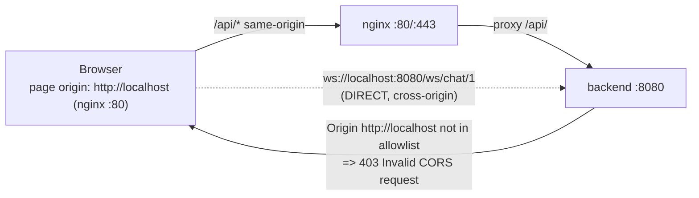

#critical #reliability #architectural #security

## Bug: Employee Chat — WebSocket Handshake Rejected (Invalid CORS) + `/app-settings` 403 Silently Drops Default-Model Preselection

### Summary

During manual testing of the implemented [[Employee-Chat-Interface]] feature, an employee logs in, selects a model, and sends the first message in `/chat`. The UI shows a **"Websocket connection error"** inline bubble and the first chat turn never runs. The browser console shows two failures:

```
Failed to load resource: the server responded with a status of 403 ()   // /api/app-settings
Failed to load resource: the server responded with a status of 403 ()   // WS handshake (no body — handshake rejected)
WebSocket connection to 'ws://localhost:8080/ws/chat/1?token=…' failed:
```

Both are HTTP **403** responses. They are **two distinct root causes** that surface together at send/page-load time:

1. **WebSocket handshake rejected as "Invalid CORS request" (blocks chat — Critical).** `useChatSocket` opens the WebSocket directly to `ws://localhost:8080/...`, which is **cross-origin** to the page serving the SPA. Spring's `WebSocketConfig` allowlist only permits `http://localhost:3000` (the Vite dev server origin). But the SPA is never served from `:3000` in this deployment — the `frontend` container exposes no host port, so the browser only reaches the app through **nginx on port 80/443**, making the page origin `http://localhost` (or `https://localhost`). The browser's `Origin: http://localhost` is not in the allowlist → Spring returns `403 Invalid CORS request` → the WS never opens → `ws.onerror` fires → the error bubble appears.

2. **`/api/app-settings` returns 403 for employees (silently breaks User Story #4).** `useChatSetup` always fetches `GET /app-settings` to read the admin-configured default model. `AppSettingsService.getSettings()` is `@PreAuthorize("hasRole('ADMIN')")`, so any employee call throws `AccessDeniedException` → **403**. The hook degrades gracefully (`settingsResult === "rejected"` → `defaultId = null` → falls back to `selectedModelId = enabledModels[0]?.id ?? null`), so this does **not** block the send. But it silently breaks **US #4** ("the system pre-selects the admin-configured default model") — employees always get the **first** enabled model, never the default the admin saved. The existing `GET /app-settings` cannot simply be opened to employees: `AppSettingsDTO` embeds the admin's `openRouterApiKey` (`AppSettingsDTO.java:15`), which must not leak to employees.

This report resolves **both** with **production-aligned** solutions (route the WebSocket through nginx + derive the WS URL from the page location; add a slim employee-readable default-model endpoint) rather than the minimal/dev allowlist broadening — see **Decisions**.

### Reproduction Conditions

1. As **admin**, configure at least one LLM model (mark it enabled), set an OpenRouter API key, and (optionally) set a **default model** in `/app-settings`. Save.
2. Log in as **employee** (e.g. `flor`, `ROLE_EMPLOYEE`). JWT payload decodes to `"authorities":[{"authority":"ROLE_EMPLOYEE"}]` — role is valid.
3. Open `/chat`. The model selector populates (from `GET /llm-model/enabled`, which works). Note: if a default model was saved, the selector shows the **first** enabled model, **not** the admin default (Finding 2 symptom — subtle; often unnoticed).
4. Type a prompt, pick a model, press **Enter**.
5. **Observed failure (Finding 1):** an inline error bubble "Websocket connection error." appears immediately; no assistant bubble, no streaming. Console shows the `WebSocket connection to 'ws://localhost:8080/ws/chat/1?token=…' failed:` line plus a `403` on the handshake.
6. **Observed (Finding 2, on page load):** `403` on `/api/app-settings` in the console at the moment the chat page mounts. Non-fatal but persistent on every visit.

### Environment / Preconditions

- Stack up via `docker compose up` — backend (`:8080`), nginx (`:80`/`:443`), frontend (Vite `:3000`, **not host-published**), db.
- The browser reaches the SPA **only through nginx** on `http://localhost` (or `https://localhost`). The page origin is therefore `http://localhost` (or `https://localhost`).
- REST API calls work because they use **same-origin** relative URLs (`/api/...`) proxied by nginx — no CORS involved.
- The WebSocket uses a **hardcoded direct** URL `ws://localhost:8080/...` (`useChatSocket.ts:40`), bypassing nginx → cross-origin → Spring runs the WS origin check.

### Real-World Scenarios

- An employee on the deployed stack (nginx-served SPA on `http://localhost` / `https://localhost`) tries to start any conversation → every send fails before the first token. Chat is **completely unusable** in the actual deployment topology. The bug does not reproduce if the developer opens the SPA directly on Vite `:3000` (host-published), which is why it slipped past manual dev testing.
- The same class of failure will occur in any production deployment: the hardcoded `ws://localhost:8080` is dev-machine-specific and will point at nothing in production. A production-aligned URL fixes both the CORS mismatch and the dev-only host/port hardcoding.

### Expected Behavior

- (US #12/#13) When an employee sends the first message, the WebSocket opens, the assistant bubble appears, and chunks stream word-by-word. No "Websocket connection error."
- (US #4) On `/chat` load, the model selector is pre-selected to the admin-configured default model (when one is set and enabled), not the first enabled model.
- The frontend must not hardcode a dev-backend host/port; the WS URL must derive from the page location and be proxied by the gateway, same as REST.

### Actual Behavior

- Finding 1: WS handshake returns `403 Invalid CORS request`; socket never opens; send fails with an inline error bubble.
- Finding 2: `GET /api/app-settings` returns `403` for `ROLE_EMPLOYEE`; `useChatSetup` falls back to the first enabled model; the admin default is never pre-selected. No UI signal of the failure.

### Impact

- Finding 1 (**Critical**): the entire Employee Chat Interface feature is non-functional in the dockerized deployment topology. A whole feature shipped green is unusable by the only role it targets.
- Finding 2 (**Moderate / usability**): silently degrades the default-model preselection UX (US #4). The failure is invisible — there is no console concern in prod and no admin signal — so the gap goes unnoticed and an employee always lands on an arbitrary first model. It also masquerades as a "first-model is always the default" coincidence, making it hard to spot in QA.

---

### Findings

---

#### Finding 1 — WebSocket handshake rejected as "Invalid CORS request" (origin allowlist mismatch)

**Severity:** 🔴 Critical

**Description:**
`useChatSocket` builds the WebSocket URL as `ws://localhost:8080/ws/chat/${conversationId}?token=…` — a **direct, cross-origin** connection to the backend. Spring's `WebSocketConfig.registerWebSocketHandlers(...)` restricts the handler origin allowlist to **only** `http://localhost:3000` (the Vite dev-server origin). In the compose deployment the browser page origin is `http://localhost` (nginx port 80) or `https://localhost` (nginx port 443) — never `:3000`. Spring's `AbstractHandshakeHandler` runs its registered `AbstractCorsAllowlist`/origin check, finds `http://localhost` absent, and rejects the upgrade with `403 Invalid CORS request` (and an empty body). The handshake never reaches `JwtHandshakeInterceptor`'s role check (verified: probing with `Origin: http://localhost:3000` returns `101` and the role check resolves `ROLE_EMPLOYEE` ↔ `UserRoles.EMPLOYEE.getAuthority()` = `ROLE_EMPLOYEE` correctly; probing with `Origin: http://localhost` / `https://localhost` returns `403 Invalid CORS request`).

**Evidence in Code:**
- `project/srcs/frontend/src/features/chat/hooks/useChatSocket.ts:40` — `const url = \`ws://localhost:8080/ws/chat/${target}?token=${token ?? ""}\`` (hardcoded host + port; cross-origin to the nginx-served page).
- `project/srcs/backend/src/main/java/com/BHT/models/chat/WebSocketConfig.java:23-25` — `registry.addHandler(chatWebSocketHandler, "/ws/chat/{conversationId}").addInterceptors(jwtHandshakeInterceptor).setAllowedOrigins("http://localhost:3000");` (only the Vite origin).
- `project/srcs/nginx/conf/nginx.conf` — there is **no** `location /ws/` block. The `/` block (lines 23-34) proxies to the *frontend* (`proxy_pass http://frontend:3000`) and carries Upgrade/Connection headers for HMR, but nothing routes `/ws/...` to the backend. So even if `useChatSocket` used a relative URL it would currently be sent to the frontend container, not the backend.
- `project/docker-compose.yml:68-79` — the `frontend` service defines **no `ports:` mapping**, so the Vite dev server (`:3000`) is unreachable from the host browser; the SPA is reachable only via nginx on `:80`/`:443`. Hence the page origin is never `http://localhost:3000`.
- Runtime evidence: `curl` WS-upgrade probe with `Origin: http://localhost:3000` → `101 Switching Protocols`; with `Origin: http://localhost` → `403` body `Invalid CORS request`; with `Origin: https://localhost` → `403` body `Invalid CORS request`.

**Why It Matters:**
Chat is the employee's primary way to interact with LLMs. A 403 on the very first send makes the whole feature unusable in the real (dockerized) deployment — the only deployment that exists. The bug does not surface when a developer opens Vite directly on `:3000`, so it evaded manual dev testing. It also encodes a dev-machine host/port (`localhost:8080`) that is wrong in production regardless of the origin issue.

**Possible Solutions:**

- **Option A (minimal/dev):** Broaden `WebSocketConfig.setAllowedOrigins(...)` to include `http://localhost`, `https://localhost`, `http://BHT.42.fr`, `https://BHT.42.fr` (and keep `http://localhost:3000`). Leaves the hardcoded `ws://localhost:8080` in the frontend, so it still breaks in any non-dev environment and still hardcodes a host/port.
- **Option B (production-aligned — adopted):** Route the WebSocket **through nginx** (same-origin upgrade) and derive the WS URL from `window.location`:
  1. Add a `location /ws/ { proxy_pass http://backend:8080; ... proxy_http_version 1.1; proxy_set_header Upgrade $http_upgrade; proxy_set_header Connection $connection_upgrade; }` block to `nginx.conf` (mirror the existing HMR `/` block).
  2. Add a Vite `/ws` proxy entry (`target: http://localhost:8080`, `ws: true`) for the rare direct-Vite dev path.
  3. In `useChatSocket` build the URL from the page location: `${location.protocol==='https:'?'wss':'ws'}://${location.host}/ws/chat/${target}?token=…`.
  
  Because the WS then originates from the same host that served the page, the upgrade is same-origin (no cross-origin check), Spring's origin allowlist can be **tightened** (or even reduced to the same set as `corsConfigurationSource`), the hardcoded dev host/port disappears, and HTTPS/WSS works transparently in production.
- **Option C:** Frontend uses a relative `/ws/...` URL with the Vite/nginx proxy only, without `window.location` derivation (e.g., keep building it manually). Fragile — re-introduces the protocol/port mismatch under HTTPS and is more code than Option B.

**Recommended Solution:** Option B — same-origin WebSocket via the gateway, URL derived from the page location. Removes the hardcoded dev host/port, works in production, eliminates the CORS mismatch entirely, and lets the WS origin allowlist be tightened rather than loosened.

**Decision:** **Option B (production-aligned) — accepted (2026-07-01).** Route the WebSocket upgrade through nginx (new `/ws/` location mirroring the existing HMR Upgrade/Connection headers), add a `/ws` Vite proxy for direct-dev parity, and replace the hardcoded `ws://localhost:8080/...` in `useChatSocket` with a page-location-derived URL (`${proto}://${host}/ws/chat/${target}?token=…`). **Rejected Option A:** broaden-the-allowlist is a dev-only band-aid — it leaves the hardcoded `localhost:8080` host/port in the frontend (wrong in any production environment), it is a divergent allowlist from the REST `corsConfigurationSource`, and it ships a security posture that loosens with every new origin rather than converging on same-origin. **Rejected Option C:** relative URL without page-location derivation re-introduces the HTTPS/WSS protocol mismatch and is more code. **Security note:** the allowlist remains **load-bearing** — browsers always send an `Origin` header on a WebSocket upgrade and Spring's `AbstractHandshakeHandler` validates the registered origin allowlist on *every* upgrade, including same-origin upgrades (same-origin routing removes the *cross-origin* mismatch, not the `Origin` check itself). The allowlist must therefore enumerate every deployment origin explicitly; do not use a wildcard such as `http*://localhost*` (it omits the prod `BHT.42.fr` host and over-matches lookalike subdomains). The concrete allowlist is given in the Proposed Fix (an explicit set sourced consistently with the REST `corsConfigurationSource`). JWT still flows via the `?token=` query param and is validated by `JwtHandshakeInterceptor` (role check confirmed correct); because the WS now transits nginx, the `/ws/` location MUST scrub access logging (or move the token to a header) to avoid writing the bearer JWT to nginx access logs — see Potential Risks.

---

#### Finding 2 — `GET /api/app-settings` 403 for employees silently drops the default-model preselection (US #4)

**Severity:** 🟡 Moderate (usability)

**Description:**
`useChatSetup` always calls `getAppSettings()` (`useChatSetup.ts:46`) to read the admin-configured default model and pre-select it (US #4). `AppSettingsController.getSettings()` has **no** `@PreAuthorize` on the controller, but the backing `AppSettingsService.getSettings()` is `@PreAuthorize("hasRole('ADMIN')")` (`AppSettingsService.java:32`). A `ROLE_EMPLOYEE` caller therefore gets `AccessDeniedException` → **403**. The hook handles the rejection gracefully (F1 in the failure path: `defaultId = null` → falls back to `enabledModels[0]?.id ?? null`, `useChatSetup.ts:66-74`), so the chat page does not crash, but the **admin default is never pre-selected** — employees always land on the first enabled model.

The existing endpoint cannot simply be opened to employees: `AppSettingsDTO` embeds the admin's **`openRouterApiKey`** (`AppSettingsDTO.java:15`) — granting employees `GET /app-settings` would leak the raw OpenRouter API key to the lowest-privileged role.

**Evidence in Code:**
- `project/srcs/backend/src/main/java/com/BHT/models/appSettings/AppSettingsService.java:32-34` — `@PreAuthorize("hasRole('ADMIN')")` over `public AppSettingsDTO getSettings()`.
- `project/srcs/backend/src/main/java/com/BHT/models/appSettings/AppSettingsController.java` — `@GetMapping getSettings()` with **no** `@PreAuthorize` (relies on the service gate, which 403s employees).
- `project/srcs/backend/src/main/java/com/BHT/models/appSettings/AppSettingsDTO.java:15` — `private String openRouterApiKey;` (secret — cannot be exposed to employees via the existing DTO).
- `project/srcs/frontend/src/features/chat/hooks/useChatSetup.ts:45-49` — `Promise.allSettled([getEnabledModels(), getAppSettings(), listAgents(...)])`; lines `66-74` — on `settingsResult === "rejected"`, `defaultId = null` → `initialModelId = defaultInEnabled ? defaultId : (models[0]?.id ?? null)` → silently falls back to first model.
- Existing precedent for the correct shape: `LlmModelService.getEnabledModels()` (ungated internal helper) + `LlmModelController.getEnabledModels()` `@PreAuthorize("hasRole('EMPLOYEE")` (`/llm-model/enabled`), and `AppSettingsService.getRawApiKey()` `AppSettingsService.java:71` (public, no `@PreAuthorize`, used by `OpenRouterService`).

**Why It Matters:**
US #4 ("the system pre-selects the admin-configured default model") is silently never honored for employees. The fallback (first enabled model) can be a completely different, more expensive, or less capable model than the admin's chosen default — and no one is the wiser because the failure is invisible (a 403 console line that no one in prod watches). The 403 also fires on every chat-page mount, producing a constant, confusing console error.

**Possible Solutions:**

- **Option A:** Add a new slim employee-readable endpoint `GET /app-settings/default-model` returning **only** the default model's `LlmModelMiniDTO` (`{ id, modelId, name, isEnabled }`) — **no** `openRouterApiKey`, no entity metadata. Backed by a new **ungated** `AppSettingsService.getDefaultModelMini()` (mirrors the `getRawApiKey()` ungated-helper precedent at `AppSettingsService.java:71` and the `getEnabledModels()` ungated-helper precedent). Controller carries `@PreAuthorize("hasRole('EMPLOYEE')")` (mirrors `GET /llm-model/enabled`). `useChatSetup` fetches this instead of the admin endpoint.
- **Option B:** Reuse `LlmModelMiniDTO` directly by annotating the persisted default; have `GET /llm-model/enabled` also indicate which enabled model is the default (`isDefault: true` on one item). Combines two concerns into one endpoint and bloats `EnabledModelDTO`, but saves a round-trip.
- **Option C:** Open `GET /app-settings` to employees with a separate employee-safe DTO that omits `openRouterApiKey`. Requires a second DTO/mapper path for the same entity; more surface area than Option A.

**Recommended Solution:** Option A — follow the established `getEnabledModels()` / `getRawApiKey()` precedent: an employee-gated controller endpoint over an **ungated** service helper returning the smallest safe payload. Minimal new code, no secret leak, fixes US #4 directly.

**Decision:** **Option A (production-aligned) — accepted (2026-07-01).** Add `GET /app-settings/default-model` (controller `@PreAuthorize("hasRole('EMPLOYEE')")`) backed by a new `AppSettingsService.getDefaultModelMini()` with **no** `@PreAuthorize` (internal helper; controller owns the access gate; javadoc warns against adding `@PreAuthorize`, mirroring `getRawApiKey()` and the `getEnabledModels()` guard). Returns `LlmModelMiniDTO` (`{ id, modelId, name, isEnabled }`) — the same compact DTO already used by `GET /llm-model/enabled` and `AppSettingsDTO.defaultModel`, so **no new DTO, no new mapper method, no new entity**. `useChatSetup` swaps its `getAppSettings()` call for `getDefaultModel()`; the preselection resolution stays `defaultModel?.id` guarded by `enabledModels.some(m => m.id === defaultId)` (the `useChatSetup` id-guard already exists at lines 71-74). **Rejected Option B:** folding `isDefault` into `EnabledModelDTO` couples two concerns (catalog membership vs. app-configured default) into one endpoint and grows a payload shared by a different consumer (`ChatEmptyState` model selector) — diverges from the small-DTO-per-concern precedent established by `LlmModelMiniDTO`. **Rejected Option C:** a second AppSettings DTO/mapper for a single field is more surface area than one endpoint + one service method, and risks future drift between the admin and employee DTOs. **Result:** the 403 on `/app-settings` disappears for employees, and US #4 is honored.

---

### Findings Summary Table

| # | Title | Severity | Status |
|---|-------|----------|--------|
| 1 | WebSocket handshake rejected as "Invalid CORS request" (origin allowlist mismatch) | 🔴 Critical | To-do |
| 2 | `GET /api/app-settings` 403 for employees silently drops default-model preselection (US #4) | 🟡 Moderate | To-do |

---

### Root Cause Analysis

**Finding 1 (WebSocket 403).** Two compounding design choices fight each other: the frontend hardcodes a **direct** backend address (`ws://localhost:8080`), while the backend's WS allowlist trusts only the **Vite** origin (`http://localhost:3000`). The deployment never lets those two origins coincide: the frontend container is not host-published (`docker-compose.yml`), so the browser only ever sees the SPA through nginx on `http://localhost`/`https://localhost`. The direct WS URL is therefore cross-origin to the page, and the page's origin is absent from the allowlist → Spring returns `403 Invalid CORS request`. The role check (`ROLE_EMPLOYEE` ↔ `UserRoles.EMPLOYEE.getAuthority()`) is correct and would pass — but it is never reached because the *origin* check runs first and rejects the upgrade.

Flow of the failure:



The minimal fix (broaden the allowlist) keeps a hardcoded dev host/port in the client — wrong in production. The production-aligned fix makes the WS **same-origin** (via nginx `/ws/` + a page-location-derived URL), which removes the cross-origin path entirely so the allowlist is no longer the gate; simultaneously removes the hardcoded `localhost:8080`.

**Finding 2 (`/app-settings` 403).** `useChatSetup` reads the default model from the admin-only `GET /app-settings`. The endpoint is admin-only for good reason — `AppSettingsDTO.openRouterApiKey` must not leak to employees — but no employee-readable view of **just the default model** exists, so the chat page hits a guaranteed 403. The hook's `Promise.allSettled` rejection path silently swallows it and falls back to first-enabled-model, masking the failure. The fix is a slim employee endpoint returning only `LlmModelMiniDTO`, following the `getEnabledModels()` precedent so US #4 is honored without any secret exposure.

### Evidence in Code
- `project/srcs/frontend/src/features/chat/hooks/useChatSocket.ts:40` — hardcoded `ws://localhost:8080/ws/chat/${target}?token=${token ?? ""}`.
- `project/srcs/backend/src/main/java/com/BHT/models/chat/WebSocketConfig.java:23-25` — handler + interceptor + `.setAllowedOrigins("http://localhost:3000")`.
- `project/srcs/backend/src/main/java/com/BHT/models/chat/JwtHandshakeInterceptor.java:44-56` — role check `UserRoles.EMPLOYEE.getAuthority()` (`ROLE_EMPLOYEE`), confirmed correct; cited to show the rejection is pre-role-check (origin).
- `project/srcs/nginx/conf/nginx.conf` — no `/ws/` location block; `/` proxies to `frontend:3000`; existing HMR Upgrade/Connection headers at lines 30-33 are the template to mirror.
- `project/docker-compose.yml:68-79` — `frontend` has no `ports:` mapping → unreachable on `:3000` from the host → page origin is the nginx origin.
- `project/srcs/backend/src/main/java/com/BHT/models/appSettings/AppSettingsService.java:32-34` — `@PreAuthorize("hasRole('ADMIN')")` over `getSettings()`.
- `project/srcs/backend/src/main/java/com/BHT/models/appSettings/AppSettingsController.java` — `@GetMapping getSettings()` with no method-level auth.
- `project/srcs/backend/src/main/java/com/BHT/models/appSettings/AppSettingsDTO.java:15` — secret `openRouterApiKey` carrying field — why the endpoint can't be opened to employees.
- `project/srcs/backend/src/main/java/com/BHT/models/appSettings/AppSettingsService.java:71` — `getRawApiKey()` ungated-helper precedent.
- `project/srcs/backend/src/main/java/com/BHT/models/llm/LlmModelController.java` — `getEnabledModels()` `@PreAuthorize("hasRole('EMPLOYEE')")` precedent for an employee-gated, ungated-service-backed read endpoint.
- `project/srcs/frontend/src/features/chat/hooks/useChatSetup.ts:45-49` — `getAppSettings()` always called; `66-74` — graceful rejection fallback to first model.
- `project/srcs/frontend/vite.config.ts` — existing `/api` proxy; the production-aligned fix adds a `/ws` proxy alongside it.

### Affected Systems / Modules

- [[Employee-Chat-Interface]] — the implemented feature this bug blocks (Finding 1) and partially breaks (Finding 2 / US #4).
- [[Docs/API-Reference/WebSocket-Chat]] — the WS protocol the frontend implements; the routing/origin constraint documented there must be updated to reflect same-origin routing through nginx.
- [[Docs/API-Reference/AppSettings]] — a new `GET /app-settings/default-model` endpoint is added (Finding 2).
- [[App-Settings-Default-Model-Not-Restored-Id-Drift]] — distinct but related admin-side default-model bug; this report's Finding 2 concerns the **employee** default-model preselection path (new endpoint), not the admin id-drift resolution. Kept separate to avoid conflating two independent consumers of the default model.
- `project/srcs/frontend/vite.config.ts` — new `/ws` proxy entry.

### Investigation Scope
- **Code reviewed:** `WebSocketConfig.java`, `JwtHandshakeInterceptor.java`, `ChatWebSocketHandler.java`, `SecurityConfig.java`, `AppSettingsService.java`, `AppSettingsController.java`, `AppSettingsDTO.java`, `LlmModelController.java` (precedent), `useChatSocket.ts`, `useChatSetup.ts`, `vite.config.ts`, `nginx.conf`, `docker-compose.yml`.
- **Logs reviewed:** the user-provided browser console excerpt (the `403` on `/api/app-settings`, the `403` on the WS handshake, and the `WebSocket connection … failed:` line).
- **Runtime evidence:** reproduced by probing the WS handshake endpoint directly with three different `Origin` headers (`http://localhost:3000` → `101`; `http://localhost` → `403 Invalid CORS request`; `https://localhost` → `403 Invalid CORS request`), confirming the rejection is the origin allowlist, not the JWT/role. JWT payload decoded to confirm `ROLE_EMPLOYEE` is present and matches `UserRoles.EMPLOYEE.getAuthority()`.

### Confidence Level
**Confirmed (both findings).** Origin-allowlist rejection is demonstrated by direct runtime probing with the user's exact JWT (HTTP status body `Invalid CORS request` on the non-`:3000` origins; `101` on `:3000`). The `getSettings()` 403 is confirmed by reading the `@PreAuthorize` annotation and the employee role in the decoded JWT; the graceful-fallback behavior is confirmed by reading `useChatSetup.ts`. No inference required.

---

## Supporting Evidence

### WS handshake probe results (same JWT as the user's error)

| `Origin` header (browser page origin) | HTTP result | Body |
|---|---|---|
| `http://localhost:3000` (Vite direct) | `101 Switching Protocols` | *(handshake completes)* |
| `http://localhost` (nginx :80 — actual deployment) | `403` | `Invalid CORS request` |
| `https://localhost` (nginx :443) | `403` | `Invalid CORS request` |

The token and the `ROLE_EMPLOYEE` role check in `JwtHandshakeInterceptor` are valid — `:3000` returns `101`. The `403` is purely the **origin allowlist**, which runs before the role check.

### Decoded JWT payload (from the user's error URL)
```json
{"iss":"UpEmpresa","sub":"UP_TK","id":2,"username":"flor",
 "authorities":[{"authority":"ROLE_EMPLOYEE"}],"iat":1782866614,"exp":1782953014}
```
`UserRoles.EMPLOYEE.getAuthority()` returns `"ROLE_EMPLOYEE"` (`UserRoles.java:8-10`) — matches the claim. The role gate passes; the rejection is not the role.

### Deployment topology
- `frontend` container exposes **no host port** (`docker-compose.yml`); Vite `:3000` is only on the internal `BHT` network.
- The browser reaches the SPA only via nginx `:80`/`:443` → page origin is `http://localhost`/`https://localhost`, never `http://localhost:3000`.
- REST calls work because they are same-origin relative URLs (`/api/...`) proxied by nginx; the WS works only if it is made same-origin too (the Option B fix).

---

## Solution Direction

### Proposed Fix (production-aligned — both findings)

**Finding 1 — same-origin WebSocket via the gateway:**

1. `project/srcs/nginx/conf/nginx.conf` — add a WebSocket reverse-proxy location (mirror the existing HMR Upgrade/Connection headers at lines 30-33):
```nginx
# 4. BACKEND WebSocket: reverse-proxy the chat WS upgrade to Spring Boot.
#    The /ws/ URL carries the JWT in ?token= — suppress access logging here so the
#    bearer token is not written to nginx access logs (default log format records $request
#    including the query string). Alternatively, move the token to a header (see Potential Risks).
location /ws/ {
    access_log off;                 # do NOT log the ?token= query string
    proxy_pass http://backend:8080;
    proxy_set_header Host $host;
    proxy_set_header X-Real-IP $remote_addr;
    proxy_set_header X-Forwarded-For $proxy_add_x_forwarded_for;

    proxy_http_version 1.1;
    proxy_set_header Upgrade $http_upgrade;
    proxy_set_header Connection $connection_upgrade;
    proxy_cache_bypass $http_upgrade;

    # Right-sized for streaming turns (idle gaps inside a turn are seconds, not minutes).
    # 300s tolerates a slow first token; nginx resets the read timer on each upstream chunk.
    proxy_read_timeout 300s;
    proxy_send_timeout 300s;
}
```
Also define a `limit_conn` zone (in the `http {}` block) to bound concurrent upgraded sockets per client and prevent worker-connection exhaustion under many employees / stale abandoned tabs:
```nginx
limit_conn_zone $binary_remote_addr zone=ws_per_ip:10m;
# then inside location /ws/:  limit_conn ws_per_ip 20;
```
2. `project/srcs/frontend/vite.config.ts` — add a `/ws` proxy for direct-dev parity (dev where the SPA is opened on Vite `:3000`):
```ts
server: {
  proxy: {
    "/api": { /* unchanged */ },
    "/ws": {
      target: "ws://localhost:8080",
      ws: true,
      changeOrigin: true,
    },
  },
}
```
3. `project/srcs/frontend/src/features/chat/hooks/useChatSocket.ts:40` — derive the URL from the page location; drop the hardcoded host/port:
```ts
const proto = window.location.protocol === "https:" ? "wss:" : "ws:"
const url = `${proto}//${window.location.host}/ws/chat/${target}?token=${token ?? ""}`
```
4. `project/srcs/backend/.../WebSocketConfig.java:25` — the origin allowlist is **load-bearing** (browsers send `Origin` on every WS upgrade and Spring validates it even for same-origin upgrades), so it must enumerate every deployment origin explicitly. Use `setAllowedOrigins(...)` (exact-match, anchored — avoids the over-broad match and the prod-host-omission of a `localhost*` wildcard):
```java
.setAllowedOrigins(
    "http://localhost:3000",   // Vite dev server (direct)
    "http://localhost",        // nginx HTTP  (server_name includes localhost + BHT.42.fr)
    "https://localhost",       // nginx HTTPS
    "http://BHT.42.fr",        // prod host
    "https://BHT.42.fr"        // prod host (HTTPS)
);
```
Do **not** use `setAllowedOriginPatterns("http*://localhost*")` — it omits the prod `BHT.42.fr` origin (same-origin upgrades scoped to that host would 403) and the trailing `localhost*` over-matches lookalike subdomains. Same-origin routing removes the cross-origin mismatch; the allowlist remains the gate. Ideally source this list from the same configuration as the REST `corsConfigurationSource` to keep REST and WS origin policies identical.

**Finding 2 — slim employee-readable default-model endpoint:**

1. `project/srcs/backend/.../AppSettingsService.java` — add an **ungated** helper (precedent: `getRawApiKey()` at line 71) with a javadoc warning mirroring the `getEnabledModels()` guard. The existing service reads the singleton via `appSettingsRepository.findFirstBy()` (the established loader used by `getSettings()`/`getRawApiKey()` — `AppSettingsEntity` has **no** `SINGLETON_ID` constant), and the `LlmModelEntity -> LlmModelMiniDTO` conversion is owned by `LlmModelMapper::toSmallDTO` (a standalone `@Component` not currently injected into `AppSettingsService`) — inject it and call it directly so **no new DTO/mapper method** is introduced:
```java
/**
 * Intentionally ungated — the controller at /app-settings/default-model enforces ROLE_EMPLOYEE.
 * Adding @PreAuthorize here will 403 employees. See getRawApiKey() and LlmModelService.getEnabledModels()
 * for the same convention.
 *
 * Returns null when no app_settings row exists yet (fresh deploy, before any admin save) OR when no
 * default model is configured — the frontend treats null as "no default" (falls back to first enabled
 * model). Do NOT throw here: throwing would 500 the employee chat page on a fresh deploy.
 */
@Transactional(readOnly = true)
public LlmModelMiniDTO getDefaultModelMini() {
    return appSettingsRepository.findFirstBy()
            .map(AppSettingsEntity::getDefaultModel)
            .map(llmModelMapper::toSmallDTO)   // reuse the existing canonical mini-DTO mapper
            .orElse(null);                      // no settings row → null (no default)
}
```
   Inject `LlmModelMapper` into `AppSettingsService` alongside the existing `AppSettingsMapper`/`AppSettingsRepository`. **Consolidation note:** the mini-DTO conversion is currently duplicated between `LlmModelMapper.toSmallDTO` and the private `AppSettingsMapper.toLlmMiniDTO`; this fix delegates to the canonical `LlmModelMapper::toSmallDTO` (consider retiring the private copy in a follow-up to eliminate the drift risk).
2. `project/srcs/backend/.../AppSettingsController.java` — add the employee-gated endpoint. `getDefaultModelMini()` returns `null` on a fresh deploy (no settings row) or when no default is set; surface that as `204 No Content` so the client gets a clean "no default" signal rather than a 200-with-null-body ambiguity:
```java
@GetMapping("/default-model")
@PreAuthorize("hasRole('EMPLOYEE')")
public ResponseEntity<LlmModelMiniDTO> getDefaultModel() {
    LlmModelMiniDTO mini = appSettingsService.getDefaultModelMini();
    return mini == null ? ResponseEntity.noContent().build() : ResponseEntity.ok(mini);
}
```
3. `project/srcs/frontend/src/features/chat/services/chatService.ts` — add `getDefaultModel(): Promise<LlmModelMiniDTO | null>` (`GET /app-settings/default-model`).
4. `project/srcs/frontend/src/features/chat/hooks/useChatSetup.ts:46` — replace `getAppSettings()` with `getDefaultModel()` and resolve `defaultId = result?.id ?? null` (the `enabledModels.some(m => m.id === defaultId)` guard at lines 71-74 already exists and stays).
5. Optional: drop the now-unused `getAppSettings` import from `useChatSetup` if no other consumer remains.

### Why These Fixes Are Correct
- **F1:** Same-origin upgrade through nginx means the `Origin` the browser sends on the upgrade equals one of the deployment origins the backend already explicitly allows (the page origin) — so the WS origin allowlist check passes, where before it received a cross-origin `http://localhost` that was absent from the (Vite-only) allowlist. (The browser still sends `Origin` and Spring still validates it on every upgrade, including same-origin — same-origin routing removes the cross-origin mismatch, not the `Origin` check. The allowlist must therefore enumerate the production hosts — done in Proposed Fix step 4.) The hardcoded `ws://localhost:8080` (dev-only, wrong in prod) is replaced by a page-location-derived URL that is correct in both dev (Vite proxy) and prod (nginx). `wss://` is used automatically under HTTPS. `JwtHandshakeInterceptor` (token + role) keeps working unchanged, since the `?token=` query param is preserved and the role check is independent of origin. Because the WS now transits nginx, the `/ws/` location suppresses access logging so the `?token=` JWT is not written to access logs.
- **F2:** A dedicated `GET /app-settings/default-model` returns exactly the one field employees need (`LlmModelMiniDTO`), with **no** `openRouterApiKey` leak — mirroring the successful `GET /llm-model/enabled` precedent. It reads the singleton via the established `findFirstBy()` (no invented `SINGLETON_ID`), delegates `LlmModelEntity -> LlmModelMiniDTO` to the canonical `LlmModelMapper::toSmallDTO` (no new mapper method), and returns `null` → `204` on a fresh deploy (no `app_settings` row yet) or when no default is set — so the employee chat page never 500s before the admin configures anything. `useChatSetup`'s existing id-guard keeps the same-authored behavior (a disabled/stale default still falls back to the first enabled model), so the only behavior change is that a *valid, enabled* admin default is now pre-selected — US #4 restored.
- Both fixes follow existing project precedents (`getEnabledModels`, `getRawApiKey`, nginx HMR Upgrade headers, Vite `/api` proxy), so they introduce no new pattern.

### Files to Modify or Create
- `project/srcs/nginx/conf/nginx.conf` — add `/ws/` location block.
- `project/srcs/frontend/vite.config.ts` — add `/ws` proxy entry.
- `project/srcs/frontend/src/features/chat/hooks/useChatSocket.ts` — page-location-derived WS URL (line 40).
- `project/srcs/backend/src/main/java/com/BHT/models/chat/WebSocketConfig.java` — make the origin allowlist explicit and load-bearing (enumetate prod hosts; no wildcard).
- `project/srcs/backend/src/main/java/com/BHT/models/appSettings/AppSettingsService.java` — add ungated `getDefaultModelMini()`.
- `project/srcs/backend/src/main/java/com/BHT/models/appSettings/AppSettingsController.java` — add `GET /default-model` (`EMPLOYEE`-gated).
- `project/srcs/frontend/src/features/chat/services/chatService.ts` — add `getDefaultModel()`.
- `project/srcs/frontend/src/features/chat/hooks/useChatSetup.ts` — call `getDefaultModel()` instead of `getAppSettings()`.
- `documentation/Docs/API-Reference/WebSocket-Chat.md` — update the dev-topology note ("WebSocket is now same-origin via nginx; no hardcoded backend port").
- `documentation/Docs/API-Reference/AppSettings.md` — document `GET /app-settings/default-model`.
- `documentation/Memory/known-issues.md` — replace the "WebSocket is not proxied by Vite / hardcoded `ws://localhost:8080`" note with the new same-origin invariant.
- (Tests) `LlmModelControllerTest`-style `@SpringBootTest` security test for `GET /app-settings/default-model` (employee 200 / admin 403 / anon 401); `useChatSetup` unit test asserting an enabled admin default is pre-selected when the new endpoint returns it; `useChatSocket` unit test asserting the URL derives from `window.location` (stub `window.location`/Vite env).

### Validation Strategy After Fix

#### Automatic Validation
- [ ] Backend: `mvn -pl srcs/backend test` — new `AppSettingsControllerTest` (or `AppSettingsDefaultModelTest`) covers employee 200 (returns the default mini DTO when one is set; `null`/204 when none), admin 403, anonymous 401; asserts `openRouterApiKey` is **not** present in the response body.
- [ ] Frontend: `npm run test -- --run` — `useChatSocket` URL-derivation test (asserts `${proto}//${host}/ws/chat/...`; `wss:` under `https:`); `useChatSetup` test asserting default model preselection succeeds for an employee (mock `getDefaultModel` → `selectedModelId === defaultId`).
- [ ] `npm run typecheck` and `npm run build` — no TS errors in modified chat files.
- [ ] Backend security regression: existing `LlmModelControllerTest` / chat WS tests still green.

#### Manual Validation
- [ ] Stack up via `docker compose up`. Log in as employee, open `/chat` (page origin `http://localhost`). Confirm **no** `403` on `/api/app-settings` in the console and **no** WS error.
- [ ] (US #4) As admin, set a default model in `/app-settings`, save. Log in as employee, open `/chat`, confirm the model selector pre-selects the **admin default**, not the first enabled model.
- [ ] Send a message; confirm the assistant bubble appears and streams word-by-word (no "Websocket connection error").
- [ ] Under HTTPS (nginx `:443`), confirm the WS uses `wss://` and the handshake succeeds (`101` in the network tab).
- [ ] Open `/chat/:conversationId` directly / refresh mid-turn — confirm history restores and no WS cross-origin rejection.

**Rule:** Prefer automatic validation when possible. Manual steps are documented here for the user; do not execute them on the user's behalf.

### Potential Risks / Notes
- `proxy_read_timeout` on the nginx `/ws/` block must be long enough for the first token of a slow model but short enough to reclaim idle/abandoned sockets. Right-sized to **300s** (nginx resets the read timer on every upstream chunk, so an active stream is never idle for long); the previous draft's 3600s let abandoned tabs pin a worker connection for an hour. Pair with `proxy_send_timeout 300s` and a `limit_conn` zone to bound concurrent upgraded sockets per client.
- **JWT in URL through nginx:** the WS handshake carries the bearer token as `?token=`. nginx access logs record `$request` (including the query string) by default, so routing the WS through the gateway writes the JWT to access logs unless the `/ws/` location sets `access_log off;` (done in Proposed Fix step 1). A stronger long-term fix is to move the token out of the URL — extend `JwtHandshakeInterceptor` to read it from an `Authorization` header or the `Sec-WebSocket-Protocol` frame — but `access_log off;` closes the immediate log-exposure gap for this fix. Note: server/app logs that already capture the URL (e.g. an edge relay upstream of nginx) should be reviewed too.
- The `/ws` Vite proxy with `ws: true` is only needed for the rare direct-Vite dev path; in the compose deployment nginx does the proxying. Keep both for parity but the production path is nginx.
- `appSettingsRepository` read in `getDefaultModelMini()` must avoid the admin-gated `getSettings()` service method (else the gate still 403s employees). Read the entity directly via `findFirstBy()` — the established loader used by `getRawApiKey()` at line 71. Do **not** use a `SINGLETON_ID` (no such constant exists on `AppSettingsEntity`, whose id is `@GeneratedValue(IDENTITY)`).
- Reuse `LlmModelMiniDTO` (no new DTO) to stay consistent with `GET /llm-model/enabled` and `AppSettingsDTO.defaultModel`. Do **not** return `AppSettingsDTO` (would leak `openRouterApiKey`). Delegate `LlmModelEntity -> LlmModelMiniDTO` to the canonical `LlmModelMapper::toSmallDTO` (inject it into `AppSettingsService`) rather than a `toDefaultMiniDTO` method — no invented mapper method.
- The WS origin allowlist is **load-bearing** (not merely defense-in-depth): Spring checks `Origin` on every upgrade, including same-origin. Be careful not to *loosen* CORS for REST by accident — `SecurityConfig.corsConfigurationSource()` already allows `http://localhost:3000` for REST; the WS allowlist should be an explicit set (Proposed Fix step 4, including the prod `BHT.42.fr` origins) and ideally sourced from the same config as REST.
- `LlmModelMiniDTO` returned as `null` when no default is set (or no settings row exists yet) — `useChatSetup`'s existing `defaultId = result?.id ?? null` handles `null`; return **`204 No Content`** (not 200-with-null) and document the contract, so the client gets an unambiguous "no default" signal.

---

## Resolution Steps

### Phase 1: Route the WebSocket through the gateway (Finding 1 — core fix)
- [x] **Step 1.1:** Add the `/ws/` location block to `nginx.conf` (mirror existing HMR Upgrade/Connection headers; `access_log off;` to avoid logging the `?token=` JWT; `proxy_read_timeout 300s` + `proxy_send_timeout 300s`; define a `limit_conn` zone and apply it to the location).
- [x] **Step 1.2:** Add the `/ws` proxy entry to `vite.config.ts` (`target: ws://localhost:8080`, `ws: true`).
- [x] **Step 1.3:** Replace the hardcoded `ws://localhost:8080/...` URL in `useChatSocket.ts:40` with the page-location-derived URL (`${proto}//${host}/ws/chat/${target}?token=…`).
- [x] **Step 1.4:** Make the WS origin allowlist explicit (load-bearing — Spring checks `Origin` on every upgrade): `setAllowedOrigins("http://localhost:3000", "http://localhost", "https://localhost", "http://BHT.42.fr", "https://BHT.42.fr")`. Do **not** use `setAllowedOriginPatterns("http*://localhost*")` (omits prod host, over-matches).

### Phase 2: Employee-readable default model (Finding 2 — core fix)
- [x] **Step 2.1:** Add ungated `AppSettingsService.getDefaultModelMini()` returning `LlmModelMiniDTO` (read the entity directly; javadoc warning against re-adding `@PreAuthorize`).
- [x] **Step 2.2:** Add `@GetMapping("/default-model") @PreAuthorize("hasRole('EMPLOYEE')")` to `AppSettingsController`.
- [x] **Step 2.3:** Add `getDefaultModel(): Promise<LlmModelMiniDTO | null>` to `chatService.ts`.
- [x] **Step 2.4:** Swap `getAppSettings()` → `getDefaultModel()` in `useChatSetup.ts`; keep the existing `enabledModels.some(m => m.id === defaultId)` id-guard.

### Phase 3: Tests
- [x] **Step 3.1:** Backend security test for `GET /app-settings/default-model` (employee 200 with the mini DTO and **no** `openRouterApiKey`; admin 403; anonymous 401).
- [x] **Step 3.2:** `useChatSocket` URL-derivation test (asserts `${proto}//${host}/ws/chat/...`; `wss:` under `https:`).
- [x] **Step 3.3:** `useChatSetup` default-preselection test (mock `getDefaultModel` returns a mini DTO whose `id` is in `enabledModels` → asserts `selectedModelId === defaultId`).

---

## Task Breakdown

### Task 1: Same-origin WebSocket routing (nginx + Vite proxy + page-location URL)
- **Steps Covered:** Steps 1.1, 1.2, 1.3, 1.4
- **Reason for Grouping:** The four edits must land together to avoid a window where the WS is neither cross-origin-allowed nor yet same-origin (which would break all chat sends). Cuts across nginx, Vite, frontend hook, and backend allowlist — a single cohesive routing change.
- **Planned Task File:** `Employee-Chat-WebSocket-Origin-Rejected-AppSettings-403-task-1-same-origin-ws-routing.md`
- **Task Document Link:** [[Employee-Chat-WebSocket-Origin-Rejected-AppSettings-403-task-1-same-origin-ws-routing]]

### Task 2: Employee-readable default-model endpoint
- **Steps Covered:** Steps 2.1, 2.2, 2.3, 2.4
- **Reason for Grouping:** Adds one backend endpoint + one service method + one frontend service + one hook swap; they share the `LlmModelMiniDTO` contract and must land together to connect the new endpoint to the consumer. Cohesive, low-complexity, mirrors the proven `GET /llm-model/enabled` pattern.
- **Planned Task File:** `Employee-Chat-WebSocket-Origin-Rejected-AppSettings-403-task-2-employee-default-model-endpoint.md`
- **Task Document Link:** [[Employee-Chat-WebSocket-Origin-Rejected-AppSettings-403-task-2-employee-default-model-endpoint]]

### Task 3: Tests
- **Steps Covered:** Steps 3.1, 3.2, 3.3
- **Reason for Grouping:** TDD coverage for the two fixes (endpoint security + WS URL derivation + default preselection); closely related test cases. Medium complexity.
- **Planned Task File:** `Employee-Chat-WebSocket-Origin-Rejected-AppSettings-403-task-3-tests.md`
- **Task Document Link:** [[Employee-Chat-WebSocket-Origin-Rejected-AppSettings-403-task-3-tests]]

---

## Expected Outcome After Fix
- An employee sending a message sees the assistant bubble stream word-by-word — no "Websocket connection error" — in the actual compose deployment (nginx-served SPA on `http://localhost`/`https://localhost`).
- No `403` on `/api/app-settings` in the employee console; US #4 holds — the model selector pre-selects the admin-configured default (when set and enabled).
- The frontend no longer hardcodes `ws://localhost:8080`; the WS URL is derived from the page location and proxied by nginx, so HTTPS/WSS and production hosts work transparently.
- The admin's OpenRouter API key never reaches employees (the new endpoint returns only `LlmModelMiniDTO`).
- Backend security regression suite stays green; new security/endpoint unit tests cover the employee default-model read.