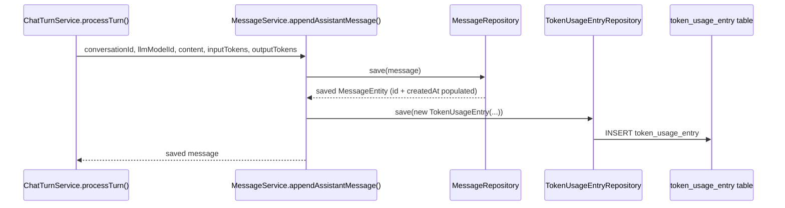

# TokenUsage Dashboard integration

#integration #backend #frontend #security #performance #architectural

## Purpose

End-to-end explanation of the **Token Usage Dashboard**: how LLM token consumption is captured, stored, aggregated, and visualized for administrators. It covers the backend ledger in `com.BHT.models.metrics`, the write integration inside `MessageService.appendAssistantMessage`, the dialect-safe aggregation query, and the feature-based React frontend.

---

## 1. Why it exists

### Original requirement

Administrators had no visibility into platform-wide LLM token consumption. Token counts existed per message, but they were not aggregated over time, so admins could not spot usage spikes, plan capacity, or audit trends.

The feature adds an **admin-only dashboard** that returns `{ timestamp, totalTokens }` points aggregated by a configurable interval (`hour` or `minute`).

### Key constraint that drove the design

Token-consumption history must **survive deletion of the underlying `MessageEntity` / `ConversationEntity`**. If the dashboard read directly from the message table, deleting a conversation would silently erase the corresponding usage data.

The solution is an **independent, append-only ledger** (`TokenUsageEntry`) that is written once per assistant message and has no foreign-key cascade to `Conversation` or `Message`.

---

## 2. Architecture overview

### Independent ledger

`TokenUsageEntry` is a separate JPA entity mapped to `token_usage_entry`. It stores:

- `employeeId` — who owns the conversation that produced the tokens.
- `inputTokens` / `outputTokens` — non-null counts copied from the assistant message.
- `createdAt` — the timestamp of the source message (used for aggregation).
- `sourceMessageId` — optional reference for debugging; intentionally not a FK.

The table has a single index on `created_at` (`srcs/backend/src/main/java/com/BHT/models/metrics/TokenUsageEntry.java:18`). There is no soft-delete column, no FK to `message`, and no cascade. Deleting a message or conversation leaves the ledger row intact.

### Why it is decoupled from `MessageEntity`

| Approach | Problem |
|----------|---------|
| Read directly from `MessageEntity` | Deleting the conversation/message removes the usage data. |
| Soft-delete (`deletedAt`) on `MessageEntity` | Pollutes the primary messaging table, complicates every query, and still ties analytics to an active entity lifecycle. |
| Append-only `TokenUsageEntry` ledger | Keeps analytics data independent, immutable, and cheap to aggregate. |

### Data flow



After the insert, the row is available to the aggregation endpoint.

---

## 3. Backend walkthrough

All backend classes live in `com.BHT.models.metrics` (`srcs/backend/src/main/java/com/BHT/models/metrics/`).

### `TokenUsageEntry.java`

**Type:** Entity  
**Responsibility:** The append-only ledger row.

- `employeeId`, `inputTokens`, `outputTokens`, and `createdAt` are non-nullable.
- `sourceMessageId` is nullable and intentionally **not** a JPA relationship (`srcs/backend/src/main/java/com/BHT/models/metrics/TokenUsageEntry.java:39`).
- The only index is `idx_token_usage_created_at` on `created_at` to speed up time-range scans.

### `TokenUsageEntryRepository.java`

**Type:** Spring Data JPA repository  
**Responsibility:** Write-side persistence for the ledger.

```java
public interface TokenUsageEntryRepository extends JpaRepository<TokenUsageEntry, Long> {}
```

It is injected into `MessageService` and used only for the single `save(...)` call after an assistant message is persisted.

### `TokenUsagePoint.java`

**Type:** Record / DTO  
**Responsibility:** Carry one aggregated bucket from the repository to the controller response.

```java
public record TokenUsagePoint(LocalDateTime timestamp, Long totalTokens) {}
```

Both production and test repositories construct this record.

### `TokenUsageRepository.java`

**Type:** Interface contract  
**Responsibility:** Define the read-side aggregation API without prescribing SQL dialect.

```java
List<TokenUsagePoint> aggregateTokenUsage(LocalDateTime from, LocalDateTime to, String interval);
```

Two profile-scoped implementations exist:

- `TokenUsageRepositoryProduction` — active on the default profile (`!test`).
- `TokenUsageRepositoryTest` — active on the `test` profile.

### `TokenUsageRepositoryProduction.java`

**Type:** Repository implementation  
**Responsibility:** Aggregate with PostgreSQL `DATE_TRUNC` via JPQL.

- Uses `EntityManager` to build the query dynamically.
- Normalizes `interval` to a whitelisted literal (`"minute"` or `"hour"`) before string formatting.
- Sums `inputTokens + outputTokens` with `COALESCE(..., 0L)` defense in depth.
- Groups and orders by the truncated timestamp.

See `srcs/backend/src/main/java/com/BHT/models/metrics/TokenUsageRepositoryProduction.java:20`.

### `TokenUsageRepositoryTest.java`

**Type:** Repository implementation  
**Responsibility:** Provide an H2-compatible aggregation path for tests.

- Active only with `@Profile("test")` (`srcs/backend/src/main/java/com/BHT/models/metrics/TokenUsageRepositoryTest.java:15`).
- Uses a native query with H2 functions `FORMATDATETIME` and `PARSEDATETIME` to emulate `DATE_TRUNC`.
- Maps `Object[]` rows to `TokenUsagePoint` manually.

This avoids changing the global H2 mode or polluting the production JPQL with dialect branches.

### `TokenUsageService.java`

**Type:** Service  
**Responsibility:** Input validation, interval normalization, and authorization.

- Validates that `from` and `to` are present and that `from` is not after `to` (`srcs/backend/src/main/java/com/BHT/models/metrics/TokenUsageService.java:30`).
- Normalizes the interval to `"hour"` or `"minute"`, rejecting anything else.
- Delegates aggregation to the injected `TokenUsageRepository`.
- Annotated `@Transactional(readOnly = true)` at class level.

### `TokenUsageController.java`

**Type:** REST controller  
**Responsibility:** HTTP facade for `GET /admin/token-usage`.

- Path: `/admin/token-usage` (`srcs/backend/src/main/java/com/BHT/models/metrics/TokenUsageController.java:14`).
- Query params: `from`, `to`, `interval` (default `"hour"`).
- Uses `@DateTimeFormat(iso = ISO.DATE_TIME)` for ISO-8601 `LocalDateTime` parsing.
- Delegates to `TokenUsageService`.

### Integration point: `MessageService.appendAssistantMessage`

The only modification to existing production code is in `srcs/backend/src/main/java/com/BHT/models/message/MessageService.java:109`.

```java
MessageEntity saved = messageRepository.save(message);
conversation.setUpdatedAt(LocalDateTime.now());
conversationRepository.save(conversation);

tokenUsageEntryRepository.save(
    new TokenUsageEntry(
        null,
        conversation.getEmployee().getId(),
        (long) inputTokens,
        (long) outputTokens,
        saved.getCreatedAt(),
        saved.getId()
    )
);
```

**Why the ledger write happens after `messageRepository.save(message)`:**

- `saved.getId()` must be populated before it can be stored in `sourceMessageId`.
- `saved.getCreatedAt()` must be populated before it can be used as the aggregation timestamp.
- Both values are guaranteed only after the JPA `save()` flushes/returns.
- Because `appendAssistantMessage` is `@Transactional`, the message and ledger writes share the same transaction.

`appendUserMessage` does **not** write a ledger row — the dashboard measures assistant-token consumption only.

---

## 4. `DATE_TRUNC` / dialect handling

### Literal-based interval selection

`TokenUsageRepositoryProduction` chooses the truncation unit with a whitelisted ternary and then embeds it as a JPQL literal:

```java
String truncLiteral = "minute".equals(interval) ? "minute" : "hour";
```

The same literal is used in `SELECT`, `GROUP BY`, and `ORDER BY` (`srcs/backend/src/main/java/com/BHT/models/metrics/TokenUsageRepositoryProduction.java:28`).

### Why a dynamic parameter was rejected

JPQL `FUNCTION('DATE_TRUNC', :interval, t.createdAt)` would pass `:interval` as a query parameter. PostgreSQL then receives a placeholder in a position where it expects a literal truncation unit (`hour`, `minute`, etc.). PostgreSQL cannot plan or execute `DATE_TRUNC` with a bind variable for the unit, so this approach fails at runtime. The interval is therefore validated and then embedded as a whitelisted literal.

### PostgreSQL vs H2 split

| Profile | Implementation | Mechanism |
|---------|----------------|-----------|
| default / prod | `TokenUsageRepositoryProduction` | JPQL + `FUNCTION('DATE_TRUNC', ...)` for PostgreSQL |
| `test` | `TokenUsageRepositoryTest` | Native SQL with H2 `FORMATDATETIME` / `PARSEDATETIME` |

The split is enforced by Spring `@Profile` annotations:

- `@Profile("!test")` on the production bean (`srcs/backend/src/main/java/com/BHT/models/metrics/TokenUsageRepositoryProduction.java:13`).
- `@Profile("test")` on the test bean (`srcs/backend/src/main/java/com/BHT/models/metrics/TokenUsageRepositoryTest.java:14`).

This keeps the production query dialect-clean and avoids changing the global H2 compatibility mode in `application-test.properties`.

---

## 5. Security

Authorization is enforced in **two layers**:

### Backend: `@PreAuthorize("hasRole('ADMIN')")`

The annotation is on `TokenUsageService.getTokenUsage(...)` (`srcs/backend/src/main/java/com/BHT/models/metrics/TokenUsageService.java:24`), not on the controller.

**Why at the service layer:**

- The controller is a thin HTTP facade; business/security rules belong in the service.
- If the method is ever reused by another controller, batch job, or CLI, the authorization travels with it.
- It matches the project's existing pattern of securing service methods rather than endpoints.

`SecurityConfig` additionally requires `ADMIN` role for any `/admin/**` URL (`srcs/backend/src/main/java/com/BHT/configuration/security/SecurityConfig.java:65`), so unauthenticated requests are rejected before reaching the controller.

### Frontend: admin-only route and sidebar

- `srcs/frontend/src/router.tsx:25` wraps `/token-usage` inside `<RoleGuard allowedRoles={[UserRole.ADMIN]}>`.
- `srcs/frontend/src/layouts/Sidebar.tsx:43` renders the "Token Usage" navigation item only for admins.

---

## 6. Frontend walkthrough

The frontend follows the project's feature-based folder convention under `srcs/frontend/src/features/tokenUsage/`.

### `srcs/frontend/src/features/tokenUsage/types.ts`

```ts
export interface TokenUsagePoint {
  timestamp: string
  totalTokens: number
}

export type TokenUsageInterval = "hour" | "minute"
```

### `srcs/frontend/src/features/tokenUsage/services/tokenUsageService.ts`

Thin wrapper around the shared `api` axios instance. Calls `GET /admin/token-usage` with `{ from, to, interval }` query params (`srcs/frontend/src/features/tokenUsage/services/tokenUsageService.ts:9`).

### `srcs/frontend/src/features/tokenUsage/hooks/useTokenUsage.ts`

React hook that:

- Defaults the range to the last 24 hours.
- Tracks `from`, `to`, `interval`, `data`, `isLoading`, and `error`.
- Fetches data whenever the range or interval changes.
- Returns `refetch` bound to the current state for the Refresh button.

### `srcs/frontend/src/features/tokenUsage/components/TokenUsageChart.tsx`

Renders an `AreaChart` from `recharts`:

- `XAxis` uses the ISO `timestamp` and a `tickFormatter` for locale-aware display.
- `YAxis` uses whole numbers (`allowDecimals={false}`).
- `Tooltip` formats the label as a local datetime and the value as "Total Tokens".
- Empty state shows "No data for the selected range."

### `srcs/frontend/src/features/tokenUsage/components/TokenUsageControls.tsx`

Form with:

- Two `datetime-local` inputs for `from` and `to`.
- A `Select` for interval (`hour` / `minute`).
- A Refresh button wired to `refetch`.

### `srcs/frontend/src/features/tokenUsage/index.ts`

Public barrel export for the feature:

```ts
export { useTokenUsage } from "./hooks/useTokenUsage"
export { TokenUsageChart } from "./components/TokenUsageChart"
export { TokenUsageControls } from "./components/TokenUsageControls"
export type { TokenUsagePoint, TokenUsageInterval } from "./types"
```

### `srcs/frontend/src/pages/TokenUsagePage.tsx`

Page component that composes the hook, controls, and chart. It also renders `ErrorMessage` when fetching fails.

### Route and sidebar wiring

- Route registration: `srcs/frontend/src/router.tsx:32` (`<Route path="/token-usage" element={<TokenUsagePage />} />`) inside the admin-only route group.
- Sidebar entry: `srcs/frontend/src/layouts/Sidebar.tsx:43` with `title: "Token Usage"`, `url: "/token-usage"`, `icon: BarChart3`, and `roles: [UserRole.ADMIN]`.

The `recharts` dependency is declared in `srcs/frontend/package.json:29`.

---

## 7. Key design decisions and rejected alternatives

### Rejected: soft-delete (`deletedAt`) on `MessageEntity`

Soft-delete would have kept historical rows, but it would have polluted the primary messaging table, forced every message query to filter on `deletedAt`, and still coupled analytics to the message lifecycle. The ledger is simpler, read-only, and purpose-built for analytics.

### Kept: existing `appendAssistantMessage` signature

The method signature stayed `(Long conversationId, Long llmModelId, String content, int inputTokens, int outputTokens)`. Refactoring it to accept an `OpenRouterUsage` object would have required updating `ChatTurnService.processTurn(...)` (`srcs/backend/src/main/java/com/BHT/models/chat/ChatTurnService.java:100`) for no added value; the existing primitive parameters already carry the exact data needed.

### Attribution: conversation owner, not triggering principal

`employeeId` is set from `conversation.getEmployee().getId()`, not from `authUserUtil.getAuthUserEmployeeEntity()`.

**Why:** `appendAssistantMessage` has no `@PreAuthorize` and is invoked internally by `ChatTurnService` after ownership has already been verified. The conversation owner is the authoritative source of who "owns" that token consumption for reporting purposes. Using the triggering principal would be ambiguous and could mis-attribute usage if an admin or internal caller ever triggered a turn on behalf of an employee.

---

## 8. Known limitations / explicitly out of scope

- **No backfill:** existing `MessageEntity` rows created before this feature was deployed are not migrated into `TokenUsageEntry`. The dashboard reflects usage from deployment forward only.
- **No per-employee breakdown:** `TokenUsageEntry.employeeId` is stored, but there is no index on `employee_id` yet (`srcs/backend/src/main/java/com/BHT/models/metrics/TokenUsageEntry.java:18`). Adding per-employee filters would require a new index and a new query dimension.
- **Timezone assumption:** `createdAt` is stored as `LocalDateTime` without explicit timezone. Returned timestamps are in the server's local time.
- **Two intervals only:** only `hour` and `minute` aggregation are supported. Broader (`day`, `week`) or finer (`second`) intervals would require query and UI changes.

---

## Relationships & traceability

**Parent Feature:**
- [[Features/done/Token-Usage-Dashboard|Token Usage Dashboard]]

**Implementation Tasks:**
- [[Tasks/done/plan_tokens_task_5|Task 5: Implement Token Usage Dashboard (Backend + Frontend)]]

**Related backend docs:**
- [[Docs/backend/Backend-Architecture|Backend Architecture]] — explains the service/repository/controller layering.
- [[Docs/backend/Backend-Model-Anatomy|Backend Model Anatomy]] — explains the generic CRUD and entity conventions used by `TokenUsageEntry`.

**Related frontend docs:**
- `srcs/frontend/src/lib/api.ts` — shared Axios instance that injects the JWT and handles 401 redirects for `tokenUsageService`.

**Key source files:**
- `srcs/backend/src/main/java/com/BHT/models/metrics/TokenUsageEntry.java`
- `srcs/backend/src/main/java/com/BHT/models/metrics/TokenUsageEntryRepository.java`
- `srcs/backend/src/main/java/com/BHT/models/metrics/TokenUsagePoint.java`
- `srcs/backend/src/main/java/com/BHT/models/metrics/TokenUsageRepository.java`
- `srcs/backend/src/main/java/com/BHT/models/metrics/TokenUsageRepositoryProduction.java`
- `srcs/backend/src/main/java/com/BHT/models/metrics/TokenUsageRepositoryTest.java`
- `srcs/backend/src/main/java/com/BHT/models/metrics/TokenUsageService.java`
- `srcs/backend/src/main/java/com/BHT/models/metrics/TokenUsageController.java`
- `srcs/backend/src/main/java/com/BHT/models/message/MessageService.java:109`
- `srcs/backend/src/test/java/com/BHT/models/metrics/TokenUsageControllerTest.java`
- `srcs/frontend/src/features/tokenUsage/types.ts`
- `srcs/frontend/src/features/tokenUsage/services/tokenUsageService.ts`
- `srcs/frontend/src/features/tokenUsage/hooks/useTokenUsage.ts`
- `srcs/frontend/src/features/tokenUsage/components/TokenUsageChart.tsx`
- `srcs/frontend/src/features/tokenUsage/components/TokenUsageControls.tsx`
- `srcs/frontend/src/features/tokenUsage/index.ts`
- `srcs/frontend/src/pages/TokenUsagePage.tsx`
- `srcs/frontend/src/router.tsx:32`
- `srcs/frontend/src/layouts/Sidebar.tsx:43`
