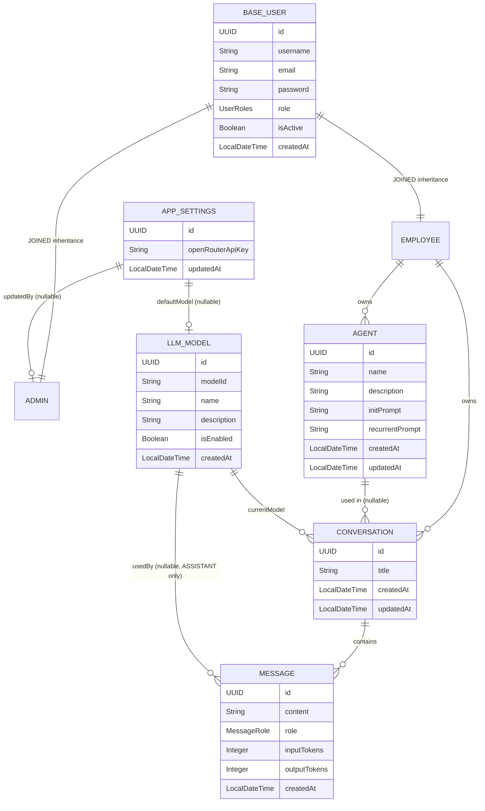
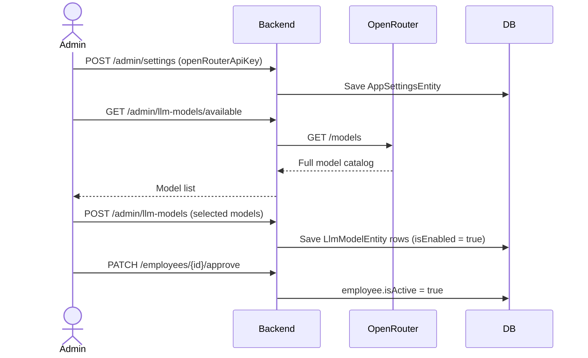
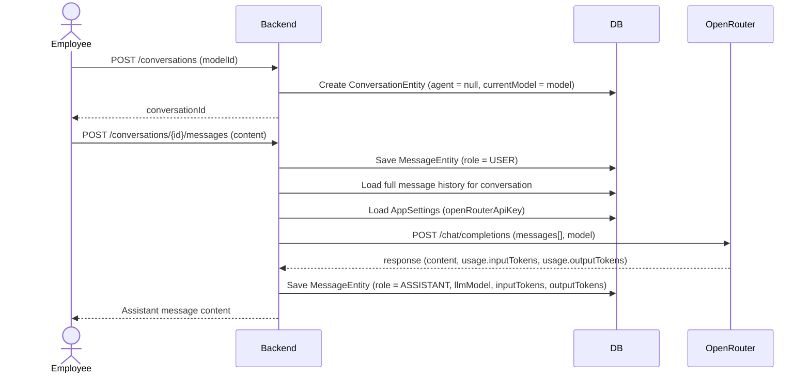
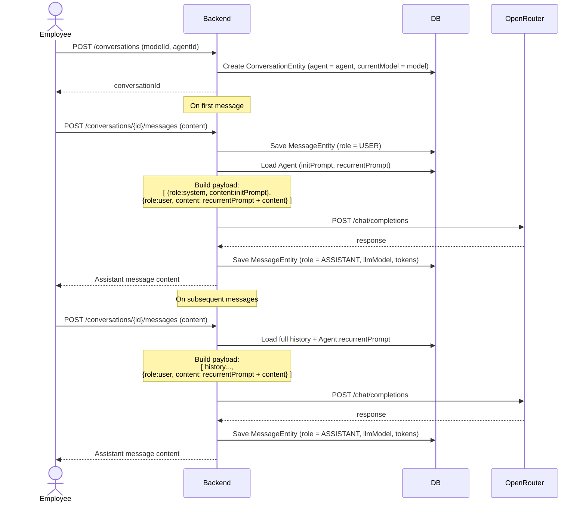
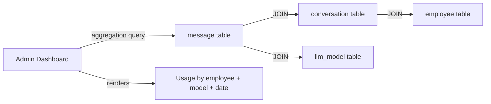
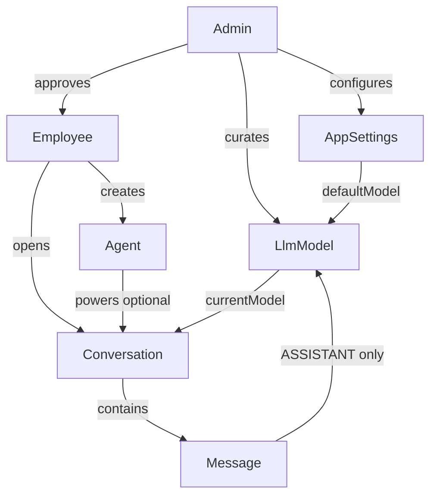
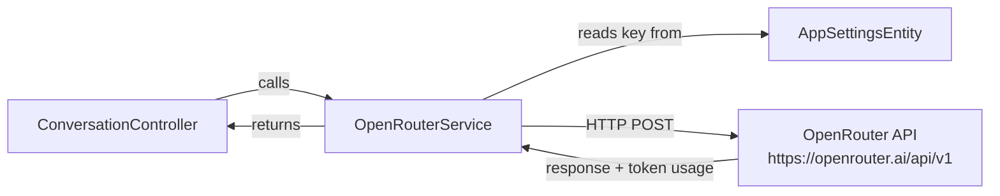
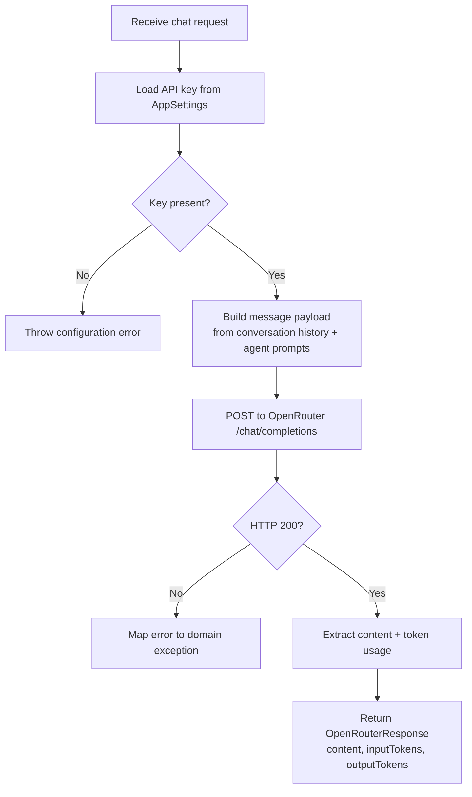
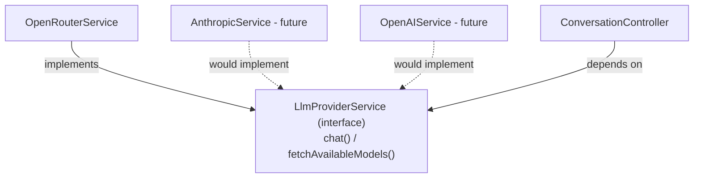

# Backend Model Roadmap

This document describes every JPA entity in the AgentForge backend: what it is, why it exists, what fields it holds, and how it relates to the rest of the system. It also covers the end-to-end flow that ties all models together at runtime, and explains why the OpenRouter integration lives as a service rather than a database entity.

---

## Entity Overview



---

## Models

### 1. BaseUserEntity *(already exists)*

**Why it exists:** Shared identity table for all user types. Spring Security loads users from this single table regardless of role, so auth works through one lookup path.

**How it works:** Uses JPA `JOINED` table inheritance. The `base_user` table holds columns common to every user (credentials, role, status). Each subtype (`admin`, `employee`) gets its own table with role-specific columns, joined by primary key.

**Fields:**

| Field | Type | Notes |
|---|---|---|
| `id` | UUID | PK |
| `username` | String | Unique, used for login |
| `email` | String | Unique |
| `password` | String | BCrypt hashed |
| `role` | `UserRoles` enum | `ADMIN` or `EMPLOYEE` |
| `isActive` | Boolean | Admin must approve before employee can log in |
| `createdAt` | LocalDateTime | |

---

### 2. AdminEntity *(already exists)*

**Why it exists:** Represents the system administrator. Admins configure the application, approve employees, manage available LLM models, and view usage analytics. They do not use the chat interface.

**Relation to BaseUser:** Inherits all base fields. The `admin` table has no extra columns for now — the role itself is the distinguishing factor.

**What Admins control:**
- `AppSettingsEntity` (API key, default model)
- `LlmModelEntity` list (which models are available)
- `EmployeeEntity` approval (`isActive`)

---

### 3. EmployeeEntity *(replaces ClientEntity)*

**Why it exists:** Represents an end user of the chat interface. Employees register, wait for admin approval, then log in to chat with LLMs and create Agents.

**Relation to BaseUser:** Inherits all base fields. The `employee` table holds no extra columns for the MVP.

**What Employees own:**
- `AgentEntity` records (their personal agents)
- `ConversationEntity` records (their chat history)

---

### 4. AppSettingsEntity

**Why it exists:** The admin needs to configure the OpenRouter API key through the dashboard UI — not via environment variables — so it can be changed at runtime without a redeploy. This is a singleton table: exactly one row ever exists.

**Fields:**

| Field | Type | Notes |
|---|---|---|
| `id` | UUID | Always the same single row |
| `openRouterApiKey` | String | Encrypted at rest recommended |
| `defaultModel` | FK → `LlmModelEntity` | Nullable — pre-selected model for new conversations |
| `updatedAt` | LocalDateTime | |
| `updatedBy` | FK → `AdminEntity` | Audit trail |

**Rules:**
- Only Admins can read or write this entity.
- If `openRouterApiKey` is null or blank, all LLM calls fail fast with a clear error.
- The `OpenRouterService` reads the key from this table on each request (cached with a short TTL).

---

### 5. LlmModelEntity

**Why it exists:** Admins decide which OpenRouter models employees are allowed to use. Without an admin-curated list, employees would have access to hundreds of models indiscriminately, with no cost or quality control. This entity is that controlled list.

**How it is populated:** The Admin UI calls `GET /admin/llm-models/available` which proxies the OpenRouter models endpoint, returns the full catalog, and lets the admin pick which ones to add. Adding a model creates a row here. The admin can enable/disable models without deleting them, preserving historical references from old messages.

**Fields:**

| Field | Type | Notes |
|---|---|---|
| `id` | UUID | PK |
| `modelId` | String | Unique — OpenRouter's identifier, e.g. `anthropic/claude-3.5-sonnet` |
| `name` | String | Human-readable display name |
| `description` | String | Nullable — pulled from OpenRouter metadata |
| `isEnabled` | Boolean | Only enabled models appear in the employee UI |
| `createdAt` | LocalDateTime | |

**Referenced by:** `AppSettingsEntity.defaultModel`, `ConversationEntity.currentModel`, `MessageEntity.llmModel`.

---

### 6. AgentEntity

**Why it exists:** Agents let employees configure a reusable LLM persona or task specialist. Instead of typing the same system prompt every time, the employee creates an Agent once and uses it across many conversations.

**How prompts work:**
- `initPrompt` — injected as the first `system` role message when a conversation with this agent starts.
- `recurrentPrompt` — prepended to every subsequent user message sent within the conversation.

This gives the agent both a strong initial context and persistent behavioral guardrails throughout the session.

**Fields:**

| Field | Type | Notes |
|---|---|---|
| `id` | UUID | PK |
| `name` | String | Display name, e.g. "Code Reviewer" |
| `description` | String | Nullable — short summary of what the agent does |
| `initPrompt` | String | `@Lob` — injected once at conversation start |
| `recurrentPrompt` | String | `@Lob` nullable — prepended to every user message |
| `owner` | FK → `EmployeeEntity` | Agents are personal; not shared between employees |
| `createdAt` | LocalDateTime | |
| `updatedAt` | LocalDateTime | |

---

### 7. ConversationEntity

**Why it exists:** Groups a sequence of messages into a named session. Tracks which employee owns it, which agent (if any) powers it, and which model is currently selected. A conversation with no agent is a free/general chat.

**General vs Agent conversations:** There is no separate "General" entity. A `null` value on the `agent` field means general. This keeps the schema flat and queries simple.

**Model switching:** The `currentModel` field is updated whenever the user switches models mid-conversation. The historical model used per response is preserved permanently on each `MessageEntity`.

**Fields:**

| Field | Type | Notes |
|---|---|---|
| `id` | UUID | PK |
| `title` | String | Auto-generated or user-edited |
| `employee` | FK → `EmployeeEntity` | Owner |
| `agent` | FK → `AgentEntity` | Nullable — null = general conversation |
| `currentModel` | FK → `LlmModelEntity` | The model currently selected for this chat |
| `createdAt` | LocalDateTime | |
| `updatedAt` | LocalDateTime | |

---

### 8. MessageEntity

**Why it exists:** Stores every individual turn in a conversation. Each message knows who sent it (user or LLM), what was said, and — for LLM responses — which model produced it and how many tokens were consumed. This is the single source of truth for both chat history and token usage analytics.

**Role enum (`MessageRole`):**

| Value | Meaning |
|---|---|
| `USER` | Message typed by the employee |
| `ASSISTANT` | Response generated by the LLM |

System-role messages (agent prompts) are built at request time by the `OpenRouterService` and are not persisted — they are reconstructed from `AgentEntity` on every call, so changing an agent's prompt retroactively affects future messages in existing conversations.

**Token tracking:** `inputTokens` and `outputTokens` are only meaningful on `ASSISTANT` messages. They are populated from the OpenRouter API response. The dashboard aggregates these fields grouped by employee and model.

**Fields:**

| Field | Type | Notes |
|---|---|---|
| `id` | UUID | PK |
| `conversation` | FK → `ConversationEntity` | |
| `role` | `MessageRole` enum | `USER` or `ASSISTANT` |
| `content` | String | `@Lob` |
| `llmModel` | FK → `LlmModelEntity` | Nullable — set only on `ASSISTANT` messages |
| `inputTokens` | Integer | Nullable — tokens in the prompt sent to the LLM |
| `outputTokens` | Integer | Nullable — tokens in the LLM's response |
| `createdAt` | LocalDateTime | |

---

## How the System Works End-to-End

### Admin setup flow



---

### Employee chat flow (general conversation)



---

### Employee chat flow (agent conversation)



---

### Token usage dashboard query

No extra entity needed. The `message` table is the source of truth:



The query groups `ASSISTANT` messages by `employee`, `llm_model`, and date, summing `input_tokens + output_tokens`. No denormalized `TokenUsage` table required.

---

## Full Relationship Summary



---

## Why OpenRouter Has No JPA Entity

### The core question

Every other major concept in this system has a JPA entity — why not OpenRouter itself?

The answer is about what a JPA entity actually represents: **persistent state that belongs to the application**. An entity is something we own, store, and query. OpenRouter is an external HTTP API we call. We do not own it, we do not store it, and we cannot query it through JPA. Giving it an entity would mean creating a database table for something that lives entirely outside our database.

### What would an "OpenRouterProviderEntity" even store?

If we created one, it would have roughly:
- the base URL (`https://openrouter.ai/api/v1`)
- the API key

The base URL is a constant — it never changes and belongs in code, not a database row. The API key already lives in `AppSettingsEntity`, which is the right place because it is admin-configurable state. There is nothing left that justifies a separate table.

### Where the integration actually lives

OpenRouter is implemented as a Spring `@Service`: `OpenRouterService`. A service is the correct abstraction because it encapsulates behavior (making HTTP calls), not state (data to be persisted).



### What OpenRouterService is responsible for



**Responsibilities:**
- Load the API key from `AppSettingsEntity` (injected via a settings service, not hardcoded)
- Build the `messages[]` array from conversation history, applying agent prompts where applicable
- Execute the HTTP call to OpenRouter using Spring's `WebClient` (non-blocking) or `RestClient`
- Parse the response and return a plain DTO — it does not touch the database directly
- Map HTTP or API errors into domain exceptions the controller can handle cleanly

**What it does NOT do:**
- It does not persist anything — that is the controller/service layer's job after receiving the response
- It does not know about `ConversationEntity` or `MessageEntity` — it only speaks in terms of a message list and a model ID
- It does not manage retry logic or streaming in the MVP (those are future concerns)

### Internal structure

```
OpenRouterService
│
├── chat(List<OpenRouterMessage> messages, String modelId)
│       → OpenRouterResponse { content, inputTokens, outputTokens }
│
└── fetchAvailableModels()
        → List<OpenRouterModelInfo> { modelId, name, description }
```

Two methods cover the full MVP surface. `chat()` is called on every message send. `fetchAvailableModels()` is called only by the admin endpoint that lets admins browse and add models.

### Why this approach scales if we add providers later

Even though this is an MVP with a single provider, the service boundary keeps future expansion cheap. If we later add a direct Anthropic or OpenAI integration, we define a `LlmProviderService` interface and make `OpenRouterService` one implementation of it. The rest of the application only depends on the interface — nothing else changes.



For the MVP, only `OpenRouterService` exists and Spring injects it directly. The interface is optional for now — what matters is that the service boundary is there. Adding the interface later is a one-line refactor, not an architectural change.
