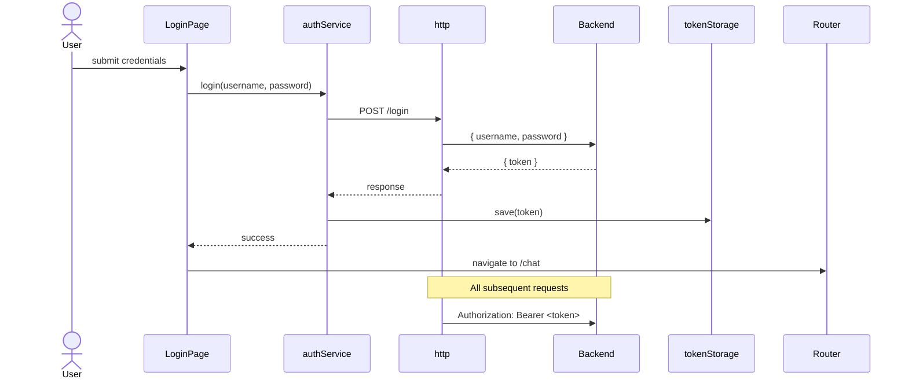
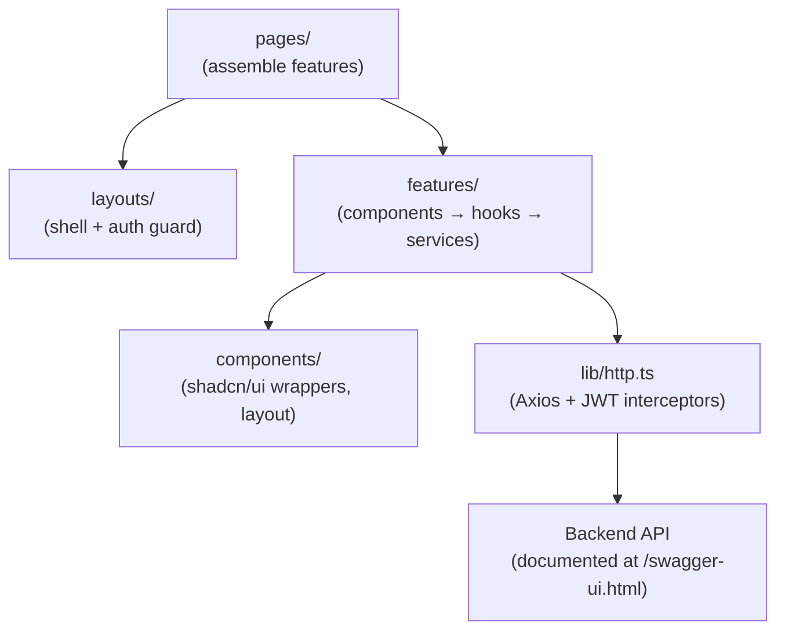

# Frontend Architecture

This document defines how the AgentForge frontend is structured, how it communicates with the backend, and the rules every developer must follow. It is the reference to open before writing the first line of frontend code.

---

## Tech Stack

| Technology | Role |
|---|---|
| React + Vite | UI framework and build tool |
| TypeScript | Language — all code is typed |
| shadcn/ui | Component library (built on Radix UI + Tailwind CSS) |
| Axios | HTTP client |
| React Router | Client-side routing |
| SWR | Data fetching and cache |

---

## How We Know What the Backend Exposes

The backend serves an interactive API reference via **springdoc-openapi**. Once added to the Spring Boot project, it auto-generates documentation from the existing controllers and DTOs with no manual work.

**Access it at:** `http://localhost:8080/swagger-ui.html`

This is the single source of truth for every endpoint, its URL, HTTP method, required headers, request body shape, and response shape. There is no separate API documentation to maintain or keep in sync — the code is the documentation.

### Future: TypeScript types from the spec

When the API surface stabilises, `openapi-typescript` can generate TypeScript types directly from the OpenAPI spec:

```bash
npx openapi-typescript http://localhost:8080/v3/api-docs -o src/types/api.ts
```

This is not required to start. Begin with hand-written types co-located in each feature and migrate to generated types when the backend stabilises.

---

## Folder Structure

```text
src/
├── lib/
│   └── http.ts              ← configured Axios instance (JWT interceptors live here)
├── features/
│   ├── auth/
│   │   ├── components/
│   │   ├── hooks/
│   │   ├── services/
│   │   ├── types.ts
│   │   └── index.ts
│   ├── chat/
│   │   ├── components/
│   │   ├── hooks/
│   │   ├── services/
│   │   ├── types.ts
│   │   └── index.ts
│   ├── agents/
│   │   ├── components/
│   │   ├── hooks/
│   │   ├── services/
│   │   ├── types.ts
│   │   └── index.ts
│   └── admin/
│       ├── components/
│       ├── hooks/
│       ├── services/
│       ├── types.ts
│       └── index.ts
├── components/
│   ├── ui/                  ← shadcn/ui component wrappers
│   └── layout/              ← AppShell, Sidebar, TopBar
├── hooks/                   ← shared hooks used by 2+ features
├── pages/                   ← thin route assemblers, no business logic
├── layouts/                 ← route shell components with <Outlet />
├── types/                   ← app-wide shared TypeScript types
├── router.tsx
└── main.tsx
```

### How features map to backend domains

| Feature folder | Backend entities it talks to |
|---|---|
| `auth/` | `BaseUserEntity`, JWT (login, token storage, logout) |
| `chat/` | `ConversationEntity`, `MessageEntity`, `LlmModelEntity` |
| `agents/` | `AgentEntity` |
| `admin/` | `EmployeeEntity`, `LlmModelEntity`, `AppSettingsEntity` |

Each feature is self-contained. Nothing outside a feature imports from inside it — only from its `index.ts`.

---

## Placement Rules

Apply these rules before creating any file:

| Question | Place it here |
|---|---|
| Used by only one feature? | `src/features/[feature]/...` |
| Used by two or more features? | `src/components/`, `src/hooks/`, `src/services/`, or `src/types/` |
| Wraps a third-party library? | `src/lib/` |
| Defines page shell or frame? | `src/layouts/` |
| Is a route target that assembles features? | `src/pages/` |

---

## Layer Rules

The dependency direction inside a feature is strict:

```
components  →  hooks  →  services  →  src/lib/http.ts
```

| Layer | Responsibility | May import from | Must NOT import from |
|---|---|---|---|
| `components/` | Render UI, handle user events | hooks, shared UI | services directly |
| `hooks/` | Compose data and UI state | services, shared hooks | components |
| `services/` | API calls, data transforms | `src/lib/http`, feature types | hooks or components |

**Why this matters (Single Responsibility):** A component that calls an API directly has two reasons to change — UI design changes and API changes. Separating the layers means each file changes for exactly one reason.

---

## HTTP Client — `src/lib/http.ts`

One configured Axios instance. Every feature service imports from here, never from `axios` directly. This is the single place where auth headers and error handling are wired.

```typescript
import axios from 'axios';

const TOKEN_KEY = 'agentforge_token';

export const http = axios.create({
  baseURL: import.meta.env.VITE_API_BASE_URL,
  headers: { 'Content-Type': 'application/json' },
});

// Attach JWT to every outbound request
http.interceptors.request.use((config) => {
  const token = localStorage.getItem(TOKEN_KEY);
  if (token) {
    config.headers.Authorization = `Bearer ${token}`;
  }
  return config;
});

// Redirect to login on 401
http.interceptors.response.use(
  (response) => response,
  (error) => {
    if (error.response?.status === 401) {
      localStorage.removeItem(TOKEN_KEY);
      window.location.href = '/login';
    }
    return Promise.reject(error);
  }
);

export const tokenStorage = {
  save: (token: string) => localStorage.setItem(TOKEN_KEY, token),
  clear: () => localStorage.removeItem(TOKEN_KEY),
  get: () => localStorage.getItem(TOKEN_KEY),
};
```

**Rules:**
- Never call `axios.create()` anywhere else in the codebase.
- Never access `localStorage` for the token outside `http.ts` and `tokenStorage`.
- Never put business logic in interceptors. The interceptors handle transport concerns only (auth header, 401 redirect).

---

## Authentication Flow



The `auth` feature owns everything in this flow: the login form component, the `useLogin` hook, and the `authService` that calls `/login` and persists the token.

---

## Feature Structure in Detail

Every feature follows the same internal shape. Here is the `chat` feature as the canonical example:

```text
features/chat/
├── components/
│   ├── ConversationList.tsx     ← sidebar list of conversations
│   ├── ConversationList.test.tsx
│   ├── MessageThread.tsx        ← the chat messages area
│   ├── MessageThread.test.tsx
│   ├── MessageInput.tsx         ← text input + send button
│   ├── MessageInput.test.tsx
│   └── ModelSelector.tsx        ← dropdown to switch LLM model
├── hooks/
│   ├── useConversations.ts      ← SWR hook: list + create conversations
│   ├── useMessages.ts           ← SWR hook: message history + send
│   └── useModelSelection.ts     ← manages currentModel state
├── services/
│   ├── conversationService.ts   ← API calls for ConversationEntity
│   └── messageService.ts        ← API calls for MessageEntity
├── types.ts                     ← Conversation, Message, MessageRole types
└── index.ts                     ← public API: export only what pages need
```

### Service example

```typescript
// features/chat/services/conversationService.ts
import { http } from '@/lib/http';
import type { Conversation, CreateConversationForm } from '../types';

export const conversationService = {
  list: () =>
    http.get<Conversation[]>('/conversations').then((r) => r.data),

  create: (form: CreateConversationForm) =>
    http.post<Conversation>('/conversations', form).then((r) => r.data),

  updateModel: (id: string, modelId: string) =>
    http.patch<Conversation>(`/conversations/${id}/model`, { modelId }).then((r) => r.data),
};
```

### Hook example

```typescript
// features/chat/hooks/useConversations.ts
import useSWR from 'swr';
import { conversationService } from '../services/conversationService';

export function useConversations() {
  const { data, error, isLoading, mutate } = useSWR(
    'conversations',
    conversationService.list
  );

  const createConversation = async (modelId: string, agentId?: string) => {
    const created = await conversationService.create({ modelId, agentId });
    mutate();
    return created;
  };

  return { conversations: data, isLoading, error, createConversation };
}
```

### Public API (`index.ts`)

```typescript
// features/chat/index.ts
export { ConversationList } from './components/ConversationList';
export { MessageThread } from './components/MessageThread';
export { MessageInput } from './components/MessageInput';
export { ModelSelector } from './components/ModelSelector';
export { useConversations } from './hooks/useConversations';
export { useMessages } from './hooks/useMessages';
export type { Conversation, Message } from './types';
```

Nothing else is importable from outside the feature. Internals are private by convention.

---

## Routing

Routes are assembled in `router.tsx`. Pages are thin — they import from features and compose them, owning no business logic themselves.

```typescript
// router.tsx
import { createBrowserRouter } from 'react-router-dom';
import { AppLayout } from './layouts/AppLayout';
import { AuthLayout } from './layouts/AuthLayout';
import { ChatPage } from './pages/ChatPage';
import { AgentsPage } from './pages/AgentsPage';
import { AdminPage } from './pages/AdminPage';
import { LoginPage } from './pages/LoginPage';

export const router = createBrowserRouter([
  {
    element: <AuthLayout />,
    children: [{ path: '/login', element: <LoginPage /> }],
  },
  {
    element: <AppLayout />,          // renders sidebar + topbar + <Outlet />
    children: [
      { path: '/chat', element: <ChatPage /> },
      { path: '/chat/:id', element: <ChatPage /> },
      { path: '/agents', element: <AgentsPage /> },
      { path: '/admin', element: <AdminPage /> },
    ],
  },
]);
```

**Route guards** belong in `AppLayout`. It checks `tokenStorage.get()` on render and redirects to `/login` if no token is present. Feature components never check auth — that is the layout's job.

---

## shadcn/ui Usage

shadcn/ui components are added to `src/components/ui/` via the CLI:

```bash
npx shadcn-ui@latest add button
npx shadcn-ui@latest add input
npx shadcn-ui@latest add dialog
```

These are owned source files — they can be customised. Feature components import from `@/components/ui/`, never directly from Radix UI or any other primitive library.

Layout-level components (sidebar, top bar, page shell) live in `src/components/layout/`. These are used by `src/layouts/` only.

---

## Key Rules Summary



**Never:**
- Import from inside a feature (`features/chat/components/X`) — always import from its index
- Call `axios` directly — always use `http` from `src/lib/http.ts`
- Access `localStorage` for the token outside `tokenStorage` in `http.ts`
- Put API calls in components — they belong in services
- Put business logic in pages — pages compose, they do not compute

**Always:**
- Co-locate tests with the file they test
- Export only what other features need via `index.ts`
- Use SWR for data that needs to stay fresh (lists, conversation history)
- Read the Swagger docs at `/swagger-ui.html` before writing a service call
