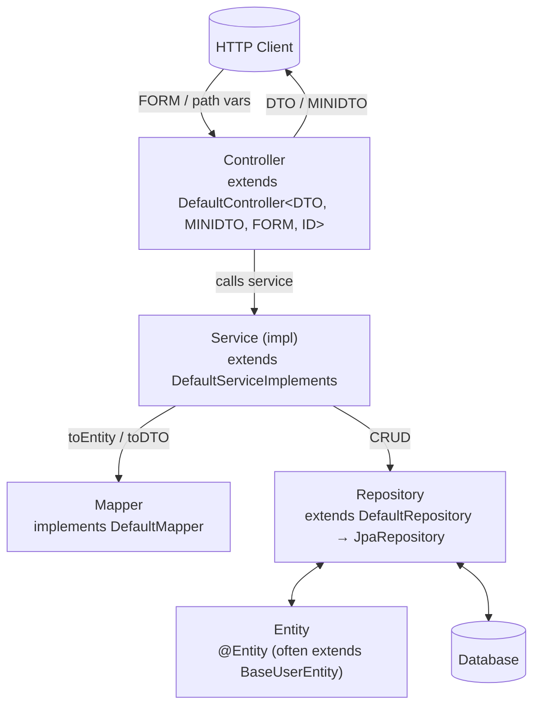
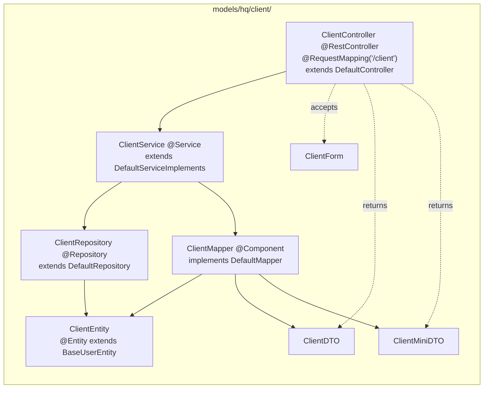
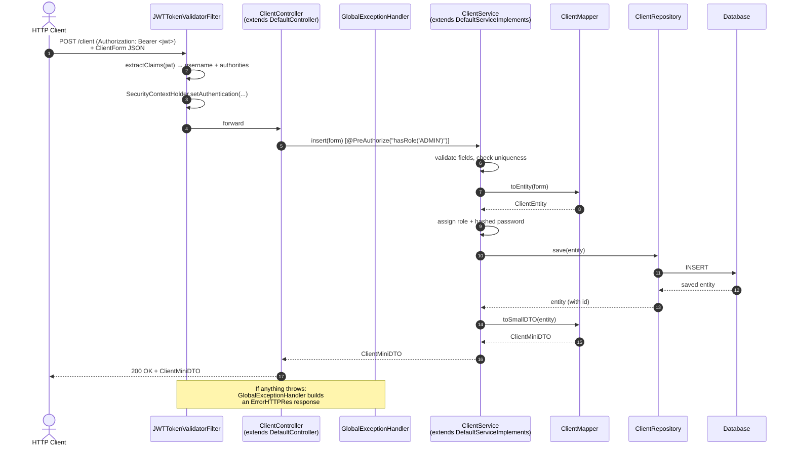
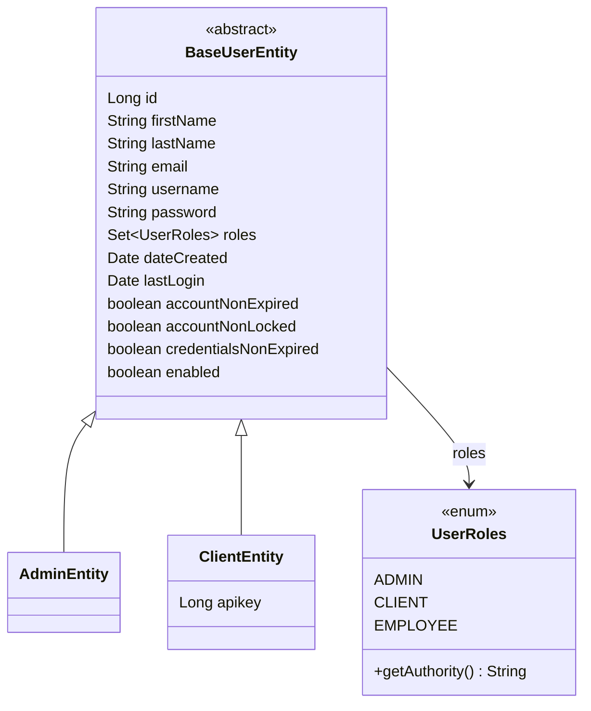
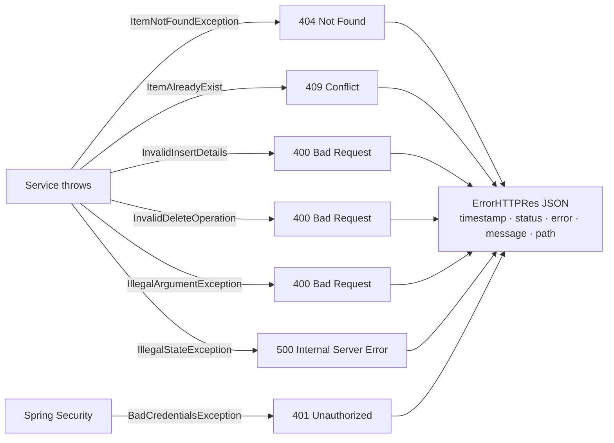

# Backend Architecture

> **Scope.** This document explains the **current state** of the Spring Boot service under `code/backend/` and how to add new entities following the existing pattern. The application still uses the `authServer` package name and MySQL — both are pending migration to the AgentForge namespace and PostgreSQL (see [[Memory/known-issues]] and [[Memory/context]]).
>
> **Intended reader.** A developer joining the backend who needs to understand the layering, the generic CRUD abstractions, and how to ship a new entity without breaking the pattern. Security is covered briefly; deeper security internals live next to the code in `code/backend/src/main/java/com/authServer/configuration/`.

Spring Boot 3.4.1 / Java 21 authentication & user-management service. The codebase is built around a **generic CRUD layering pattern**: every domain entity is a thin "slice" that plugs into a shared set of abstract controllers, services, mappers, and repositories.

---

## 1. High-Level Overview

The application is a single Spring Boot service that exposes a stateless REST API secured with JWT. It is split into three conceptual zones:

- **Shared layer** (`shared/`) — generic building blocks (default interfaces and abstract implementations, base user model, tools).
- **Domain layer** (`models/`) — concrete entities that extend the generic layer (e.g. `admin`, `client`).
- **Cross-cutting layer** (`configuration/`, `exceptions/`, `constant/`) — security, bootstrap, global error handling, application constants.

```mermaid
flowchart LR
    subgraph CROSS["Cross-cutting"]
        SEC["configuration/security<br/>SecurityConfig, SecurityController"]
        FLT["configuration/filter<br/>JWTTokenValidatorFilter, JwtTokenService"]
        BOOT["configuration/boostrap<br/>AdminBoostrap"]
        EXC["exceptions/<br/>GlobalExceptionHandler"]
    end

    subgraph DOMAIN["Domain (models/hq)"]
        ADM["admin/ (AdminEntity, AdminService, ...)"]
        CLI["client/ (ClientEntity, ClientService, ...)"]
    end

    subgraph SHARED["Shared"]
        DI["defaultInterfaces<br/>DefaultService / Mapper / Repository"]
        IMP["defaultImplements<br/>DefaultController / DefaultServiceImplements"]
        BASE["shared/models/baseUser<br/>BaseUserEntity"]
        SU["shared/securityUser<br/>SecurityUser, BaseUserRepository"]
        TOOLS["shared/tools<br/>FileSigner, Validators, ErrorHTTPRes, ..."]
    end

    DOMAIN --> SHARED
    CROSS --> SHARED
    CROSS --> DOMAIN
```



### Tech stack (from `code/backend/pom.xml`)

See [[Memory/tech]] for the authoritative list. Summary:

| Area | Dependency |
|------|------------|
| Web / REST | `spring-boot-starter-web`, `spring-boot-starter-webflux`, `spring-boot-starter-websocket` |
| Persistence | `spring-boot-starter-data-jpa`, `spring-boot-starter-data-jdbc`, MySQL driver (runtime), H2 (test + runtime) |
| Security | `spring-boot-starter-security`, `jjwt-api/impl/jackson 0.12.5` |
| Batch / Scheduling | `spring-boot-starter-batch`, `@EnableScheduling` |
| Validation | `spring-boot-starter-validation` (Jakarta Bean Validation) |
| Cloud | `software.amazon.awssdk:s3` |
| Boilerplate | Lombok |

Entry point: `code/backend/src/main/java/com/authServer/authServerApplication.java` — `@SpringBootApplication`, `@EnableScheduling`, `@EnableWebSecurity`.

---

## 2. Package Structure

```
com.authServer
├── authServerApplication.java          # @SpringBootApplication entry point
│
├── configuration
│   ├── boostrap/                       # App bootstrap (CommandLineRunner seeders)
│   │   └── AdminBoostrap               # creates default admin if none exists
│   ├── filter/                         # JWT filter + token service
│   │   ├── JWTTokenValidatorFilter     # OncePerRequestFilter, runs before BasicAuth
│   │   └── JwtTokenService             # sign / parse tokens
│   └── security/
│       ├── SecurityConfig              # filter chain, CORS, password encoder
│       ├── SecurityController          # /login endpoint
│       ├── LoginForm / LoginResponseDTO
│
├── constant
│   └── ApplicationConstants            # TK_HEADER, ISSUER, JWT key env var, ...
│
├── exceptions
│   ├── GlobalExceptionHandler          # @ControllerAdvice -> ErrorHTTPRes
│   ├── ItemNotFoundException
│   ├── ItemAlreadyExist
│   ├── InvalidInsertDetails
│   └── InvalidDeleteOperation
│
├── models
│   └── hq                              # "headquarters" — internal business entities
│       ├── admin/                      # an entity slice (8 files)
│       └── client/                     # an entity slice (8 files)
│
└── shared
    ├── defaultInterfaces/              # The generic contracts
    │   ├── DefaultService<DTO, MINIDTO, FORM, ID>
    │   ├── DefaultMapper<DTO, MINIDTO, FORM, ENTITY>
    │   ├── DefaultRepository<ENTITY, ID>       (extends JpaRepository)
    │   └── DownloadableParent                  (marker interface)
    ├── defaultImplements/              # The generic implementations
    │   ├── DefaultController<DTO, MINIDTO, FORM, ID>
    │   └── DefaultServiceImplements<DTO, MINIDTO, FORM, ENTITY, ID>
    ├── functional/
    │   └── ThrowingSupplier
    ├── models/baseUser/                # base user shared across Admin/Client/...
    │   ├── BaseUserEntity              # @Inheritance(JOINED)
    │   ├── BaseUserDTO / BaseUserMiniDTO / BaseUserMapper
    │   └── UserRoles (enum: ADMIN, CLIENT, EMPLOYEE)
    ├── securityUser/                   # Spring Security adapter over BaseUserEntity
    │   ├── SecurityUser (implements UserDetails)
    │   ├── SecurityUserServiceImpl (implements UserDetailsService)
    │   └── BaseUserRepository
    └── tools/                          # stateless utilities
        ├── FileSigner, ChecksumUtils
        ├── UploadValidator, TextFieldValidator, URLValidator
        ├── AuthUserUtil, DiskBasedMultipartFile
        ├── ValidationResult
        └── ErrorHTTPRes                # standard error response body
```

**Naming conventions**
- Packages are **lowercase** (`models/hq/client`).
- Files inside an entity package follow the suffix convention `…Entity`, `…DTO`, `…MiniDTO`, `…Form`, `…Mapper`, `…Repository`, `…Service` / `…ServiceImpl`, `…Controller`.
- Domain entities live under `models/hq/<entity>` and share the `hq` prefix.

> **Planned rename.** The `com.authServer` package and the `authServer` artifact are leftover identifiers; they will be renamed to the AgentForge namespace before the first AgentForge domain entity lands. Do not create new files under `com.authServer.*` unless strictly necessary during the rename. See [[Memory/known-issues]] § "Backend legacy naming".

---

## 3. The Layered Architecture

The service follows a classic **Controller → Service → Repository** layering, with a **Mapper** converting between the three object shapes used at each boundary.



### Object shapes crossing each boundary

| Shape | Purpose | Example |
|-------|---------|---------|
| **FORM** | Input payload for POST/PUT — what the client sends in | `ClientForm` |
| **ENTITY** | JPA-managed persistent object — never leaves the service layer | `ClientEntity` |
| **DTO** | Full read model returned by `getOne` / `getAll` / `update` / `delete` | `ClientDTO` |
| **MINIDTO** | Slim creation response returned by `insert` (no id echo, trimmed fields) | `ClientMiniDTO` |

The mapper is the **only** place that knows how to convert between these shapes, keeping the controller free of mapping code and the service free of REST concerns.

---

## 4. The Generic CRUD Layer

This is the core idea of the codebase: everything generic is factored into four files under `shared/`. Concrete entity slices only need to parameterize them with their own four types.

```mermaid
classDiagram
    class DefaultService~DTO,MINIDTO,FORM,ID~ {
        <<interface>>
        +getOne(ID) DTO
        +getAll() Collection~DTO~
        +insert(FORM) MINIDTO
        +update(ID, FORM) DTO
        +delete(ID) DTO
    }

    class DefaultMapper~DTO,MINIDTO,FORM,ENTITY~ {
        <<interface>>
        +toDTO(ENTITY) DTO
        +toSmallDTO(ENTITY) MINIDTO
        +toEntity(FORM) ENTITY
    }

    class DefaultRepository~ENTITY,ID~ {
        <<interface>>
        +JpaRepository methods
    }

    class DefaultController~DTO,MINIDTO,FORM,ID~ {
        <<abstract>>
        #defaultService : DefaultService
        +getOne(id) @GetMapping /{id}
        +getAll()   @GetMapping ""
        +insert(form) @PostMapping ""
        +update(id, form) @PutMapping /{id}
        +delete(id) @DeleteMapping /{id}
    }

    class DefaultServiceImplements~DTO,MINIDTO,FORM,ENTITY,ID~ {
        <<abstract>>
        #repository : DefaultRepository
        #mapper : DefaultMapper
        @Transactional
    }

    DefaultServiceImplements ..|> DefaultService
    DefaultController o-- DefaultService
    DefaultServiceImplements o-- DefaultRepository
    DefaultServiceImplements o-- DefaultMapper
```

### What each generic piece provides for free

- **`DefaultController`** — five REST endpoints (`GET /{id}`, `GET /`, `POST /`, `PUT /{id}`, `DELETE /{id}`) wired to the injected service. Uses `@Valid` on the `FORM` body.
- **`DefaultServiceImplements`** — default implementations of all five `DefaultService` methods, annotated `@Transactional(rollbackFor = {business exceptions})` and `@PreAuthorize("isAuthenticated()")`. Holds `repository` and `mapper` as `protected final` fields so subclasses can reuse them.
- **`DefaultMapper`** — contract for `toDTO` / `toSmallDTO` / `toEntity`. No default implementation; each entity owns its mapping rules.
- **`DefaultRepository`** — marker interface `@NoRepositoryBean` that extends `JpaRepository<ENTITY, ID>`. Concrete repos inherit everything JPA offers.

### Overriding vs. reusing

A concrete service only overrides a method when the entity has extra rules (uniqueness checks, role assignment, password hashing, etc.). Everything it does not override falls through to `DefaultServiceImplements`. `ClientService.insert` is a good example of an override: it validates the form, checks uniqueness, hashes a derived password, and assigns the `CLIENT` role before persisting.

> **Known defect.** `DefaultServiceImplements.update(id, form)` loads the entity and saves it **without applying any field from the form** — it is effectively a no-op today. Every concrete service that needs a working `update` must override it. See [[Memory/known-issues]] § "Boilerplate CRUD abstraction has a real bug".

---

## 5. The Entity Slice Pattern

Each entity lives in its own package with **exactly eight files** (plus optional domain-specific helpers). The naming is uniform so you can navigate any slice after seeing one.



| File | Responsibility | Key annotations |
|------|----------------|-----------------|
| `ClientEntity` | Persistent domain object | `@Entity`, `@Table(name = "client")`, extends `BaseUserEntity` |
| `ClientDTO` | Full read model | Lombok `@Data @Builder` |
| `ClientMiniDTO` | Trimmed creation response | Lombok `@Data @Builder` |
| `ClientForm` | Write payload | Lombok `@Data` (+ validation annotations) |
| `ClientMapper` | `FORM`↔`ENTITY`↔`DTO`/`MINIDTO` conversion | `@Component`, `implements DefaultMapper<…>` |
| `ClientRepository` | Data access + custom finders | `@Repository`, `extends DefaultRepository<ClientEntity, Long>` |
| `ClientService` | Business rules, overrides generic CRUD | `@Service`, `extends DefaultServiceImplements<…>` |
| `ClientController` | REST facade, URL mapping, domain-specific endpoints | `@RestController`, `@RequestMapping("/client")`, `extends DefaultController<…>` |

`AdminController` is a minimal example: it extends `DefaultController` and adds nothing. `ClientController` is a richer example: it also exposes `GET /client/token/{username}`, showing how to add endpoints outside the generic CRUD.

---

## 6. Request Lifecycle

A typical authenticated `POST /client` request flows through the system like this:



Key points:
1. **JWT filter runs before the controller.** It populates `SecurityContextHolder` so `@PreAuthorize` checks work.
2. **Controllers do not validate business rules.** That belongs in the service.
3. **Mappers own all shape conversion.** Controllers never touch entities; services never touch DTOs for input.
4. **Any exception thrown by the service is caught by `GlobalExceptionHandler`** and translated to a consistent `ErrorHTTPRes` payload.

---

## 7. User Inheritance Model

All user-like entities share a base table via JPA's JOINED inheritance strategy.



- `BaseUserEntity` is `@Inheritance(strategy = JOINED)` — each subclass has its own table, plus a shared `base_user` table for common columns.
- `UserRoles` values map to Spring Security authorities via `getAuthority()` → `"ROLE_" + name()`.
- `BaseUserRepository` (in `shared/securityUser`) can look up any user by username regardless of subtype, which is how login works for both admins and clients.

If you add a new user-like entity (e.g. `EmployeeEntity`), extend `BaseUserEntity`. If you add a non-user entity (e.g. `InvoiceEntity`), don't — just use a plain `@Entity`.

> **Planned role migration.** The `UserRoles` enum values (`ADMIN`, `CLIENT`, `EMPLOYEE`) do not match the AgentForge product roles (`EMPLOYEE`, `MANAGER`). This migration touches the `user_roles` element-collection table, the seeded admin, and any `ROLE_*` string matchers in JWT claims. See [[Memory/known-issues]] § "Existing user roles do not match the product".

---

## 8. Exception Handling

Business logic throws **typed checked exceptions**. A single `@ControllerAdvice` converts them to `ErrorHTTPRes` bodies with appropriate HTTP status codes.



Rules for new code:
- **Throw the typed exception**, don't build a `ResponseEntity` inside the service.
- **Rollback is already wired**: `DefaultServiceImplements` is `@Transactional(rollbackFor = { ItemNotFoundException, InvalidInsertDetails, InvalidDeleteOperation, ItemAlreadyExist })`. Overriding services should keep this list intact or re-declare it.
- If you introduce a **new business error**, create a new exception class under `exceptions/` and add a handler to `GlobalExceptionHandler`.

---

## 9. Security (brief)

Security is stateless JWT with BCrypt-hashed passwords. It is **not** the focus of this document — only the touchpoints a new entity developer needs to know are listed here.

```mermaid
flowchart LR
    U[Client] -->|"POST /login<br/>username/password"| SC[SecurityController]
    SC --> AM[AuthenticationManager]
    AM --> SUS[SecurityUserServiceImpl<br/>UserDetailsService]
    SUS --> BUR[(BaseUserRepository)]
    SC --> JTS[JwtTokenService]
    JTS --> U
    U -->|"Authorization: Bearer ..."| FLT[JWTTokenValidatorFilter]
    FLT --> SCH[SecurityContextHolder]
    SCH --> CTRL[Controllers<br/>@PreAuthorize]
```

Key points to remember when writing services:
- `SecurityConfig` disables CSRF, makes the session stateless, installs `JWTTokenValidatorFilter` **before** `BasicAuthenticationFilter`, and configures CORS for `http://localhost:3000`.
- The only open endpoint is `/login`; everything else requires a valid JWT (see `JWTTokenValidatorFilter.shouldNotFilter`).
- Method-level authorization is done with `@PreAuthorize` on service methods. `DefaultServiceImplements` defaults all CRUD to `@PreAuthorize("isAuthenticated()")`. Override with `@PreAuthorize("hasRole('ADMIN')")` or similar when a method should be restricted.
- `SecurityUser` adapts `BaseUserEntity` to Spring's `UserDetails`. Any entity that extends `BaseUserEntity` can log in with no extra code.
- `AdminBoostrap` seeds a default admin (`admin` / `test`) on first startup if the admin table is empty — useful for local dev, **not** a production credential.

For deeper security details (filter internals, token format, key rotation), see `code/backend/src/main/java/com/authServer/configuration/security/` and `code/backend/src/main/java/com/authServer/configuration/filter/` directly. Related constraints: [[Memory/known-issues]] § "Secrets and dev fallbacks in application.properties" and § "CORS origin hardcoded".

---

## 10. How to Add a New Entity

Follow the slice pattern. Assume you want to add an `Invoice` entity with `id`, `amount`, `clientId`. Create a new package `com.authServer.models.hq.invoice` (the package will move to the AgentForge namespace after the planned rename) and add these eight files in order.

### Step 1 — `InvoiceEntity`
```java
@Table(name = "invoice")
@Entity
@NoArgsConstructor @AllArgsConstructor
@Getter @Setter @Builder
public class InvoiceEntity {
    @Id @GeneratedValue(strategy = GenerationType.IDENTITY)
    private Long id;

    @Column(nullable = false)
    private BigDecimal amount;

    @Column(name = "client_id", nullable = false)
    private Long clientId;
}
```
Do **not** extend `BaseUserEntity` unless the entity represents a user.

### Step 2 — `InvoiceDTO`, `InvoiceMiniDTO`, `InvoiceForm`
One file each. `DTO` is the full read shape, `MiniDTO` is what `insert` returns, `Form` is what POST/PUT accept. Use Lombok (`@Data @Builder`) the same way the existing slices do. Apply `jakarta.validation` annotations on the `Form`; the generic controller already calls `@Valid`.

### Step 3 — `InvoiceRepository`
```java
@Repository
public interface InvoiceRepository extends DefaultRepository<InvoiceEntity, Long> {
    List<InvoiceEntity> findByClientId(Long clientId);   // custom finder, optional
}
```

### Step 4 — `InvoiceMapper`
```java
@Component
public class InvoiceMapper
        implements DefaultMapper<InvoiceDTO, InvoiceMiniDTO, InvoiceForm, InvoiceEntity> {

    @Override public InvoiceDTO     toDTO(InvoiceEntity e)      { /* build full DTO */ }
    @Override public InvoiceMiniDTO toSmallDTO(InvoiceEntity e) { /* build mini DTO */ }
    @Override public InvoiceEntity  toEntity(InvoiceForm f)     { /* build entity   */ }
}
```
Handle `null` inputs defensively — see `ClientMapper` for the pattern.

### Step 5 — `InvoiceService`
```java
@Service
public class InvoiceService
        extends DefaultServiceImplements<InvoiceDTO, InvoiceMiniDTO, InvoiceForm, InvoiceEntity, Long> {

    public InvoiceService(InvoiceRepository repository, InvoiceMapper mapper) {
        super(repository, mapper);
    }

    // Override ONLY the CRUD methods that need special rules.
    // Everything else inherits from DefaultServiceImplements.
    @Override
    @PreAuthorize("hasRole('ADMIN')")
    public InvoiceMiniDTO insert(InvoiceForm form)
            throws ItemNotFoundException, ItemAlreadyExist, InvalidInsertDetails {
        // validate, then:
        return mapper.toSmallDTO(repository.save(mapper.toEntity(form)));
    }

    // update() MUST be overridden — the base implementation does not apply the form.
    @Override
    @PreAuthorize("hasRole('ADMIN')")
    public InvoiceDTO update(Long id, InvoiceForm form)
            throws ItemNotFoundException, InvalidInsertDetails {
        InvoiceEntity toUpdate = repository.findById(id).orElseThrow(ItemNotFoundException::new);
        // apply form fields onto toUpdate here
        return mapper.toDTO(repository.save(toUpdate));
    }
}
```
If you need to use a custom finder, cast the repository the same way the existing services do: `((InvoiceRepository) repository).findByClientId(...)`.

### Step 6 — `InvoiceController`
```java
@RestController
@RequestMapping("/invoice")
public class InvoiceController
        extends DefaultController<InvoiceDTO, InvoiceMiniDTO, InvoiceForm, Long> {

    public InvoiceController(InvoiceService service) {
        super(service);
    }

    // Add extra endpoints here if needed, e.g.:
    // @GetMapping("/by-client/{clientId}")
    // public ResponseEntity<List<InvoiceDTO>> byClient(@PathVariable Long clientId) { ... }
}
```

### Step 7 — Run
JPA `ddl-auto=update` (see `code/backend/src/main/resources/application.properties`) will create the `invoice` table at startup. The five CRUD endpoints are now live at `/invoice` with JWT auth and global exception handling — no additional wiring needed.

### Checklist
- [ ] Entity annotated with `@Entity` + `@Table(name = "…")`
- [ ] `Form` uses `jakarta.validation` annotations where applicable
- [ ] Mapper `@Component`, implements `DefaultMapper`
- [ ] Repository `@Repository`, extends `DefaultRepository<Entity, Id>`
- [ ] Service `@Service`, extends `DefaultServiceImplements<…>`, calls `super(repository, mapper)`
- [ ] Service overrides `update(...)` (the generic `update` is a no-op — see § 4 and [[Memory/known-issues]])
- [ ] Controller `@RestController` + `@RequestMapping("/…")`, extends `DefaultController<…>`
- [ ] `@PreAuthorize` used on overridden methods that need role-based access
- [ ] Custom business errors thrown as typed exceptions already known to `GlobalExceptionHandler` (or add a new handler if needed)

Follow this pattern and a new entity ships in ~8 short files, inherits CRUD for free, gets consistent error responses, and plugs into security without extra configuration.

---

## Related Documentation

- [[Memory/brief]] — Product brief, MVP goals, technical direction.
- [[Memory/architecture]] — System-wide architecture across backend, frontend (planned), and deployment (planned).
- [[Memory/tech]] — Full tech stack with versions.
- [[Memory/known-issues]] — Architectural gotchas and constraints that override the pattern described here (notably: `authServer` rename, MySQL→Postgres migration, `DefaultServiceImplements.update` bug, role-model migration).
- [[Memory/context]] — Current focus and immediate next steps.
