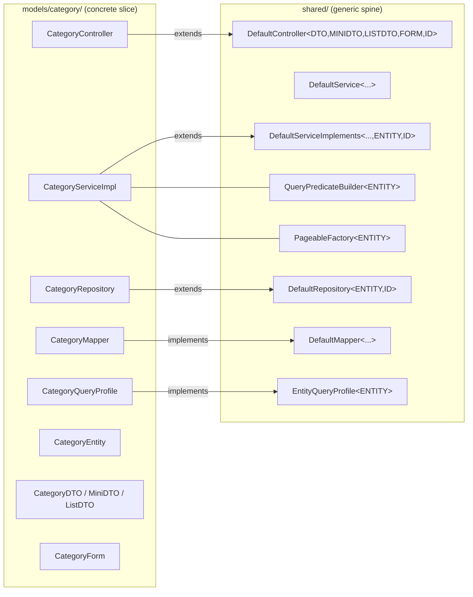
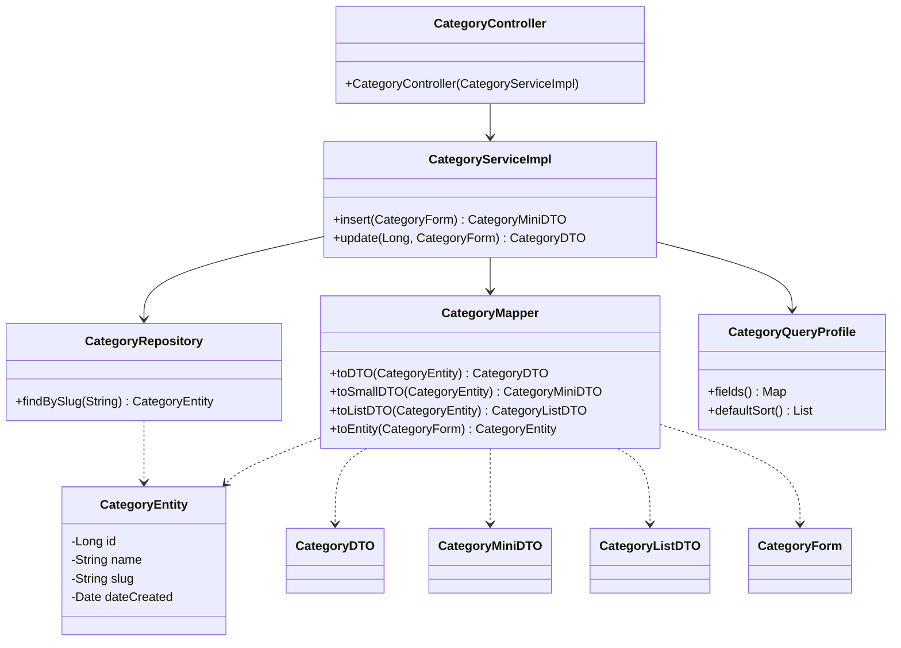
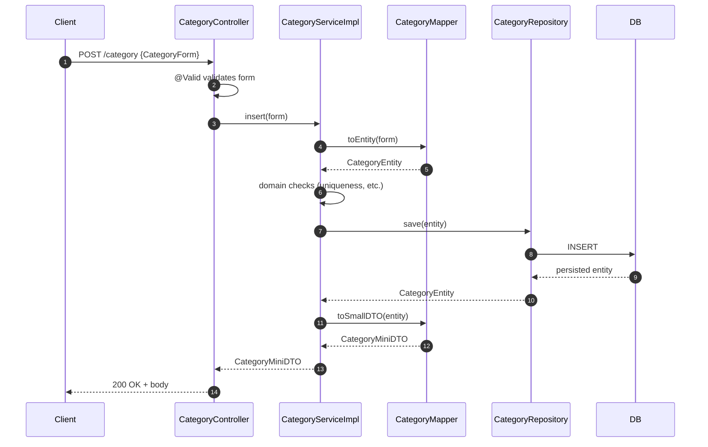
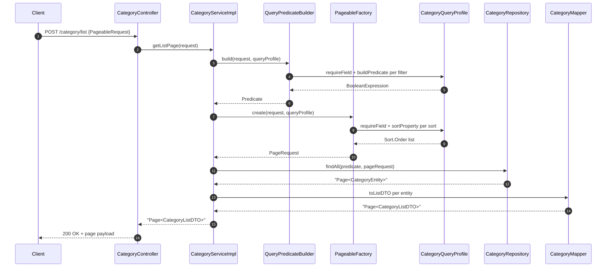

# Backend Model Anatomy — How a Model Is Built

> **Scope.** This document explains how a "model" is structured in the AgentForge Spring Boot backend (`backend/src/main/java/com/agentForgeBackend/`). It covers the shared abstractions (`shared/defaultInterfaces`, `shared/defaultImplements`, `shared/query`), the concrete files every model must provide, and a step-by-step recipe to add a new model. Examples use a generic `Category` model — the existing `admin` and `client` models are tied to the security/`BaseUserEntity` flow and are **not representative** of a normal domain model.
>
> **Intended reader.** A backend developer who needs to add a new domain entity following the project conventions, or who needs to understand why the existing models are split into so many files.

---

## Table of Contents

1. [The Pattern in One Picture](#1-the-pattern-in-one-picture)
2. [The Shared Layer](#2-the-shared-layer)
3. [Anatomy of a Model](#3-anatomy-of-a-model)
4. [Request / Response Flow](#4-request--response-flow)
5. [The Pageable List Query Subsystem](#5-the-pageable-list-query-subsystem)
6. [Recipe: Creating a New Model (`Category`)](#6-recipe-creating-a-new-model-category)
7. [Conventions, Pitfalls, and Checklists](#7-conventions-pitfalls-and-checklists)

---

## 1. The Pattern in One Picture

Every domain model is a **thin slice** that plugs into a generic CRUD spine. The shared layer provides abstract controllers, services, repositories, mappers, and the QueryDSL-based pageable list infrastructure. A model only declares its own types and any custom behavior.



Each concrete file is small. The bulk of the behavior — `getOne`, `getAll`, `insert`, `update`, `delete`, paginated list with filters and sort — lives in `DefaultServiceImplements` and `DefaultController`.

---

## 2. The Shared Layer

The generic spine lives in two packages. Read them together — interfaces define the contract, implementations carry the behavior.

### 2.1 `shared/defaultInterfaces/`

| File | Role |
|------|------|
| `DefaultService.java` | Service contract: `getOne`, `getAll`, `insert`, `update`, `delete`, `getListPage` |
| `DefaultMapper.java` | Mapper contract: `toDTO`, `toSmallDTO`, `toListDTO`, `toEntity` |
| `DefaultRepository.java` | Marker that combines `JpaRepository` + `QuerydslPredicateExecutor` (`@NoRepositoryBean`) |

#### `DefaultService<DTO, MINIDTO, LISTDTO, FORM, ID>`

`backend/src/main/java/com/agentForgeBackend/shared/defaultInterfaces/DefaultService.java`

```java
public interface DefaultService<DTO, MINIDTO, LISTDTO, FORM, ID> {
    DTO getOne(ID id) throws ItemNotFoundException;
    Collection<DTO> getAll();
    MINIDTO insert(FORM form) throws ItemNotFoundException, ItemAlreadyExist, InvalidInsertDetails;
    DTO update(ID id, FORM form) throws ItemNotFoundException, InvalidInsertDetails;
    DTO delete(ID id) throws ItemNotFoundException, InvalidDeleteOperation;
    Page<LISTDTO> getListPage(PageableRequest request) throws InvalidQueryRequestException;
}
```

The five generic parameters are the heart of the pattern:

- **DTO** — full representation returned by `getOne` / `getAll` / `update` / `delete`.
- **MINIDTO** — slim representation returned by `insert` (typically excludes derived fields the caller already has).
- **LISTDTO** — table-row representation returned by paginated list queries.
- **FORM** — the request body shape for `insert` and `update` (validated with Jakarta Bean Validation).
- **ID** — the primary key type (usually `Long`).

#### `DefaultMapper<DTO, MINIDTO, LISTDTO, FORM, ENTITY>`

```java
public interface DefaultMapper<DTO, MINIDTO, LISTDTO, FORM, ENTITY> {
    DTO toDTO(ENTITY entity);
    MINIDTO toSmallDTO(ENTITY entity);
    LISTDTO toListDTO(ENTITY entity);
    ENTITY toEntity(FORM form);
}
```

Mappers are intentionally hand-written (no MapStruct) so that field projection per DTO variant is explicit.

#### `DefaultRepository<ENTITY, ID>`

```java
@NoRepositoryBean
public interface DefaultRepository<ENTITY, ID>
        extends JpaRepository<ENTITY, ID>, QuerydslPredicateExecutor<ENTITY> {}
```

Combining JPA + QueryDSL is what makes `getListPage` possible — `findAll(Predicate, Pageable)` comes from `QuerydslPredicateExecutor`.

### 2.2 `shared/defaultImplements/`

#### `DefaultController<DTO, MINIDTO, LISTDTO, FORM, ID>`

`backend/src/main/java/com/agentForgeBackend/shared/defaultImplements/DefaultController.java`

The abstract REST controller exposes the seven canonical endpoints. A concrete controller only needs `@RestController`, `@RequestMapping("/<base>")`, and a constructor that wires the service.

| Method | Verb + Path | Purpose |
|--------|-------------|---------|
| `getOne` | `GET /{id}` | Fetch a full DTO by id |
| `getAll` | `GET /` | Fetch all entities as DTOs (no paging) |
| `getListPage` | `POST /list` | Paginated, filtered, sorted list of LISTDTOs |
| `insert` | `POST /` | Create from FORM, return MINIDTO |
| `update` | `PUT /{id}` | Update from FORM, return DTO |
| `delete` | `DELETE /{id}` | Delete by id, return DTO of the deleted row |

> **Why is list a `POST`?** The query body (filters, sort, paging) is structured JSON — too rich for query strings. Treat `POST /list` as a "search" idiom; it does not mutate state.

#### `DefaultServiceImplements<DTO, MINIDTO, LISTDTO, FORM, ENTITY, ID>`

This abstract class implements every method on `DefaultService`, secured with `@PreAuthorize("isAuthenticated()")` by default and wrapped in `@Transactional` (with rollback on the project's checked exceptions). Concrete services typically override only what they need to specialize — usually `insert` (uniqueness checks, related lookups, password hashing, etc.) and sometimes `getOne` (eager joins, custom not-found messages).

It depends on five collaborators, all injected via constructor:

```java
public DefaultServiceImplements(
        DefaultRepository<ENTITY, ID> repository,
        DefaultMapper<DTO, MINIDTO, LISTDTO, FORM, ENTITY> mapper,
        EntityQueryProfile<ENTITY> queryProfile,
        PageableFactory<ENTITY> pageableFactory,
        QueryPredicateBuilder<ENTITY> queryPredicateBuilder)
```

The last three are the pageable list machinery — see [section 5](#5-the-pageable-list-query-subsystem).

---

## 3. Anatomy of a Model

A normal model lives under `models/<area>/<modelName>/` and ships **ten files**. Using a generic `Category` model:

```
models/catalog/category/
├── CategoryController.java     # extends DefaultController
├── CategoryServiceImpl.java    # extends DefaultServiceImplements
├── CategoryRepository.java     # extends DefaultRepository
├── CategoryMapper.java         # implements DefaultMapper
├── CategoryQueryProfile.java   # implements EntityQueryProfile (sortable + filterable fields)
├── CategoryEntity.java         # @Entity — JPA persistence
├── CategoryDTO.java            # full read shape
├── CategoryMiniDTO.java        # slim shape returned from insert
├── CategoryListDTO.java        # table-row shape for /list
└── CategoryForm.java           # validated input shape for insert/update
```

### 3.1 The five DTO/Form shapes

These are **plain POJOs** with Lombok (`@Data`, `@Builder`, `@AllArgsConstructor`, `@NoArgsConstructor`) and Jakarta validation annotations on the form. They have **no behavior**; the mapper is the only place that knows how to translate between them and the entity.

| Type | Purpose | Typical fields |
|------|---------|----------------|
| `Entity` | JPA-mapped table row | every column |
| `DTO` | Single-record read | most fields, possibly excluding internals |
| `MiniDTO` | Result of `insert` | the minimum the caller needs to keep working |
| `ListDTO` | Row in a paged list | the columns the table shows |
| `Form` | Body of `insert` / `update` | only writable fields, with `@NotBlank`, `@Email`, etc. |

A common newcomer question is "why three read DTOs?" The answer is intentional separation:

- `DTO` is for detail screens — full data, but no expensive joins by default.
- `MiniDTO` keeps `POST /` responses cheap and avoids leaking newly-derived fields the caller will refetch anyway.
- `ListDTO` is shaped for tables — typically includes `id`, display columns, timestamps, and status flags but no nested objects.

If two of the three are identical for a given model that's fine — duplicate them. Do not collapse them; the abstraction depends on three distinct generic parameters.

### 3.2 Entity

A standard Spring Data JPA `@Entity` annotated with `@Table(name = "...")` and Lombok. Fields use `jakarta.persistence` annotations. **Do not** extend `BaseUserEntity` unless the entity is itself a security principal — that base class is reserved for the auth flow.

### 3.3 Repository

```java
@Repository
public interface CategoryRepository extends DefaultRepository<CategoryEntity, Long> {
    // add custom finders here, e.g. findBySlug(String slug)
}
```

You inherit `findAll(Predicate, Pageable)` automatically — that is what powers `/list`.

### 3.4 Mapper

A `@Component` that implements `DefaultMapper`. Build outputs with the DTO's Lombok `builder()`. Be defensive about nulls in `toListDTO` and `toEntity` because they are called with form/entity inputs that may legitimately have optional fields. Reference: `models/hq/admin/AdminMapper.java` for the established style.

### 3.5 QueryProfile

A `@Component` that implements `EntityQueryProfile<ENTITY>`. It declares which fields the `/list` endpoint accepts as filters and sorts, by mapping API field names to the entity's QueryDSL `Q*` paths. Detail in [section 5](#5-the-pageable-list-query-subsystem).

### 3.6 Service Implementation

Extends `DefaultServiceImplements`. Use `@Service` and override only what needs to differ. The constructor must call `super(...)` with the five generic collaborators.

### 3.7 Controller

Extends `DefaultController`. Use `@RestController` and `@RequestMapping("/category")`. The constructor takes the concrete service and passes it to `super(...)`. No methods are required — all seven endpoints are inherited.

### 3.8 Per-file cheat sheet



---

## 4. Request / Response Flow

The two interesting flows are `insert` (a write) and `getListPage` (a query). Everything else follows the same shape.

### 4.1 `POST /category` — insert



Key points:

- `@Valid @RequestBody FORM` triggers Jakarta Bean Validation **before** the controller method runs. Invalid bodies never reach the service.
- The default `insert` in `DefaultServiceImplements` is one line: `mapper.toSmallDTO(repository.save(mapper.toEntity(form)))`. Override it when you need uniqueness checks or post-save derivations.
- `@Transactional(rollbackFor = {...})` on the abstract service rolls back when the documented checked exceptions fire (`ItemAlreadyExist`, `InvalidInsertDetails`, etc.).

### 4.2 `POST /category/list` — paginated query



---

## 5. The Pageable List Query Subsystem

`shared/query/` is the subsystem that makes `POST /<resource>/list` work safely. Three pieces matter to model authors: `PageableRequest` (input), `EntityQueryProfile` (per-model whitelist), `QueryableField` (factory for typed filterable/sortable fields).

### 5.1 `PageableRequest`

`backend/src/main/java/com/agentForgeBackend/shared/query/PageableRequest.java`

```json
{
  "page": 0,
  "size": 20,
  "sort": [{ "field": "dateCreated", "direction": "DESC" }],
  "filters": [
    {
      "field": "name",
      "operations": [
        { "operator": "CONTAINS", "value": "elec" }
      ]
    }
  ]
}
```

Constraints (from Jakarta validation):
- `page >= 0`
- `1 <= size <= 100`
- `sort` and `filters` are required (empty arrays allowed)

Within a single filter, multiple `operations` are **OR**'d. Multiple filters are **AND**'d. So the example above is `name CONTAINS 'elec'`; adding a second filter on `enabled` would `AND` it.

### 5.2 `EntityQueryProfile<ENTITY>` — the per-model whitelist

This is the **only** place that decides which fields the API exposes for filtering and sorting. Anything not listed here is rejected with `InvalidQueryRequestException`. That is the security boundary — clients cannot filter by columns you did not opt in.

Pattern (mirroring `models/hq/admin/AdminQueryProfile.java`):

```java
@Component
public class CategoryQueryProfile implements EntityQueryProfile<CategoryEntity> {

    private static final QCategoryEntity CATEGORY = QCategoryEntity.categoryEntity;

    private static final Map<String, QueryableField<CategoryEntity, ?>> FIELDS = Map.of(
        "id",          QueryableField.<CategoryEntity, Long>number("id", CATEGORY.id, Long.class).sortable("id"),
        "name",        QueryableField.<CategoryEntity>string("name", CATEGORY.name).sortable("name"),
        "slug",        QueryableField.<CategoryEntity>string("slug", CATEGORY.slug).sortable("slug"),
        "enabled",     QueryableField.<CategoryEntity>booleanField("enabled", CATEGORY.enabled).sortable("enabled"),
        "dateCreated", QueryableField.<CategoryEntity, Date>dateTime("dateCreated", CATEGORY.dateCreated, Date.class)
                                     .sortable("dateCreated")
    );

    private static final List<SortRequest> DEFAULT_SORT = List.of(
        SortRequest.builder().field("id").direction(SortDirection.ASC).build()
    );

    @Override public Map<String, QueryableField<CategoryEntity, ?>> fields() { return FIELDS; }
    @Override public List<SortRequest> defaultSort() { return DEFAULT_SORT; }
}
```

The `Q*` types are **generated by QueryDSL** during compile (under `target/generated-sources/`). Run `./mvnw compile` after adding a new entity so the `Q<Entity>` class exists.

### 5.3 `QueryableField` factories

Each factory produces a typed field that knows which operators it supports. From `shared/query/QueryableField.java`:

| Factory | Java type | Operators |
|---------|-----------|-----------|
| `string(name, expr)` | `String` | `EQUALS`, `NOT_EQUALS`, `CONTAINS`, `STARTS_WITH`, `ENDS_WITH`, `IN` |
| `number(name, expr, valueType)` | numeric (Long, Integer, BigDecimal, ...) | `EQUALS`, `NOT_EQUALS`, `>`, `>=`, `<`, `<=`, `IN` |
| `booleanField(name, expr)` | `Boolean` | `EQUALS`, `NOT_EQUALS` |
| `enumField(name, expr, valueType)` | enum | `EQUALS`, `NOT_EQUALS`, `IN` |
| `dateTime(name, expr, valueType)` | `Date`, `Instant`, `LocalDateTime`, ... | `EQUALS`, `NOT_EQUALS`, `>`, `>=`, `<`, `<=` |
| `date(name, expr, valueType)` | `LocalDate`, ... | same as `dateTime` |

Modifiers:
- `.sortable("propertyName")` — the property name is the JPA path used by Spring's `Sort`. For top-level columns it's the field name; for nested associations use dot notation (e.g. `"owner.email"`).
- `.nullable()` — adds `IS_NULL` and `IS_NOT_NULL` operators.

### 5.4 `QueryPredicateBuilder` and `PageableFactory`

These are stateless `@Component`s parameterized by entity type. Spring instantiates one per service via constructor injection — no special wiring is required. Their job:

- `QueryPredicateBuilder.build(request, profile)` — walks `request.filters`, asks the profile for each field, asks the field to build a `BooleanExpression` for each operation, AND-combines groups, OR-combines operations within a group.
- `PageableFactory.create(request, profile)` — validates `page`/`size`, resolves `sort` against the profile (falling back to `defaultSort()` if the request has none), returns a Spring `PageRequest`.

You should not need to touch either class when adding a new model.

---

## 6. Recipe: Creating a New Model (`Category`)

Concrete walkthrough. Adapt names, fields, validation, and security to your entity.

### Step 1 — Pick a package

Use `models/<area>/<modelName>/`. Group by domain area (`models/catalog/category/`, `models/billing/invoice/`, ...). Avoid putting everything under `models/hq/`; that area is for headquarter/security-related models.

### Step 2 — Write the entity

`CategoryEntity.java`

```java
@Entity
@Table(name = "category")
@Data
@NoArgsConstructor
@AllArgsConstructor
@Builder
public class CategoryEntity {
    @Id
    @GeneratedValue(strategy = GenerationType.IDENTITY)
    private Long id;

    @Column(nullable = false, length = 120)
    private String name;

    @Column(nullable = false, unique = true, length = 140)
    private String slug;

    @Column(nullable = false)
    private boolean enabled;

    @Column(nullable = false, updatable = false)
    @CreationTimestamp
    private Date dateCreated;
}
```

Compile so QueryDSL generates `QCategoryEntity`:

```bash
./mvnw -q compile
```

### Step 3 — Write the four shapes

- `CategoryDTO` — `id`, `name`, `slug`, `enabled`, `dateCreated`.
- `CategoryMiniDTO` — `id`, `name`, `slug`.
- `CategoryListDTO` — same as DTO (table view); duplicate is fine.
- `CategoryForm` — `name` (`@NotBlank`, `@Size(max=120)`), `slug` (`@NotBlank`, `@Pattern`), `enabled` (defaults to true).

### Step 4 — Repository

```java
@Repository
public interface CategoryRepository extends DefaultRepository<CategoryEntity, Long> {
    boolean existsBySlug(String slug);
    Optional<CategoryEntity> findBySlug(String slug);
}
```

### Step 5 — Mapper

```java
@Component
public class CategoryMapper implements DefaultMapper<CategoryDTO, CategoryMiniDTO, CategoryListDTO, CategoryForm, CategoryEntity> {
    @Override public CategoryDTO toDTO(CategoryEntity e) { /* builder */ }
    @Override public CategoryMiniDTO toSmallDTO(CategoryEntity e) { /* builder */ }
    @Override public CategoryListDTO toListDTO(CategoryEntity e) { /* builder, null-guard */ }
    @Override public CategoryEntity toEntity(CategoryForm f) { /* builder, null-guard */ }
}
```

### Step 6 — QueryProfile

See [section 5.2](#52-entityqueryprofileentity--the-per-model-whitelist) for the full template. Whitelist exactly the fields the frontend table or filter panel needs.

### Step 7 — Service

```java
@Service
public class CategoryServiceImpl
        extends DefaultServiceImplements<CategoryDTO, CategoryMiniDTO, CategoryListDTO, CategoryForm, CategoryEntity, Long> {

    public CategoryServiceImpl(
            CategoryRepository repository,
            CategoryMapper mapper,
            CategoryQueryProfile queryProfile,
            PageableFactory<CategoryEntity> pageableFactory,
            QueryPredicateBuilder<CategoryEntity> queryPredicateBuilder) {
        super(repository, mapper, queryProfile, pageableFactory, queryPredicateBuilder);
    }

    @Override
    public CategoryMiniDTO insert(CategoryForm form) throws ItemAlreadyExist, InvalidInsertDetails {
        CategoryRepository repo = (CategoryRepository) this.repository;
        if (repo.existsBySlug(form.getSlug())) {
            throw new ItemAlreadyExist("Category slug already in use");
        }
        return mapper.toSmallDTO(repo.save(mapper.toEntity(form)));
    }
}
```

Override only what you need. If the default `insert` is enough, drop the override.

### Step 8 — Controller

```java
@RestController
@RequestMapping("/category")
public class CategoryController
        extends DefaultController<CategoryDTO, CategoryMiniDTO, CategoryListDTO, CategoryForm, Long> {

    public CategoryController(CategoryServiceImpl service) {
        super(service);
    }
}
```

### Step 9 — Verify

You now have:

```
GET    /category/{id}     → CategoryDTO
GET    /category          → Collection<CategoryDTO>
POST   /category/list     → Page<CategoryListDTO>
POST   /category          → CategoryMiniDTO  (body: CategoryForm)
PUT    /category/{id}     → CategoryDTO       (body: CategoryForm)
DELETE /category/{id}     → CategoryDTO
```

Smoke test with the project's standard tooling (`backend/test.sh` or Postman). Authentication is required by default — `@PreAuthorize("isAuthenticated()")` is inherited.

### Step 10 — Tighten security

If only a subset of roles should access this model, override the relevant methods and add a stronger `@PreAuthorize`:

```java
@Override
@PreAuthorize("hasRole('ADMIN')")
public CategoryDTO delete(Long id) throws ItemNotFoundException, InvalidDeleteOperation {
    return super.delete(id);
}
```

The `AdminServiceImpl` is the canonical example of per-method tightening (`models/hq/admin/AdminServiceImpl.java:34`).

---

## 7. Conventions, Pitfalls, and Checklists

### 7.1 Conventions

- **One package per model.** Keep the ten files in `models/<area>/<model>/`. Do not split them across packages by layer.
- **Lombok + builder for DTOs.** `@Data @Builder @AllArgsConstructor @NoArgsConstructor`. Keep DTOs free of behavior.
- **Mappers are hand-written.** Do not pull in MapStruct.
- **No mixing of layers.** Controllers must not call repositories. Services must not return entities to controllers.
- **`/list` is `POST`.** Do not invent `GET` variants with query strings.
- **Whitelist explicitly.** Never expose a column in `EntityQueryProfile` "just in case" — it widens the API surface.

### 7.2 Common pitfalls

- **`Q<Entity>` not found.** You forgot to recompile after adding the entity. Run `./mvnw -q compile`.
- **Sort key looks right but errors out.** The string passed to `.sortable(...)` is the JPA property path, not the DB column. Use `firstName`, not `first_name`.
- **`InvalidQueryRequestException: Unknown query field 'x'`.** The frontend is filtering on a field you did not whitelist. Decide: add it to the profile or fix the client.
- **Default `insert` saves with stale derived state.** If the entity has fields the form does not carry (timestamps, status flags), make sure `@CreationTimestamp` / column defaults handle them, or override `insert` and set them explicitly.
- **`@PreAuthorize` silently bypassed.** If you forget `@EnableMethodSecurity` (it is enabled in `SecurityConfig`), method-level annotations are ignored. Don't disable it locally.
- **Concrete `DefaultRepository` cast.** `DefaultServiceImplements` holds the repository as `DefaultRepository<ENTITY, ID>`. To call your custom finder you must cast (`(CategoryRepository) this.repository`). That's the existing pattern; live with it or expose a typed accessor in your subclass.

### 7.3 New-model checklist

- [ ] Package created under `models/<area>/<model>/`
- [ ] `Entity` written and project compiles (so `Q<Entity>` exists)
- [ ] `Form` annotated with Jakarta validation
- [ ] `DTO`, `MiniDTO`, `ListDTO` defined (duplicates allowed)
- [ ] `Repository extends DefaultRepository`
- [ ] `Mapper @Component implements DefaultMapper` with all four methods
- [ ] `QueryProfile @Component` whitelisting filterable + sortable fields and providing a `defaultSort()`
- [ ] `ServiceImpl @Service extends DefaultServiceImplements`, with overrides only where defaults aren't enough
- [ ] `Controller @RestController @RequestMapping("/<base>") extends DefaultController`
- [ ] Tightened `@PreAuthorize` on sensitive methods
- [ ] Smoke-tested all seven endpoints (auth + happy path + one error case each)

---

## Related Files

### Shared spine
- `backend/src/main/java/com/agentForgeBackend/shared/defaultInterfaces/DefaultService.java`
- `backend/src/main/java/com/agentForgeBackend/shared/defaultInterfaces/DefaultMapper.java`
- `backend/src/main/java/com/agentForgeBackend/shared/defaultInterfaces/DefaultRepository.java`
- `backend/src/main/java/com/agentForgeBackend/shared/defaultImplements/DefaultController.java`
- `backend/src/main/java/com/agentForgeBackend/shared/defaultImplements/DefaultServiceImplements.java`

### Pageable / list query
- `backend/src/main/java/com/agentForgeBackend/shared/query/PageableRequest.java`
- `backend/src/main/java/com/agentForgeBackend/shared/query/EntityQueryProfile.java`
- `backend/src/main/java/com/agentForgeBackend/shared/query/QueryableField.java`
- `backend/src/main/java/com/agentForgeBackend/shared/query/QueryPredicateBuilder.java`
- `backend/src/main/java/com/agentForgeBackend/shared/query/PageableFactory.java`
- `backend/src/main/java/com/agentForgeBackend/shared/query/FilterRequest.java`
- `backend/src/main/java/com/agentForgeBackend/shared/query/FilterOperator.java`

### Reference model (security-tied — read for style, not as a template)
- `backend/src/main/java/com/agentForgeBackend/models/hq/admin/`

### Adjacent docs
- [[Backend-Architecture]]
- [[Backend-QueryDSL-Pageable-List-Queries]]
