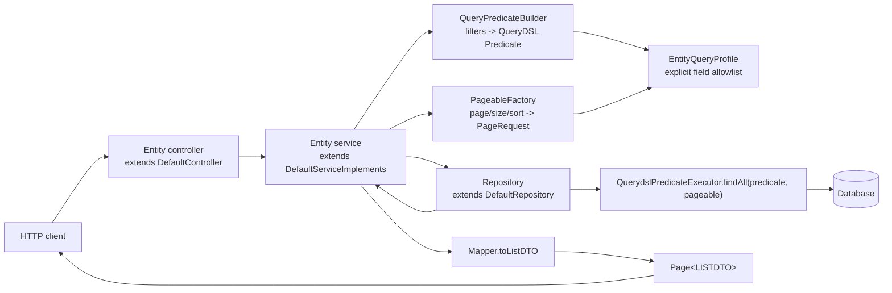
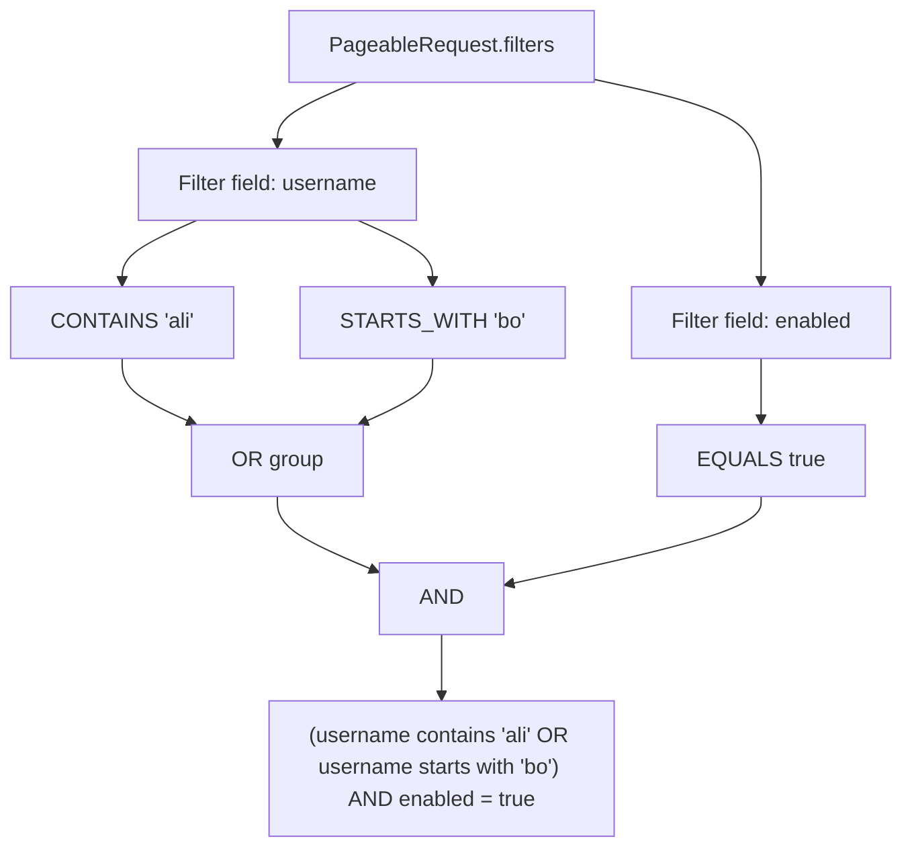
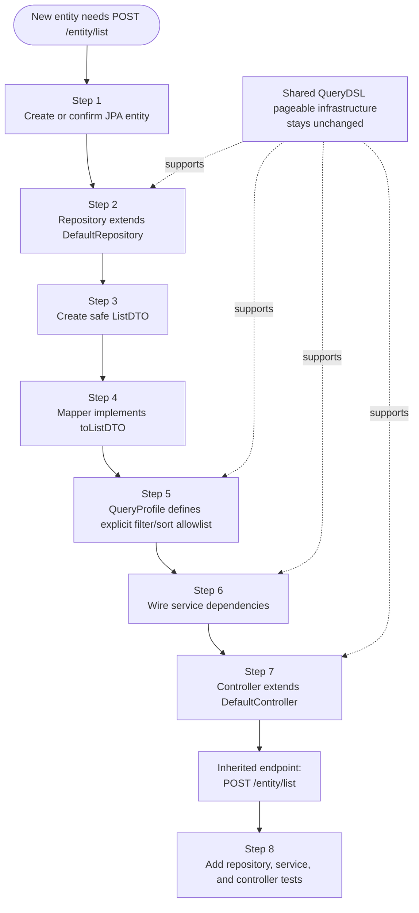

# Backend QueryDSL Pageable List Queries

> **Scope.** This document explains the current QueryDSL filtering and pageable list-query implementation under `code/backend/`. It is the handoff guide for developers adding new backend entities that need `POST /{entity}/list` support.
>
> **Related implementation feature.** See [[Features/done/Backend-QueryDSL-Filtering-Pagination|Backend QueryDSL Filtering And Pagination]].

## Critical Rule

Do **not** modify the shared pageable or QueryDSL infrastructure while adding a normal entity.

The shared implementation is used by every controller-backed entity through `DefaultController`, `DefaultServiceImplements`, `DefaultRepository`, `PageableFactory`, `QueryPredicateBuilder`, `QueryableField`, and `EntityQueryProfile`. A change to those shared classes can break all existing and future list endpoints, including `POST /admin/list` and `POST /client/list`.

When adding an entity, extend the system by creating entity-specific pieces: `ListDTO`, `QueryProfile`, mapper wiring, service constructor wiring, repository, and controller. Only change the shared query infrastructure as part of a dedicated cross-entity feature with tests for every affected entity.

---

## What The System Provides

Every entity that follows the generic backend pattern can expose a list endpoint that accepts one JSON request containing pagination, page size, sorting, and filters.

Current inherited endpoints:

| Entity | Controller | Endpoint | Response |
|--------|------------|----------|----------|
| Admin | `code/backend/src/main/java/com/authServer/models/hq/admin/AdminController.java` | `POST /admin/list` | `Page<AdminListDTO>` |
| Client | `code/backend/src/main/java/com/authServer/models/hq/client/ClientController.java` | `POST /client/list` | `Page<ClientListDTO>` |

The endpoint is `POST` because filter groups and sort arrays are easier to validate and evolve in a JSON body than as encoded query parameters.



---

## Request Contract

The request DTO is `PageableRequest` at `code/backend/src/main/java/com/authServer/shared/query/PageableRequest.java`.

```json
{
  "page": 0,
  "size": 20,
  "sort": [
    {
      "field": "username",
      "direction": "ASC"
    }
  ],
  "filters": [
    {
      "field": "enabled",
      "operations": [
        {
          "operator": "EQUALS",
          "value": true
        }
      ]
    },
    {
      "field": "email",
      "operations": [
        {
          "operator": "CONTAINS",
          "value": "example.com"
        }
      ]
    }
  ]
}
```

### Defaults And Validation

| Field | Type | Default | Validation |
|-------|------|---------|------------|
| `page` | integer | `0` | Must be `>= 0` |
| `size` | integer | `20` | Must be `1..100` |
| `sort` | array of `SortRequest` | empty array | Must not be `null`; each item needs `field` and `direction` |
| `filters` | array of `FilterRequest` | empty array | Must not be `null`; each item needs `field` and at least one operation |

An empty JSON body such as `{}` is valid. It means page `0`, size `20`, no filters, and the entity profile's default sort.

### Sort Request

`SortRequest` is defined at `code/backend/src/main/java/com/authServer/shared/query/SortRequest.java`.

| Field | Type | Values |
|-------|------|--------|
| `field` | string | Public API field name from the entity query profile |
| `direction` | enum | `ASC`, `DESC` |

Sorting is allowlist-based. A field can be filterable but not sortable unless its `QueryableField` has `.sortable("...")`.

### Filter Request

`FilterRequest` and `FilterOperationRequest` are defined under `code/backend/src/main/java/com/authServer/shared/query/`.

| Field | Type | Meaning |
|-------|------|---------|
| `filters[].field` | string | Public API field name from the entity query profile |
| `filters[].operations` | array | One or more operations for that field |
| `operations[].operator` | enum | One value from `FilterOperator` |
| `operations[].value` | JSON value | Type depends on the field definition and operator |

Filters are combined with `AND`. Multiple operations inside the same filter are combined with `OR`.



---

## Supported Operators

Operators are defined by `FilterOperator` at `code/backend/src/main/java/com/authServer/shared/query/FilterOperator.java`.

| Field factory | Value type | Supported operators | Value format |
|---------------|------------|---------------------|--------------|
| `QueryableField.string(...)` | `String` | `EQUALS`, `NOT_EQUALS`, `CONTAINS`, `STARTS_WITH`, `ENDS_WITH`, `IN` | JSON string, or non-empty string array for `IN` |
| `QueryableField.number(...)` | Java number type | `EQUALS`, `NOT_EQUALS`, `GREATER_THAN`, `GREATER_THAN_OR_EQUAL`, `LESS_THAN`, `LESS_THAN_OR_EQUAL`, `IN` | JSON number, or non-empty number array for `IN` |
| `QueryableField.booleanField(...)` | `Boolean` | `EQUALS`, `NOT_EQUALS` | JSON boolean only |
| `QueryableField.enumField(...)` | Java enum | `EQUALS`, `NOT_EQUALS`, `IN` | Exact enum-name string, or non-empty enum-name string array for `IN` |
| `QueryableField.dateTime(...)` | `Date`, `Instant`, `LocalDateTime`, `OffsetDateTime`, `ZonedDateTime` | `EQUALS`, `NOT_EQUALS`, `GREATER_THAN`, `GREATER_THAN_OR_EQUAL`, `LESS_THAN`, `LESS_THAN_OR_EQUAL` | ISO-8601 date/time string |
| `QueryableField.date(...)` | `LocalDate` or supported date type | Same as date/time | ISO-8601 date string |
| Any field with `.nullable()` | Same field type | Adds `IS_NULL`, `IS_NOT_NULL` | Value is ignored |

Important behavior:

| Behavior | Details |
|----------|---------|
| String partial matches | `CONTAINS`, `STARTS_WITH`, and `ENDS_WITH` use QueryDSL ignore-case expressions. |
| String equality | `EQUALS` and `NOT_EQUALS` use direct equality. Database collation can still affect case behavior. |
| Boolean values | Must be real JSON booleans, not strings like `"true"`. |
| Integral numbers | `Long`, `Integer`, `Short`, `Byte`, and `BigInteger` reject fractional values. |
| `IN` values | Must be non-empty JSON arrays. |
| Null checks | Must be opted into per field with `.nullable()`. Current Admin and Client profiles do not mark fields nullable. |

---

## Shared Implementation Pieces

### QueryDSL Setup

QueryDSL is configured in `code/backend/pom.xml`.

| Piece | Current implementation |
|-------|------------------------|
| QueryDSL dependency | `io.github.openfeign.querydsl:querydsl-jpa` |
| Version property | `openfeign.querydsl.version` with current value `6.12` |
| Annotation processor | `io.github.openfeign.querydsl:querydsl-apt` with classifier `jpa` |
| Generated Q classes | `code/backend/target/generated-sources/annotations` |

Do not rename the property to `querydsl.version`. Spring Boot's parent POM already uses `querydsl.version` for the original `com.querydsl` BOM, and using the OpenFeign version there can break dependency resolution.

When adding a new entity, run Maven compilation if the `QYourEntity` class is missing in the IDE. Generated Q classes are build output and should not be committed.

### Repository Layer

`DefaultRepository` extends Spring Data JPA and QueryDSL predicate execution:

```java
@NoRepositoryBean
public interface DefaultRepository<ENTITY, ID>
        extends JpaRepository<ENTITY, ID>, QuerydslPredicateExecutor<ENTITY> {
}
```

This is what makes the generic service able to call:

```java
repository.findAll(predicate, pageRequest)
```

Every concrete repository must extend `DefaultRepository<YourEntity, YourId>`.

### Controller Layer

`DefaultController` at `code/backend/src/main/java/com/authServer/shared/defaultImplements/DefaultController.java` exposes the inherited list endpoint:

```java
@PostMapping("/list")
public ResponseEntity<Page<LISTDTO>> getListPage(@Valid @RequestBody PageableRequest request)
        throws InvalidQueryRequestException {
    return ResponseEntity.ok(defaultService.getListPage(request));
}
```

Concrete controllers only need to extend `DefaultController<DTO, MINIDTO, LISTDTO, FORM, ID>` and define their base path with `@RequestMapping`.

### Service Layer

`DefaultServiceImplements` at `code/backend/src/main/java/com/authServer/shared/defaultImplements/DefaultServiceImplements.java` owns the generic list-query orchestration.

```java
@Transactional(readOnly = true)
public Page<LISTDTO> getListPage(PageableRequest request) throws InvalidQueryRequestException {
    Predicate predicate = queryPredicateBuilder.build(request, queryProfile);
    PageRequest pageRequest = pageableFactory.create(request, queryProfile);

    return repository.findAll(predicate, pageRequest)
            .map(mapper::toListDTO);
}
```

The service is the boundary where the request becomes a database query. Controllers do not build predicates. Mappers do not build predicates. Repositories do not know about request DTOs.

### PageableFactory

`PageableFactory` validates pagination and sorting, then builds a Spring `PageRequest`.

| Responsibility | Behavior |
|----------------|----------|
| Validate request object | Rejects `null` request, negative page, size outside `1..100`, and `null` sort list. |
| Choose sort | Uses request sort when present; otherwise uses `profile.defaultSort()`. |
| Validate sort fields | Rejects unknown fields and fields not marked sortable. |
| Convert direction | Maps `SortDirection.ASC` and `SortDirection.DESC` to Spring `Sort.Direction`. |

If the entity profile's default sort is invalid, `PageableFactory` throws `IllegalStateException`. That is a developer configuration error, not a client error.

### QueryPredicateBuilder

`QueryPredicateBuilder` validates filter groups and builds a QueryDSL `Predicate`.

| Responsibility | Behavior |
|----------------|----------|
| Validate filters | Rejects `null` filter list, `null` filter items, and empty operation lists. |
| Resolve fields | Calls `profile.requireField(field)` so only profile fields are accepted. |
| Build operations | Calls `QueryableField.buildPredicate(operator, value)` for typed conversion and operator validation. |
| Combine predicates | Uses `OR` inside one field group and `AND` across filter groups. |

### QueryableField

`QueryableField` is the field definition and value-conversion layer. It binds a public API field name to a QueryDSL expression, a Java value type, allowed operators, optional sort property, typed value conversion, and predicate creation.

Example from `AdminQueryProfile`:

```java
"email", QueryableField.<AdminEntity>string("email", ADMIN.email).sortable("email")
```

This means:

| Part | Meaning |
|------|---------|
| Public field name | Clients use `"email"` in JSON. |
| QueryDSL expression | The predicate uses `QAdminEntity.adminEntity.email`. |
| Field type | Values must be JSON strings. |
| Operators | String operators are allowed. |
| Sort property | Clients may sort by `email`. |

### EntityQueryProfile

Every entity has an explicit query profile. This is the allowlist that protects the API from arbitrary field access.

Current profiles:

| Entity | Profile | Q class | Default sort |
|--------|---------|---------|--------------|
| Admin | `AdminQueryProfile` | `QAdminEntity.adminEntity` | `id ASC` |
| Client | `ClientQueryProfile` | `QClientEntity.clientEntity` | `id ASC` |

The profile must list every filterable/sortable field explicitly. Do not use reflection. Do not pass raw client-provided field names into QueryDSL or Spring Sort.

---

## Current Admin And Client Profiles

Admin and Client expose the same list-query fields today.

| API field | Type | Filterable | Sortable | Notes |
|-----------|------|------------|----------|-------|
| `id` | `Long` | yes | yes | Numeric operators and `IN`. |
| `firstName` | `String` | yes | yes | String operators and `IN`. |
| `lastName` | `String` | yes | yes | String operators and `IN`. |
| `email` | `String` | yes | yes | String operators and `IN`. |
| `username` | `String` | yes | yes | String operators and `IN`. |
| `enabled` | `Boolean` | yes | yes | `EQUALS` and `NOT_EQUALS` only. |
| `dateCreated` | `Date` | yes | yes | ISO-8601 date/time values. |
| `lastLogin` | `Date` | yes | yes | ISO-8601 date/time values. |

Fields intentionally not exposed:

| Entity | Field | Reason |
|--------|-------|--------|
| Admin | `password` | Secret/internal field. Not in `AdminListDTO` and not in `AdminQueryProfile`. |
| Admin | `roles` | Element collection support is not implemented in the profile. |
| Client | `password` | Secret/internal field. Not in `ClientListDTO` and not in `ClientQueryProfile`. |
| Client | `apikey` | Sensitive field. Not in `ClientListDTO` and not in `ClientQueryProfile`. |
| Client | `roles` | Element collection support is not implemented in the profile. |

The controller tests explicitly verify that sensitive fields are not returned and rejected as unknown query fields.

---

## Response Shape

The list endpoint returns Spring's `Page<LISTDTO>`. The JSON shape includes `content` plus pagination metadata.

Example response shape:

```json
{
  "content": [
    {
      "id": 1,
      "firstName": "Admin",
      "lastName": "User",
      "email": "admin@example.com",
      "username": "admin",
      "roles": ["ROLE_ADMIN"],
      "enabled": true,
      "dateCreated": "2026-04-27T00:00:00.000+00:00",
      "lastLogin": null
    }
  ],
  "totalElements": 1,
  "totalPages": 1,
  "size": 20,
  "number": 0,
  "first": true,
  "last": true,
  "empty": false
}
```

The exact metadata fields are produced by Spring's `Page` serialization. The important backend contract is that `content` contains list DTOs, not entities and not full detail DTOs.

---

## Error Handling

Invalid query requests are handled by `GlobalExceptionHandler` at `code/backend/src/main/java/com/authServer/exceptions/GlobalExceptionHandler.java`.

| Error condition | Result |
|-----------------|--------|
| Unknown filter field | `400 Bad Request`, error `Invalid Query Request` |
| Unknown sort field | `400 Bad Request`, error `Invalid Query Request` |
| Unsupported operator for a field | `400 Bad Request`, error `Invalid Query Request` |
| Invalid value type | `400 Bad Request`, error `Invalid Query Request` |
| Invalid `page` or `size` through Bean Validation | `400 Bad Request`, error `Validation Failed` |
| Malformed enum value such as unknown operator name | `400 Bad Request`, error `Malformed Request` |
| Invalid profile default sort | `500 Internal Server Error`, because this is a developer misconfiguration |

Example invalid response:

```json
{
  "timestamp": "2026-04-27T19:00:00.000000",
  "status": 400,
  "error": "Invalid Query Request",
  "message": "Unknown query field 'password'.",
  "path": "/admin/list"
}
```

---

## How To Add QueryDSL Pageable Support To A New Entity

This assumes the entity follows the existing backend slice pattern under `code/backend/src/main/java/com/authServer/models/hq/<entity>/`.




### Step 1: Create Or Confirm The Entity

Create the JPA entity as usual. If it is user-like, extend `BaseUserEntity`. If it is not user-like, use a normal `@Entity`.

Run Maven compilation when needed so QueryDSL generates `QYourEntity` under `target/generated-sources/annotations`.

### Step 2: Create The Repository

The repository must extend `DefaultRepository`.

```java
@Repository
public interface InvoiceRepository extends DefaultRepository<InvoiceEntity, Long> {
}
```

This gives the entity both normal JPA repository behavior and QueryDSL predicate execution.

### Step 3: Create The List DTO

Create a `YourEntityListDTO` even if it initially resembles the full DTO.

The list DTO is the safe read model for table/list screens. It must not expose secrets, credentials, internal tokens, large blobs, or fields that should not appear in list results.

```java
@Data
@Builder
@NoArgsConstructor
@AllArgsConstructor
public class InvoiceListDTO {
    private Long id;
    private BigDecimal amount;
    private String status;
    private Date dateCreated;
}
```

### Step 4: Update The Mapper

Implement the five-generic-parameter mapper contract.

```java
@Component
public class InvoiceMapper
        implements DefaultMapper<InvoiceDTO, InvoiceMiniDTO, InvoiceListDTO, InvoiceForm, InvoiceEntity> {

    @Override
    public InvoiceListDTO toListDTO(InvoiceEntity entity) {
        if (entity == null) {
            return null;
        }

        return InvoiceListDTO.builder()
                .id(entity.getId())
                .amount(entity.getAmount())
                .status(entity.getStatus().name())
                .dateCreated(entity.getDateCreated())
                .build();
    }
}
```

Keep `toListDTO` focused on list output. Do not return the JPA entity. Do not expose fields simply because they exist on the entity.

### Step 5: Create The Query Profile

Create an entity-specific profile that implements `EntityQueryProfile<YourEntity>`.

```java
@Component
public class InvoiceQueryProfile implements EntityQueryProfile<InvoiceEntity> {

    private static final QInvoiceEntity INVOICE = QInvoiceEntity.invoiceEntity;

    private static final Map<String, QueryableField<InvoiceEntity, ?>> FIELDS = Map.of(
            "id", QueryableField.<InvoiceEntity, Long>number("id", INVOICE.id, Long.class).sortable("id"),
            "amount", QueryableField.<InvoiceEntity, BigDecimal>number("amount", INVOICE.amount, BigDecimal.class).sortable("amount"),
            "status", QueryableField.<InvoiceEntity, InvoiceStatus>enumField("status", INVOICE.status, InvoiceStatus.class).sortable("status"),
            "dateCreated", QueryableField.<InvoiceEntity, Date>dateTime("dateCreated", INVOICE.dateCreated, Date.class).sortable("dateCreated")
    );

    private static final List<SortRequest> DEFAULT_SORT = List.of(SortRequest.builder()
            .field("id")
            .direction(SortDirection.ASC)
            .build());

    @Override
    public Map<String, QueryableField<InvoiceEntity, ?>> fields() {
        return FIELDS;
    }

    @Override
    public List<SortRequest> defaultSort() {
        return DEFAULT_SORT;
    }
}
```

Profile rules:

| Rule | Reason |
|------|--------|
| Only expose fields explicitly listed in `FIELDS`. | Prevents clients from querying internal entity fields. |
| Use stable API field names. | Changing a field name breaks clients. |
| Mark sortable fields with `.sortable("propertyName")`. | Filtering and sorting are separate permissions. |
| Keep sensitive fields out of the profile. | Unknown-field rejection is a security boundary. |
| Add `.nullable()` only when null checks are part of the public API. | `IS_NULL` and `IS_NOT_NULL` should be intentional. |
| Define a valid `defaultSort()`. | Empty request bodies depend on it. |

### Step 6: Wire The Service

The service constructor must pass the repository, mapper, query profile, pageable factory, and predicate builder to `super(...)`.

```java
@Service
public class InvoiceService extends DefaultServiceImplements<
        InvoiceDTO,
        InvoiceMiniDTO,
        InvoiceListDTO,
        InvoiceForm,
        InvoiceEntity,
        Long> {

    public InvoiceService(
            InvoiceRepository repository,
            InvoiceMapper mapper,
            InvoiceQueryProfile queryProfile,
            PageableFactory<InvoiceEntity> pageableFactory,
            QueryPredicateBuilder<InvoiceEntity> queryPredicateBuilder) {

        super(repository, mapper, queryProfile, pageableFactory, queryPredicateBuilder);
    }
}
```

Override CRUD methods only for entity-specific business rules. The inherited `getListPage(...)` should normally remain untouched.

Important existing backend issue: `DefaultServiceImplements.update(...)` currently saves the loaded entity without applying the form. If the new entity needs update support, override `update(...)` in the concrete service.

### Step 7: Wire The Controller

The controller only needs to extend `DefaultController` with the new `LISTDTO` generic parameter.

```java
@RestController
@RequestMapping("/invoice")
public class InvoiceController extends DefaultController<
        InvoiceDTO,
        InvoiceMiniDTO,
        InvoiceListDTO,
        InvoiceForm,
        Long> {

    public InvoiceController(InvoiceService service) {
        super(service);
    }
}
```

The inherited endpoint is now `POST /invoice/list`.

### Step 8: Add Tests

Use the existing Admin and Client tests as examples.

| Test level | Existing examples | What to verify |
|------------|-------------------|----------------|
| Shared request/query unit tests | `shared/query/QueryableFieldTest.java`, `shared/query/QueryPredicateBuilderTest.java` | Only needed if changing shared infrastructure. |
| Generic service/controller tests | `shared/defaultImplements/DefaultServiceImplementsListQueryTest.java`, `DefaultControllerListEndpointTest.java` | Only needed if changing generic behavior. |
| Repository integration tests | `models/hq/admin/AdminRepositoryQuerydslIntegrationTest.java`, `models/hq/client/ClientRepositoryQuerydslIntegrationTest.java` | QueryDSL predicates work against persisted data. |
| Service integration tests | `AdminServiceListQueryIntegrationTest.java`, `ClientServiceListQueryIntegrationTest.java` | `getListPage(...)` maps `Page<ENTITY>` to `Page<LISTDTO>`. |
| Controller endpoint tests | `AdminControllerListEndpointTest.java`, `ClientControllerListEndpointTest.java` | `POST /{entity}/list` works and returns controlled `400` errors. |

Minimum tests for a new entity:

| Scenario | Expected result |
|----------|-----------------|
| `{}` request | Returns page `0`, size `20`, profile default sort. |
| Filter by one allowed field | Returns matching rows. |
| Sort by one allowed sortable field | Returns ordered rows. |
| Page size smaller than result count | Returns correct content and total metadata. |
| Unknown filter field | `400 Bad Request`. |
| Unknown sort field | `400 Bad Request`. |
| Unsupported operator for a field | `400 Bad Request`. |
| Invalid value type | `400 Bad Request`. |
| Sensitive field in filter or sort | `400 Bad Request`. |
| Sensitive field in response body | Field does not exist in `content[*]`. |

---

## When You May Modify Shared Infrastructure

Changing shared query classes is allowed only when the change is intentionally cross-entity.

| Desired change | Correct approach |
|----------------|------------------|
| Add a new operator | Add it to `FilterOperator`, implement it in `QueryableField`, update tests for every relevant field type, and verify Admin/Client still pass. |
| Add a new field type | Add a new `QueryableField` factory and tests. Do not special-case one entity inside the shared builder. |
| Change request shape | Treat it as an API contract migration. Update controller tests and frontend/client callers. |
| Change pagination limits | Treat it as a product-wide decision because it affects every list endpoint. |
| Change filter combination rules | Treat it as a breaking API behavior change because current semantics are `AND` across fields and `OR` inside one field. |
| Add relation filtering | Keep relation paths explicit in each entity profile and cover them with integration tests. Do not add reflection-based relation discovery. |

Never make shared changes to quickly support one entity. If one entity needs special list behavior, prefer an entity-specific profile or a separate entity-specific endpoint.

---

## Common Mistakes To Avoid

| Mistake | Why it is wrong |
|---------|-----------------|
| Adding an entity field to `ListDTO` and assuming it is filterable. | Filtering is controlled by `EntityQueryProfile`, not DTO fields. |
| Adding a field to `EntityQueryProfile` and forgetting `.sortable(...)`. | The field will be filterable but sort requests for it will return `400`. |
| Exposing `password`, API keys, internal tokens, or secrets in `ListDTO`. | List endpoints are used by UI screens and should be safe by default. |
| Exposing sensitive fields in `EntityQueryProfile`. | Even if not returned, filter/sort access can leak information. |
| Using raw entity property names from the client without allowlisting. | This bypasses the safety model and can expose internals. |
| Changing `PageableRequest` for one entity. | The request DTO is shared by every inherited list endpoint. |
| Changing `QueryPredicateBuilder` to handle one special field. | Entity-specific behavior belongs in the entity profile or a dedicated endpoint. |
| Relying on string guesses for booleans or numbers. | The system intentionally uses typed JSON values and rejects invalid types. |
| Selecting generated Q classes for commit. | Q classes are generated build output under `target/`. |

---

## Developer Checklist

Before considering a new entity's list endpoint done, verify each item.

| Check | Done |
|-------|------|
| Repository extends `DefaultRepository<ENTITY, ID>`. |  |
| Mapper implements `DefaultMapper<DTO, MINIDTO, LISTDTO, FORM, ENTITY>`. |  |
| Mapper implements safe `toListDTO(...)`. |  |
| Service extends `DefaultServiceImplements<DTO, MINIDTO, LISTDTO, FORM, ENTITY, ID>`. |  |
| Service constructor injects `EntityQueryProfile`, `PageableFactory<ENTITY>`, and `QueryPredicateBuilder<ENTITY>`. |  |
| Controller extends `DefaultController<DTO, MINIDTO, LISTDTO, FORM, ID>`. |  |
| `@RequestMapping` gives the expected endpoint base path. |  |
| Query profile uses generated `QYourEntity`. |  |
| Query profile field map is explicit and excludes sensitive fields. |  |
| Sortable fields are intentionally marked with `.sortable(...)`. |  |
| Default sort is valid and stable. |  |
| Tests cover success, pagination, sorting, filtering, unknown fields, unsupported operators, invalid value types, and sensitive field exclusion. |  |
| No shared query infrastructure was changed for entity-specific needs. |  |

---

## Source Reference Map

| Area | Files |
|------|-------|
| Request DTOs and enums | `code/backend/src/main/java/com/authServer/shared/query/PageableRequest.java`, `SortRequest.java`, `FilterRequest.java`, `FilterOperationRequest.java`, `FilterOperator.java`, `SortDirection.java` |
| Query infrastructure | `code/backend/src/main/java/com/authServer/shared/query/QueryableField.java`, `EntityQueryProfile.java`, `PageableFactory.java`, `QueryPredicateBuilder.java` |
| Generic CRUD contracts | `code/backend/src/main/java/com/authServer/shared/defaultInterfaces/DefaultRepository.java`, `DefaultMapper.java`, `DefaultService.java` |
| Generic CRUD implementation | `code/backend/src/main/java/com/authServer/shared/defaultImplements/DefaultController.java`, `DefaultServiceImplements.java` |
| Query error handling | `code/backend/src/main/java/com/authServer/exceptions/InvalidQueryRequestException.java`, `GlobalExceptionHandler.java` |
| Admin integration | `code/backend/src/main/java/com/authServer/models/hq/admin/AdminListDTO.java`, `AdminQueryProfile.java`, `AdminMapper.java`, `AdminServiceImpl.java`, `AdminController.java` |
| Client integration | `code/backend/src/main/java/com/authServer/models/hq/client/ClientListDTO.java`, `ClientQueryProfile.java`, `ClientMapper.java`, `ClientService.java`, `ClientController.java` |
| Validation examples | `code/backend/src/test/java/com/authServer/shared/query/`, `code/backend/src/test/java/com/authServer/shared/defaultImplements/`, `code/backend/src/test/java/com/authServer/models/hq/admin/`, `code/backend/src/test/java/com/authServer/models/hq/client/` |

## Related Documentation

| Document | Purpose |
|----------|---------|
| [[Features/done/Backend-QueryDSL-Filtering-Pagination|Backend QueryDSL Filtering And Pagination]] | Original feature implementation record. |
| [[Docs/backend/Backend-Architecture|Backend Architecture]] | Broader backend layering and entity slice pattern. |
| [[Memory/architecture]] | Current architectural memory for backend, frontend target, and deployment target. |
| [[Memory/known-issues]] | Known backend sharp edges such as broken Maven wrapper, update no-op, generated target output, and QueryDSL property naming. |
