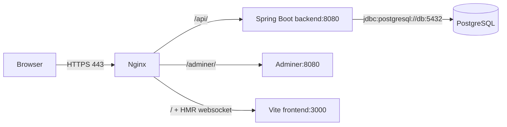

#docker #compose #devops #infrastructure

# Docker Compose Configuration Report

Created: 2026-05-12

## Purpose

This report explains how Docker Compose is currently configured for AgentForge. It is based on the active application tree under `project/`, not the stale project-local documentation tree under `project/documentation/`.

This report intentionally does not include real values from `project/.env`. Environment behavior is described from `project/.env.example`, `project/docker-compose.yml`, and the service configuration files.

Related context: [[Memory/context]], [[Memory/architecture]], [[Memory/tech]], [[Memory/known-issues]].

## Executive Summary

The current Docker Compose setup defines a five-service stack:

| Service | Role |
|---|---|
| `db` | PostgreSQL database, built from a custom Debian-based image. |
| `adminer` | Browser database administration UI. |
| `backend` | Spring Boot API, run with Maven in development mode. |
| `frontend` | React/Vite frontend, run as a Vite development server. |
| `nginx` | HTTPS gateway for the Vite dev frontend, backend API proxying, and Adminer proxying. |

All services are attached to a single bridge network named `BHT`. PostgreSQL uses a bind-backed Docker volume under `project/data/`. The backend waits for PostgreSQL health before starting, while the other dependency relationships only wait for container startup.

The strongest part of the configuration is the database-to-backend path: PostgreSQL has a healthcheck, and the backend receives explicit Spring datasource variables pointing to `db:5432`. The frontend development path is now wired through Nginx: `/` proxies to the Vite dev server at `frontend:3000`, including WebSocket headers required for HMR.

## Files Reviewed

| File | Purpose |
|---|---|
| `project/docker-compose.yml` | Main Compose definition for all runtime services, network, and volumes. |
| `project/.env.example` | Example runtime variables for database, backend, secrets, frontend port, and domain. |
| `project/makefile` | Convenience targets for setup, startup, shutdown, rebuild, and cleanup. |
| `project/srcs/backend/Dockerfile` | Development backend image based on Maven and Java 21. |
| `project/srcs/backend/src/main/resources/application.properties` | Backend runtime database, JPA, JWT, and file-signature settings. |
| `project/srcs/frontend/Dockerfile` | Development frontend image that installs Node.js 20 and runs Vite. |
| `project/srcs/frontend/package.json` | Frontend scripts, including `dev` and `build`. |
| `project/srcs/nginx/Dockerfile` | Nginx image with a generated self-signed certificate. |
| `project/srcs/nginx/conf/nginx.conf` | HTTPS server, static file root, `/api/` proxy, and `/adminer/` proxy. |
| `project/srcs/postgresql/Dockerfile` | Custom PostgreSQL image based on Debian Bookworm. |
| `project/srcs/postgresql/tools/init_db.sh` | Database initialization, role/database creation, and PostgreSQL listen/auth configuration. |
| `project/documentation/devops/dockerization-requirements.md` | Older Dockerization requirements document, currently stale relative to the active Compose stack. |

## Topology



## Compose Layout

The Compose file is `project/docker-compose.yml`. It defines:

| Compose section | Current configuration |
|---|---|
| Services | `db`, `adminer`, `backend`, `frontend`, `nginx`. |
| Network | `BHT`, a bridge network shared by every service. |
| Volumes | `db_data`, implemented as a bind-backed local volume. |
| Environment source | `db`, `backend`, and `frontend` use `env_file: .env`. |
| Public ports | Backend publishes `${BACKEND_PORT}:8080`; Nginx publishes `443:443`. |

Running `docker compose --env-file .env.example -f docker-compose.yml config` succeeds, so the Compose file is syntactically valid with the example environment values.

## Service Configuration

### `db`

| Setting | Value |
|---|---|
| Compose build context | `./srcs/postgresql` |
| Container name | `postgres_db` |
| Restart policy | `always` |
| Environment file | `.env` |
| Network | `BHT` |
| Volume mount | `db_data:/var/lib/postgresql/data` |
| Healthcheck | `pg_isready -U $${POSTGRES_USER} -d $${POSTGRES_DB}` |
| Host port | None |

The database image is custom. `project/srcs/postgresql/Dockerfile` uses `debian:bookworm`, installs `postgresql` and `postgresql-client`, copies `init_db.sh`, exposes `5432`, and starts PostgreSQL through `/usr/local/bin/init_db.sh`.

`init_db.sh` performs the runtime bootstrap:

| Bootstrap step | Behavior |
|---|---|
| Required variables | Fails fast if `POSTGRES_USER`, `POSTGRES_PASSWORD`, or `POSTGRES_DB` is missing. |
| Data ownership | Chowns `/var/lib/postgresql/data` to `postgres:postgres` and sets mode `700`. |
| Initial database | Runs `initdb` if `PG_VERSION` does not exist in the data directory. |
| Listen config | Ensures `listen_addresses='*'` exists in `postgresql.conf`. |
| Network auth | Ensures `host all all 0.0.0.0/0 scram-sha-256` exists in `pg_hba.conf`. |
| Role handling | Creates or updates the configured role with `LOGIN SUPERUSER PASSWORD`. |
| Database handling | Creates the configured database if it does not already exist. |
| Final process | Executes PostgreSQL as the `postgres` user. |

The service is internal-only because no database port is published to the host. Other containers reach it by service name as `db` on the shared Compose network.

### `adminer`

| Setting | Value |
|---|---|
| Image | `adminer` |
| Container name | `adminer` |
| Restart policy | `always` |
| Network | `BHT` |
| Depends on | `db` with default `service_started` behavior |
| Host port | None |

Adminer is not exposed directly by Compose. Nginx exposes it through `/adminer/` and proxies to `http://adminer:8080/`.

### `backend`

| Setting | Value |
|---|---|
| Compose build context | `./srcs/backend` |
| Container name | `backend` |
| Restart policy | `always` |
| Environment file | `.env` |
| Published port | `${BACKEND_PORT}:8080` |
| Source mount | `./srcs/backend:/app` |
| Network | `BHT` |
| Depends on | `db` with `condition: service_healthy` |

The backend image is a development image. `project/srcs/backend/Dockerfile` uses `maven:3.9.6-eclipse-temurin-21`, sets `/app` as the working directory, copies only `pom.xml`, runs `mvn dependency:go-offline -B`, exposes `8080`, and starts with `mvn spring-boot:run`.

Compose injects these Spring overrides:

| Variable | Value |
|---|---|
| `SPRING_DATASOURCE_URL` | `jdbc:postgresql://db:5432/${POSTGRES_DB}` |
| `SPRING_DATASOURCE_USERNAME` | `${POSTGRES_USER}` |
| `SPRING_DATASOURCE_PASSWORD` | `${POSTGRES_PASSWORD}` |
| `SPRING_JPA_HIBERNATE_DDL_AUTO` | `update` |

The backend `application.properties` already points to PostgreSQL by default:

| Property | Value |
|---|---|
| `spring.datasource.url` | `jdbc:postgresql://db:5432/${POSTGRES_DB}` |
| `spring.datasource.username` | `${POSTGRES_USER}` |
| `spring.datasource.password` | `${POSTGRES_PASSWORD}` |
| `spring.datasource.driver-class-name` | `org.postgresql.Driver` |
| `spring.jpa.hibernate.ddl-auto` | `update` |
| `spring.jpa.database-platform` | `org.hibernate.dialect.PostgreSQLDialect` |
| `spring.jpa.open-in-view` | `false` |
| `TK_KEY` | `${JWT_SECRET}` |
| `file.signature.secret` | `${JWT_SECRET}` |

The backend can be reached two ways in the current configuration:

| Access path | Behavior |
|---|---|
| Direct host access | `http://localhost:${BACKEND_PORT}` maps to container port `8080`. |
| Nginx proxy access | `https://<domain>/api/` proxies to `http://backend:8080/api/`. |

### `frontend`

| Setting | Value |
|---|---|
| Compose build context | `./srcs/frontend` |
| Container name | `frontend` |
| Restart policy | `always` |
| Environment file | `.env` |
| Source mount | `./srcs/frontend:/app` |
| Dependency mount | Anonymous volume at `/app/node_modules` |
| Network | `BHT` |
| Depends on | `backend` with default `service_started` behavior |
| Host port | None |

The frontend image is a development image. `project/srcs/frontend/Dockerfile` uses `debian:bookworm`, installs Node.js 20 through NodeSource, sets `/app` as the working directory, exposes `3000`, and starts with:

```bash
npm install && npm run dev -- --host 0.0.0.0 --port 3000
```

The frontend container therefore runs a Vite development server inside the Compose network. Compose does not publish the frontend port to the host; Nginx proxies public `/` requests to `frontend:3000`.

### `nginx`

| Setting | Value |
|---|---|
| Compose build context | `./srcs/nginx` |
| Container name | `nginx` |
| Restart policy | `always` |
| Published port | `443:443` |
| Network | `BHT` |
| Depends on | `backend`, `frontend`, and `adminer` with default `service_started` behavior |

The Nginx image uses `debian:bookworm`, installs `nginx` and `openssl`, generates a self-signed certificate at build time, copies `conf/nginx.conf` to `/etc/nginx/conf.d/default.conf`, exposes `443`, and runs Nginx in the foreground.

The generated certificate is hardcoded:

| Certificate field | Value |
|---|---|
| Key path | `/etc/nginx/ssl/BHT.key` |
| Certificate path | `/etc/nginx/ssl/BHT.crt` |
| Subject CN | `BHT.42.fr` |
| Validity | 365 days |

The Nginx server block listens on IPv4 and IPv6 HTTPS:

| Directive | Value |
|---|---|
| `listen` | `443 ssl` |
| `listen` | `[::]:443 ssl` |
| `server_name` | `BHT.42.fr` |
| `ssl_protocols` | `TLSv1.2 TLSv1.3` |

Nginx route behavior:

| Route | Behavior |
|---|---|
| `/` | Proxies to `http://frontend:3000` with WebSocket upgrade headers for Vite HMR. |
| `/api/` | Proxies to `http://backend:8080/api/`. |
| `/adminer/` | Proxies to `http://adminer:8080/` and rewrites cookie path to `/adminer/`. |

## Network Configuration

The stack defines one bridge network:

| Network | Driver | Attached services |
|---|---|---|
| `BHT` | `bridge` | `db`, `adminer`, `backend`, `frontend`, `nginx` |

Docker service-name DNS is used throughout the stack. The backend reaches PostgreSQL through `db`, Nginx reaches the backend through `backend`, and Nginx reaches Adminer through `adminer`.

## Volume Configuration

The Compose file defines one named volume with local bind-driver options:

| Volume | Host path | Container path | Used by |
|---|---|---|---|
| `db_data` | `./data/postgres` | `/var/lib/postgresql/data` | `db` |

Because this is a bind-backed volume, the host directory must exist. The Makefile creates it in the setup target.

The frontend service also declares an anonymous Docker volume at `/app/node_modules`. This prevents the host bind mount from replacing container-installed dependencies with a host `node_modules` directory.

## Environment Variables

`project/.env.example` defines these variables:

| Variable | Defined purpose | Current use |
|---|---|---|
| `POSTGRES_DB` | Database name. | Used by `db`, backend datasource URL, and backend Spring config. |
| `POSTGRES_USER` | Database role. | Used by `db`, backend datasource username, and backend Spring config. |
| `POSTGRES_PASSWORD` | Database role password. | Used by `db`, backend datasource password, and backend Spring config. |
| `DATABASE_URL` | Full database URL. | Loaded into some containers via `env_file`, but not referenced by Compose or Spring config. |
| `BACKEND_PORT` | Host port for backend. | Used by Compose as `${BACKEND_PORT}:8080`. |
| `FRONTEND_PORT` | Intended frontend port. | Loaded through `env_file`, but not referenced by Compose or the frontend Dockerfile. |
| `JWT_SECRET` | JWT signing secret. | Used by backend `TK_KEY` and currently also by `file.signature.secret`. |
| `FILE_SIGNATURE_SECRET` | Intended file-signature secret. | Loaded through `env_file`, but backend currently does not reference it. |
| `DOMAIN_NAME` | Intended deployment domain. | Loaded through `env_file`, but Nginx hardcodes `BHT.42.fr`. |

The Compose file does not pass environment variables to Nginx, and the Nginx config is not templated. Changing `DOMAIN_NAME` in `.env` will not change the Nginx `server_name` or generated certificate subject.

## Makefile Workflow

The Makefile in `project/makefile` wraps the common Docker Compose commands.

| Target | Behavior |
|---|---|
| `make all` | Creates `project/data/postgres`, sets broad permissions, then runs `docker compose -f ./docker-compose.yml up -d --build`. |
| `make up` | Ensures `project/data/postgres` exists through the setup sentinel, then runs `docker compose -f ./docker-compose.yml up -d` without forcing a rebuild. |
| `make build` | Runs `docker compose -f ./docker-compose.yml build`. |
| `make stop` | Stops containers without removing them. |
| `make down` | Removes containers and default network artifacts without deleting volumes. |
| `make clean` | Runs Compose down with `-v --rmi local --remove-orphans`, prunes builder cache, and deletes `project/data`. |
| `make re` | Runs `make fclean` and then `make all`. |

The setup target uses `sudo chmod -R 777 ./data`. This avoids local bind-volume permission problems, but it is intentionally permissive and should be revisited before shared or production-like deployments.

## Startup Order

| Service | Wait behavior |
|---|---|
| `db` | Starts independently and reports health through `pg_isready`. |
| `backend` | Waits for `db` to become healthy. |
| `adminer` | Waits only for `db` container startup. |
| `frontend` | Waits only for `backend` container startup. |
| `nginx` | Waits only for `backend`, `frontend`, and `adminer` container startup. |

Only the backend has a readiness-aware dependency. The frontend, Adminer, and Nginx may start before their upstream services are ready to accept requests.

## Current Access Paths

| Component | Access path |
|---|---|
| Nginx gateway | `https://localhost/` or `https://BHT.42.fr/` if local DNS/hosts is configured. |
| Frontend through Nginx | `https://<nginx-host>/`, proxied to the Vite dev server with HMR support. |
| Backend direct port | `http://localhost:${BACKEND_PORT}`. |
| Backend through Nginx | `https://<nginx-host>/api/`. |
| Adminer through Nginx | `https://<nginx-host>/adminer/`. |
| PostgreSQL | Internal Compose network only, service name `db`, port `5432`. |
| Frontend Vite server | Internal Compose network only, service name `frontend`, port `3000`; public access goes through Nginx. |

## Important Mismatches And Risks

### Frontend Proxy Is Development-Only

Nginx now proxies `/` to `frontend:3000`, so developers can use the Vite dev server and HMR through the same HTTPS gateway that proxies `/api/` and `/adminer/`.

Expected impact: this is correct for the current development phase, but it is not a production frontend serving model. A later production profile should build static assets or use another production-ready frontend serving strategy.

### Domain Configuration Is Hardcoded

`.env.example` defines `DOMAIN_NAME`, but Nginx hardcodes `server_name BHT.42.fr` and the Dockerfile generates a certificate with `CN=BHT.42.fr`.

Expected impact: changing `.env` does not change the domain served by Nginx or the certificate identity.

### Backend Is Exposed Directly And Through Nginx

The backend is reachable directly through `${BACKEND_PORT}:8080` and indirectly through Nginx `/api/`.

Expected impact: if Nginx is meant to be the only public gateway, the direct backend port bypasses TLS termination and any future proxy-level access controls.

### `FILE_SIGNATURE_SECRET` Is Defined But Not Used

The example environment defines `FILE_SIGNATURE_SECRET`, but `application.properties` sets `file.signature.secret=${JWT_SECRET}`.

Expected impact: JWT signing and file-signature signing currently share the same secret despite having separate variables in the documented environment file.

### `FRONTEND_PORT` And `DATABASE_URL` Are Defined But Not Used

`FRONTEND_PORT` is not used by Compose or the frontend Dockerfile. `DATABASE_URL` is loaded into some containers but not used by the Spring configuration, which relies on `SPRING_DATASOURCE_*` and `spring.datasource.*` properties.

Expected impact: developers may assume these variables are effective when they are currently inert.

### PostgreSQL Role Is Superuser

The database bootstrap script creates or updates the configured application role with `SUPERUSER`.

Expected impact: this is convenient for local bootstrap but too privileged for a normal application database user.

### PostgreSQL Network Auth Is Broad

The script adds `host all all 0.0.0.0/0 scram-sha-256` to `pg_hba.conf`.

Expected impact: PostgreSQL is not published to the host, so exposure is limited by Docker networking, but any container on a reachable network path can attempt authentication.

### Custom PostgreSQL Image Is More Complex Than Required

The current image installs PostgreSQL from Debian packages and runs `/usr/lib/postgresql/15/bin/postgres`. The older Dockerization requirements mentioned PostgreSQL 16 and recommended avoiding a custom database Dockerfile unless a real need exists.

Expected impact: database version and lifecycle are coupled to Debian package availability and the custom init script rather than an official pinned PostgreSQL image.

### Adminer Is Always Present

Adminer starts as part of the default stack and is exposed through Nginx at `/adminer/`.

Expected impact: useful in development, but it should be profile-gated or otherwise treated as development-only before production deployment.

### Build Caches Are Limited

The backend Dockerfile downloads Maven dependencies during image build, but Compose bind-mounts the full backend source over `/app`. There is no persistent Maven cache volume. The frontend installs dependencies on container startup and stores `node_modules` in an anonymous volume.

Expected impact: dependency installation can be slower or less predictable than a cache-volume-based development setup.

## Current State Assessment

The current configuration is best understood as a development-oriented full-stack draft, not a production-ready deployment definition.

It already provides:

- One-command orchestration through Compose and Makefile targets.
- Internal service networking through the `BHT` bridge network.
- Persistent PostgreSQL data through a bind-backed volume.
- A backend container that waits for database health.
- A frontend development proxy through Nginx with Vite HMR WebSocket support.
- Environment-driven PostgreSQL and JWT configuration for the backend.
- A first Nginx HTTPS gateway with backend and Adminer routes.

It does not yet provide:

- A production static frontend serving path.
- Environment-driven Nginx domain/certificate behavior.
- Production-grade database user privileges.
- Production-grade secret separation.
- A clean split between development conveniences and production exposure.
- A documented backend test runner in Compose.

## Recommended Cleanup Sequence

1. Decide whether this Compose file is the canonical development stack, a production-like stack, or both split through profiles/override files.
2. Add a production frontend profile later that builds static assets or otherwise replaces the development-only Vite proxy.
3. Make Nginx domain and certificate behavior align with `DOMAIN_NAME`, or remove `DOMAIN_NAME` until it is implemented.
4. Separate `FILE_SIGNATURE_SECRET` from `JWT_SECRET` in backend configuration.
5. Decide whether direct backend host exposure should remain or whether all external access should go through Nginx.
6. Replace the custom PostgreSQL image with an official pinned `postgres` image unless custom initialization remains necessary.
7. Reduce the database application role from `SUPERUSER` to the minimum privileges required by the application.
8. Put Adminer behind a development Compose profile before using the stack outside local development.
9. Add readiness checks or retry behavior for services that currently depend only on container startup.
10. Add a containerized backend test runner or Makefile target if Dockerized tests remain part of the expected workflow.
